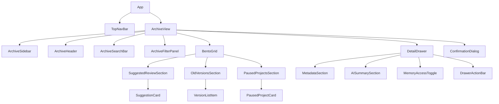
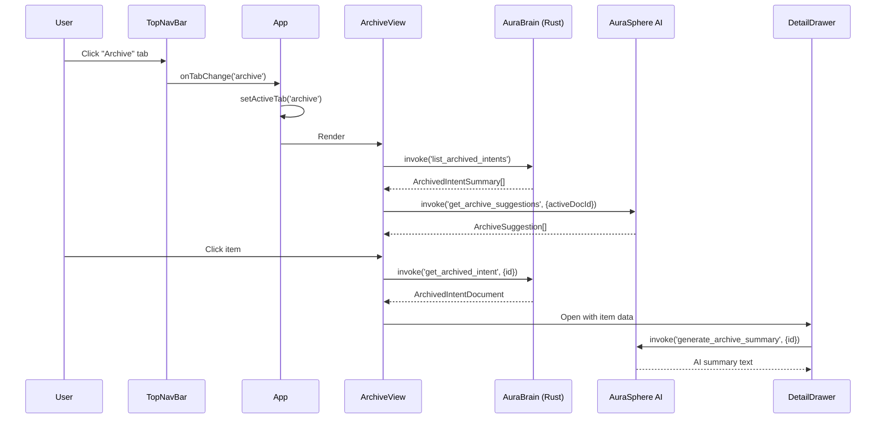
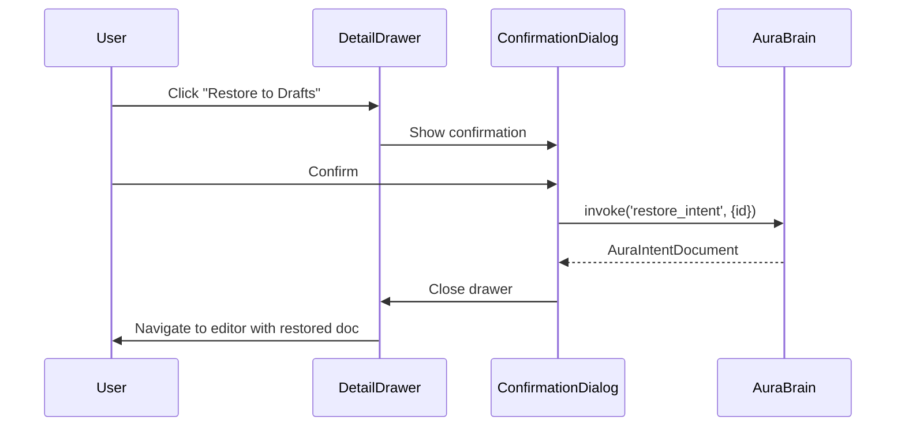

# Design Document: Archive Management

## Overview

The Archive Management feature adds a dedicated full-screen view to the WordAI desktop editor for managing archived documents, old versions, paused projects, and AI-powered review suggestions. The Archive view is accessible via a new "Archive" tab in the TopNavBar and integrates with the existing AuraBrain (Rust/Tauri SQLite backend) for persistence and AuraSphere (AI system) for intelligent content suggestions and summaries.

The feature introduces:
- A new `'archive'` tab value in the global state and navigation system
- An `ArchiveView` component with bento-grid layout (4+8 columns)
- An `ArchiveSidebar` for category navigation (Drafts, Projects, Versions, Trash)
- AI-powered suggestion cards that surface relevant archived content
- A `DetailDrawer` overlay with metadata, AI summary, memory access toggle, and actions
- Search and filtering with debounced text input and category/date filters
- Responsive layout adapting across lg (1024px), md (768px), and mobile breakpoints
- Full keyboard and screen reader accessibility with focus trapping in the drawer

### Design Decisions

1. **Extend existing `stateManager` pattern**: The `activeTab` union type is extended from `'editor' | 'library'` to `'editor' | 'library' | 'archive'` to maintain consistency with the current navigation model.

2. **New Tauri IPC commands for archive operations**: Archive-specific CRUD operations will be added to the Rust backend, backed by a new `archived_intents` table in the existing SQLite store.

3. **AI integration via existing `AIServiceConnector` pattern**: AI suggestions and summaries use the existing infrastructure with new specialized commands that provide archive-specific context.

4. **Component composition over monolith**: The ArchiveView is decomposed into focused sub-components (ArchiveSidebar, ArchiveSearchBar, SuggestionCard, VersionListItem, PausedProjectCard, DetailDrawer) following the same pattern as LibraryView.

5. **CSS design tokens only**: All styling uses the existing `--md-sys-color-*`, `--font-family-*`, `--radius-*`, `--shadow-*` tokens. No hardcoded values.

6. **Local state for view data**: Following the LibraryView pattern, ArchiveView manages its own data fetching and UI state via React hooks, while only tab navigation lives in the global stateManager.


## Architecture

### Component Tree



### Data Flow



### Detail Drawer Lifecycle




### State Management

The feature extends the existing `AppState` in `stateManager.tsx`:

```typescript
// Extend activeTab type
activeTab: 'editor' | 'library' | 'archive';
```

The `ArchiveView` component manages its own local state via React hooks (consistent with LibraryView pattern):

```typescript
const [archivedItems, setArchivedItems] = useState<ArchivedIntentSummary[]>([]);
const [suggestions, setSuggestions] = useState<ArchiveSuggestion[]>([]);
const [pausedProjects, setPausedProjects] = useState<PausedProject[]>([]);
const [isLoading, setIsLoading] = useState(true);
const [loadError, setLoadError] = useState<string | null>(null);
const [searchInput, setSearchInput] = useState('');
const [searchQuery, setSearchQuery] = useState(''); // debounced (300ms)
const [activeCategory, setActiveCategory] = useState<ArchiveCategory>('drafts');
const [activeFilters, setActiveFilters] = useState<ArchiveFilters>({ types: [], dateRange: 'all' });
const [selectedItemId, setSelectedItemId] = useState<string | null>(null);
const [isDrawerOpen, setIsDrawerOpen] = useState(false);
```

## Components and Interfaces

### ArchiveView

The root component for the archive tab. Manages data fetching, search/filter state, and orchestrates child components.

```typescript
export interface ArchiveViewProps {
  onOpenDocument: (doc: Document) => void;
  onTabChange: (tab: 'editor' | 'library' | 'archive') => void;
  currentDocumentId: string | null;
}
```

**Responsibilities:**
- Fetch archived items on mount via `invoke('list_archived_intents')`
- Request AI suggestions via `invoke('get_archive_suggestions', { activeDocId })`
- Manage debounced search (300ms) and filter state
- Coordinate Detail Drawer open/close
- Handle restore, delete, and save-to-library actions

### ArchiveSidebar

Left navigation panel with category links and "New Entry" button.

```typescript
export interface ArchiveSidebarProps {
  activeCategory: ArchiveCategory;
  onCategoryChange: (category: ArchiveCategory) => void;
  onNewEntry: () => void;
}

export type ArchiveCategory = 'drafts' | 'projects' | 'versions' | 'trash';
```

**Layout:** Fixed width 288px, `role="navigation"`, vertical scrollable if overflow.


### ArchiveSearchBar

Search input with glass-panel styling, clear button, and filters button.

```typescript
export interface ArchiveSearchBarProps {
  value: string;
  onChange: (value: string) => void;
  onClear: () => void;
  onToggleFilters: () => void;
  isFilterPanelOpen: boolean;
}
```

**Behavior:** Live filtering as user types (debounced 300ms). Clear button visible when non-empty. Filters button toggles filter panel visibility.

### ArchiveFilterPanel

Dropdown panel with filter options for item type and date range.

```typescript
export interface ArchiveFilterPanelProps {
  filters: ArchiveFilters;
  onChange: (filters: ArchiveFilters) => void;
  onClear: () => void;
}
```

### SuggestionCard

AI-powered card displaying an archived item suggested for review.

```typescript
export interface SuggestionCardProps {
  suggestion: ArchiveSuggestion;
  isPrimary: boolean;
  onReview: (id: string) => void;
  onCompare?: (id: string) => void;
  onRestore?: (id: string) => void;
}
```

**Variants:**
- Default: Shows "Review" action link
- "Referenced Work" category: Shows "Compare" and "Restore" buttons instead

**Styling:**
- Primary (first card): glass-panel effect, `--shadow-ambient-strong`, primary/10 border
- Secondary (subsequent): glass-panel effect, `--shadow-ambient`, outline-variant/10 border

### VersionListItem

Row component for an archived document version.

```typescript
export interface VersionListItemProps {
  version: ArchivedVersion;
  onOpen: (id: string) => void;
  onCompare: (id: string) => void;
  onRestore: (id: string) => void;
}
```

**Layout:** Horizontal row with document icon (rounded container), title (font-headline, semibold), timestamp (relative time), reason, and circular action buttons (visible on hover/focus).


### PausedProjectCard

Folder card for a paused project collection.

```typescript
export interface PausedProjectCardProps {
  project: PausedProject;
  onOpen: (id: string) => void;
}
```

**Layout:** Card with folder icon (48px), project name (truncated at 60 chars), document count, description (max 2 lines), timestamp, and "Open Folder" link. Decorative 64px circle in top-right scales to 1.1x on hover (300ms ease-in-out).

### DetailDrawer

Right-side overlay panel with full item details and actions.

```typescript
export interface DetailDrawerProps {
  isOpen: boolean;
  item: ArchivedIntentDocument | null;
  isLoading: boolean;
  loadError: string | null;
  onClose: () => void;
  onRestore: (id: string) => void;
  onCompare: (id: string) => void;
  onOpenReadOnly: (id: string) => void;
  onSaveToLibrary: (id: string) => void;
  onDelete: (id: string) => void;
  onToggleMemoryAccess: (id: string, enabled: boolean) => void;
  onRetryLoad: () => void;
  triggerRef: React.RefObject<HTMLElement>;
}
```

**Behavior:**
- Slides in from right with 500ms ease-out transition
- Max-width 672px (full-screen on mobile < 768px)
- Focus trap while open (Tab/Shift+Tab cycle within drawer)
- Closes on Escape, Scrim click, or close button
- Returns focus to trigger element on close
- Scrim: `inverse-surface/10` background with 2px backdrop blur
- `role="dialog"`, `aria-modal="true"`

### MemoryAccessToggle

Toggle switch for controlling AI memory access to an archived item.

```typescript
export interface MemoryAccessToggleProps {
  enabled: boolean;
  isUpdating: boolean;
  error: string | null;
  onChange: (enabled: boolean) => void;
}
```

**Behavior:**
- Optimistic UI update on toggle
- Reverts on persistence failure with error message
- Announces state to screen readers via `aria-live="polite"`
- Operable via Space key

### DrawerActionBar

Sticky footer with primary and secondary action buttons.

```typescript
export interface DrawerActionBarProps {
  itemId: string;
  hasRelatedFile: boolean;
  onRestore: () => void;
  onCompare: () => void;
  onOpenReadOnly: () => void;
  onSaveToLibrary: () => void;
  onDelete: () => void;
}
```

**Layout:**
- Primary row: "Restore to Drafts" (primary bg, flex-1), "Compare with Current" (surface bg, flex-1, disabled if no related file), "Open Read-only" (bordered, fixed width)
- Secondary row: "Save to Library" (left, bookmark_add icon), "Delete Permanently" (right, error color, delete_forever icon)
- Frosted-glass background: `surface-container-lowest/90` with 12px backdrop blur


## Data Models

### Frontend Types

```typescript
// types/archive.ts

/** Summary of an archived item for list display */
export interface ArchivedIntentSummary {
  id: string;
  intent_name: string;
  archived_at: number;       // Unix timestamp (seconds)
  archive_reason: string;
  archive_type: 'draft' | 'version' | 'project_doc';
  related_current_id: string | null;
  memory_access_enabled: boolean;
  created_at: number;
  updated_at: number;
  version: number;
  project_id: string | null;
}

/** Full archived document with content */
export interface ArchivedIntentDocument extends ArchivedIntentSummary {
  content: AuraDocumentBlock[];
}

/** AI suggestion for review */
export interface ArchiveSuggestion {
  id: string;
  archive_item_id: string;
  category: 'unused_concept' | 'referenced_work' | 'outdated_draft' | 'related_research';
  title: string;
  description: string;
  archived_at: number;
  relevance_score: number;
}

/** Paused project folder */
export interface PausedProject {
  id: string;
  name: string;
  description: string;
  document_count: number;
  paused_at: number;
}

/** Archived version of a specific document */
export interface ArchivedVersion {
  id: string;
  intent_name: string;
  version: number;
  archived_at: number;
  archive_reason: string;
  related_current_id: string | null;
}

/** Filter state */
export interface ArchiveFilters {
  types: Array<'suggestions' | 'versions' | 'paused_projects'>;
  dateRange: 'last_7_days' | 'last_30_days' | 'last_90_days' | 'all';
}

/** AI Summary loading state */
export interface AISummaryState {
  status: 'idle' | 'loading' | 'success' | 'error';
  text: string | null;
  retryCount: number;
}
```


### IPC Commands (Tauri Backend)

| Command | Parameters | Returns | Description |
|---------|-----------|---------|-------------|
| `list_archived_intents` | `{ category?: string }` | `ArchivedIntentSummary[]` | List archived items, optionally by category |
| `get_archived_intent` | `{ id: string }` | `ArchivedIntentDocument` | Get full archived document by ID |
| `archive_intent` | `{ id: string, reason: string }` | `ArchivedIntentSummary` | Move active document to archive |
| `restore_intent` | `{ id: string }` | `AuraIntentDocument` | Restore archived item to active workspace |
| `delete_archived_intent` | `{ id: string }` | `void` | Permanently delete an archived item |
| `update_memory_access` | `{ id: string, enabled: boolean }` | `void` | Toggle AI memory access for an item |
| `get_archive_suggestions` | `{ active_doc_id: string }` | `ArchiveSuggestion[]` | Get AI-powered review suggestions |
| `generate_archive_summary` | `{ id: string }` | `string` | Generate AI summary for an archived item |
| `list_paused_projects` | `{}` | `PausedProject[]` | List all paused projects |
| `get_project_documents` | `{ project_id: string }` | `ArchivedIntentSummary[]` | Get documents within a paused project |

### Backend Schema (SQLite)

```sql
CREATE TABLE IF NOT EXISTS archived_intents (
  id TEXT PRIMARY KEY,
  intent_name TEXT NOT NULL,
  raw_content TEXT NOT NULL,
  archived_at INTEGER NOT NULL,
  created_at INTEGER NOT NULL,
  updated_at INTEGER NOT NULL DEFAULT (strftime('%s', 'now')),
  archive_reason TEXT NOT NULL DEFAULT '',
  archive_type TEXT NOT NULL DEFAULT 'draft',
  related_current_id TEXT,
  memory_access_enabled INTEGER NOT NULL DEFAULT 1,
  project_id TEXT,
  version INTEGER NOT NULL DEFAULT 1,
  FOREIGN KEY (project_id) REFERENCES paused_projects(id) ON DELETE SET NULL
);

CREATE TABLE IF NOT EXISTS paused_projects (
  id TEXT PRIMARY KEY,
  name TEXT NOT NULL,
  description TEXT NOT NULL DEFAULT '',
  paused_at INTEGER NOT NULL,
  created_at INTEGER NOT NULL
);

CREATE INDEX idx_archived_intents_type ON archived_intents(archive_type);
CREATE INDEX idx_archived_intents_archived_at ON archived_intents(archived_at DESC);
CREATE INDEX idx_archived_intents_project_id ON archived_intents(project_id);
```


## Key Functions with Formal Specifications

### Function 1: applyArchiveFilters()

```typescript
function applyArchiveFilters(
  items: ArchivedIntentSummary[],
  query: string,
  filters: ArchiveFilters
): ArchivedIntentSummary[]
```

**Preconditions:**
- `items` is a valid array (may be empty)
- `query` is a string (may be empty)
- `filters.types` is a valid array of filter type strings
- `filters.dateRange` is one of the valid date range values

**Postconditions:**
- Returns a subset of `items` where every returned item satisfies ALL active criteria
- Empty query + empty types + 'all' dateRange returns the original array (sorted)
- Result is sorted by `archived_at` descending
- Result length ≤ input length

**Loop Invariants:**
- Each filter step only removes items, never adds
- Items passing all filters satisfy all criteria simultaneously

### Function 2: sortAndLimitVersions()

```typescript
function sortAndLimitVersions(
  versions: ArchivedVersion[],
  maxCount?: number
): ArchivedVersion[]
```

**Preconditions:**
- `versions` is a valid array
- `maxCount` defaults to 5 if not provided

**Postconditions:**
- Returns at most `maxCount` items
- Items are sorted by `archived_at` descending
- For any adjacent pair (a, b) in result: `a.archived_at >= b.archived_at`

### Function 3: truncateReason()

```typescript
function truncateReason(
  reason: string | null | undefined,
  placeholder?: string
): string
```

**Preconditions:**
- `placeholder` defaults to "No reason provided"

**Postconditions:**
- If reason is null/undefined/empty → returns placeholder
- If reason.length ≤ 200 → returns reason unchanged
- If reason.length > 200 → returns first 200 chars + "…"

### Function 4: isCompareDisabled()

```typescript
function isCompareDisabled(relatedCurrentId: string | null | undefined): boolean
```

**Preconditions:**
- Input may be any string, null, or undefined

**Postconditions:**
- Returns `true` if and only if `relatedCurrentId` is null or undefined
- Returns `false` for any non-null, non-undefined string (including empty string)

### Function 5: useFocusTrap()

```typescript
function useFocusTrap(
  containerRef: React.RefObject<HTMLElement>,
  isActive: boolean,
  triggerRef: React.RefObject<HTMLElement>
): void
```

**Preconditions:**
- `containerRef` points to a mounted DOM element when `isActive` is true
- `triggerRef` points to the element that opened the drawer
- Container has at least one focusable child element

**Postconditions:**
- When isActive becomes true: focus moves to first focusable element in container
- While isActive: Tab/Shift+Tab cycles within container only
- When isActive becomes false: focus returns to triggerRef element
- Escape key triggers close (via onClose callback)

### Function 6: useAISummary()

```typescript
function useAISummary(itemId: string | null): {
  state: AISummaryState;
  retry: () => void;
}
```

**Preconditions:**
- `itemId` is either a valid archive item ID or null

**Postconditions:**
- When itemId is null: state is `{ status: 'idle', text: null, retryCount: 0 }`
- When itemId is set: initiates generation with 30s timeout
- On success: `state.status = 'success'`, `state.text` contains summary (max 500 chars)
- On failure: `state.status = 'error'`, retryCount incremented
- `retry()` re-initiates generation if retryCount < 3
- After 3 failures: `retry()` is a no-op


## Algorithmic Pseudocode

### Archive View Initialization

```typescript
ALGORITHM initializeArchiveView(activeDocId: string | null, category: ArchiveCategory)
INPUT: active document ID, selected category
OUTPUT: populated archive view state

BEGIN
  setIsLoading(true)
  setLoadError(null)

  TRY
    // Parallel fetch: items + suggestions + projects
    [items, suggestions, projects] ← await Promise.all([
      invoke('list_archived_intents', { category }),
      activeDocId ? invoke('get_archive_suggestions', { active_doc_id: activeDocId }) : [],
      invoke('list_paused_projects')
    ])

    setArchivedItems(items)
    setSuggestions(suggestions)
    setPausedProjects(projects)
    setIsLoading(false)
  CATCH error
    setLoadError(error.message)
    setIsLoading(false)
  END TRY
END
```

**Preconditions:**
- AuraBrain backend is initialized
- User has navigated to Archive tab

**Postconditions:**
- On success: all sections populated with data
- On failure: error state displayed with retry option

### Search and Filter Algorithm

```typescript
ALGORITHM applyArchiveFilters(items, query, filters)
INPUT: items: ArchivedIntentSummary[], query: string, filters: ArchiveFilters
OUTPUT: filtered and sorted subset of items

BEGIN
  result ← items

  // Step 1: Text search (case-insensitive substring)
  IF query.trim() IS NOT EMPTY THEN
    q ← query.toLowerCase().trim()
    result ← result.filter(item =>
      item.intent_name.toLowerCase().includes(q) OR
      item.archive_reason.toLowerCase().includes(q)
    )
  END IF

  // Step 2: Type filter
  IF filters.types.length > 0 THEN
    typeMap ← { suggestions: 'draft', versions: 'version', paused_projects: 'project_doc' }
    allowed ← Set(filters.types.map(t => typeMap[t]))
    result ← result.filter(item => allowed.has(item.archive_type))
  END IF

  // Step 3: Date range filter
  IF filters.dateRange !== 'all' THEN
    now ← Math.floor(Date.now() / 1000)
    daysMap ← { last_7_days: 7, last_30_days: 30, last_90_days: 90 }
    cutoff ← now - daysMap[filters.dateRange] * 86400
    result ← result.filter(item => item.archived_at >= cutoff)
  END IF

  // Step 4: Sort by archived_at descending
  result ← result.sort((a, b) => b.archived_at - a.archived_at)

  RETURN result
END
```

**Preconditions:**
- items is a valid array, query is a string, filters has valid structure

**Postconditions:**
- Returns subset where every item matches ALL active criteria
- Result is sorted by archived_at descending
- Empty query + empty types + 'all' dateRange → returns all items sorted

**Loop Invariants:**
- Each filter step only removes items, never adds
- Result is always a subset of the input to that step


### Focus Trap Algorithm

```typescript
ALGORITHM manageFocusTrap(drawerEl: HTMLElement, triggerEl: HTMLElement)
INPUT: drawer DOM element, trigger element that opened the drawer
OUTPUT: focus trapped within drawer; restored on close

BEGIN
  // Step 1: Query focusable elements
  SELECTOR ← 'button, [href], input, select, textarea, [tabindex]:not([tabindex="-1"])'
  focusables ← Array.from(drawerEl.querySelectorAll(SELECTOR))
  first ← focusables[0]
  last ← focusables[focusables.length - 1]

  // Step 2: Move initial focus
  first.focus()

  // Step 3: Trap on keydown
  ON keydown(e) DO
    IF e.key === 'Escape' THEN
      closeDrawer()
      RETURN
    END IF

    IF e.key !== 'Tab' THEN RETURN

    IF e.shiftKey THEN
      IF document.activeElement === first THEN
        e.preventDefault()
        last.focus()
      END IF
    ELSE
      IF document.activeElement === last THEN
        e.preventDefault()
        first.focus()
      END IF
    END IF
  END ON

  // Step 4: Restore on unmount/close
  ON cleanup DO
    triggerEl.focus()
  END ON
END
```

**Preconditions:**
- drawerEl is mounted and contains ≥1 focusable element
- triggerEl is a valid focusable element

**Postconditions:**
- Focus never leaves drawer while active
- Focus returns to trigger on close/unmount
- Escape key closes the drawer

### AI Summary Generation Algorithm

```typescript
ALGORITHM generateAISummary(itemId: string)
INPUT: archive item ID
OUTPUT: summary text or error state

BEGIN
  state ← { status: 'loading', text: null, retryCount: 0 }
  render(state)

  FUNCTION attemptGeneration():
    TRY
      summary ← await withTimeout(
        invoke('generate_archive_summary', { id: itemId }),
        30_000
      )
      state ← { status: 'success', text: summary, retryCount: state.retryCount }
    CATCH error
      state.retryCount ← state.retryCount + 1
      IF state.retryCount >= 3 THEN
        state ← { status: 'error', text: null, retryCount: 3 }
      ELSE
        state ← { status: 'error', text: null, retryCount: state.retryCount }
      END IF
    END TRY
    render(state)
  END FUNCTION

  attemptGeneration()

  ON retry DO
    IF state.retryCount < 3 THEN
      state.status ← 'loading'
      render(state)
      attemptGeneration()
    END IF
  END ON
END
```

**Preconditions:**
- itemId is a valid archive item ID
- AuraSphere AI service is accessible

**Postconditions:**
- On success: state.text contains summary ≤ 500 characters
- On timeout/error: state.status = 'error'
- After 3 failures: retry is disabled (retryCount = 3)

**Loop Invariants:**
- retryCount monotonically increases (0 → 1 → 2 → 3)
- Each attempt either succeeds or increments retryCount


### Memory Access Toggle Algorithm

```typescript
ALGORITHM toggleMemoryAccess(itemId: string, currentEnabled: boolean)
INPUT: item ID, current toggle state
OUTPUT: persisted new state or reverted state with error

BEGIN
  newState ← NOT currentEnabled

  // Step 1: Optimistic UI update
  setEnabled(newState)
  setError(null)
  setIsUpdating(true)

  // Step 2: Persist to backend
  TRY
    await invoke('update_memory_access', { id: itemId, enabled: newState })
    setIsUpdating(false)
    announceViaAriaLive(newState ? 'Memory access enabled' : 'Memory access disabled')
  CATCH error
    // Step 3: Revert on failure
    setEnabled(currentEnabled)
    setError('Failed to save memory access state')
    setIsUpdating(false)
  END TRY
END
```

**Preconditions:**
- itemId exists in AuraBrain
- Toggle is not currently in updating state

**Postconditions:**
- On success: displayed state = new state, backend updated, screen reader announced
- On failure: displayed state = previous state, error message shown

## Example Usage

```typescript
// Example 1: ArchiveView integration in App.tsx
function App() {
  const { state, setActiveTab } = useAppState();

  return (
    <div>
      <TopNavBar activeTab={state.activeTab} onTabChange={setActiveTab} />
      {state.activeTab === 'archive' && (
        <ArchiveView
          onOpenDocument={handleOpenDocumentFromArchive}
          onTabChange={setActiveTab}
          currentDocumentId={state.document?.id ?? null}
        />
      )}
    </div>
  );
}

// Example 2: Search and filter within ArchiveView
function ArchiveView({ currentDocumentId }: ArchiveViewProps) {
  const [items, setItems] = useState<ArchivedIntentSummary[]>([]);
  const [searchQuery, setSearchQuery] = useState('');
  const [filters, setFilters] = useState<ArchiveFilters>({ types: [], dateRange: 'all' });

  const displayItems = useMemo(
    () => applyArchiveFilters(items, searchQuery, filters),
    [items, searchQuery, filters]
  );

  return (
    <div role="main">
      <ArchiveSearchBar
        value={searchQuery}
        onChange={setSearchQuery}
        onClear={() => setSearchQuery('')}
      />
      {displayItems.length === 0 && searchQuery ? (
        <EmptyState
          message={t('archive.noResults')}
          onClear={() => { setSearchQuery(''); setFilters({ types: [], dateRange: 'all' }); }}
        />
      ) : (
        <BentoGrid items={displayItems} />
      )}
    </div>
  );
}

// Example 3: Memory access toggle
function MemoryAccessToggle({ enabled, onChange, error }: MemoryAccessToggleProps) {
  return (
    <div
      role="switch"
      aria-checked={enabled}
      tabIndex={0}
      onKeyDown={(e) => { if (e.key === ' ') { e.preventDefault(); onChange(!enabled); } }}
      onClick={() => onChange(!enabled)}
    >
      <span aria-live="polite">{enabled ? 'Enabled' : 'Disabled'}</span>
      {error && <span role="alert">{error}</span>}
    </div>
  );
}

// Example 4: Restore with confirmation
async function handleRestore(itemId: string) {
  const restored = await invoke<AuraIntentDocument>('restore_intent', { id: itemId });
  const doc = auraIntentToDocument(restored).value;
  onOpenDocument(doc);
  setActiveTab('editor');
}
```


## Correctness Properties

### Property 1: Document state preservation across tab switches

*For any* document with any content and any unsaved-changes state, switching the active tab from `'editor'` to `'archive'` and back to `'editor'` SHALL produce a document state identical to the original (same id, title, content, version, and metadata).

**Validates: Requirements 1.6**

### Property 2: Archive filter correctness

*For any* list of `ArchivedIntentSummary` items, any search query string, any set of item type filters, and any date range filter, the `applyArchiveFilters` function SHALL return exactly the items that satisfy ALL of the following simultaneously:
- The item's `intent_name` or `archive_reason` contains the search query as a case-insensitive substring (or the query is empty)
- The item's `archive_type` matches one of the selected type filters (or no type filters are selected)
- The item's `archived_at` timestamp falls within the selected date range (or date range is `'all'`)

Furthermore, the result SHALL be sorted by `archived_at` in descending order.

**Validates: Requirements 3.3, 3.6, 3.7**

### Property 3: Version list sorting and limit invariant

*For any* list of `ArchivedVersion` items of any length, the `sortAndLimitVersions` function SHALL return at most 5 items, and for any two adjacent items in the result, the first item's `archived_at` timestamp SHALL be greater than or equal to the second item's `archived_at` timestamp (descending order).

**Validates: Requirements 5.3**

### Property 4: Archive reason truncation correctness

*For any* string input to the `truncateReason` function:
- If the input length is ≤ 200 characters, the output SHALL equal the input exactly
- If the input length is > 200 characters, the output SHALL be exactly the first 200 characters followed by "…"
- If the input is empty, null, or undefined, the output SHALL be the placeholder text

**Validates: Requirements 8.3**

### Property 5: Compare button disabled state derivation

*For any* `related_current_id` value, the `isCompareDisabled` function SHALL return `true` if and only if the value is `null` or `undefined`.

**Validates: Requirements 11.6**

### Property 6: Toggle state revert on persistence failure

*For any* initial toggle state (enabled or disabled) and any toggle action that results in a persistence failure, the toggle's displayed state SHALL revert to the initial state prior to the failed toggle action.

**Validates: Requirements 10.7**


## Error Handling

### Network and IPC Errors

| Error Scenario | Handling Strategy |
|---|---|
| `list_archived_intents` fails | Display full-page error state with retry button (LibraryView pattern) |
| `get_archived_intent` fails | Display error in DetailDrawer with retry button |
| `restore_intent` fails | Show error notification toast, item remains in archive |
| `delete_archived_intent` fails | Show error notification toast, item remains unchanged |
| `update_memory_access` fails | Revert toggle to previous state, show inline error |
| `get_archive_suggestions` fails | Show placeholder message in suggestions section |
| `generate_archive_summary` fails | Show fallback message with retry (max 3 attempts) |
| `sync_intent` (Save to Library) fails | Show error notification toast |
| `list_paused_projects` fails | Show error message with retry button in section |

### AI Service Errors

| Error Scenario | Handling Strategy |
|---|---|
| AI suggestions timeout | Show "suggestions unavailable" placeholder |
| AI summary timeout (30s) | Show fallback message with retry button |
| AI summary 3 retries exhausted | Show fallback message, disable retry button |
| AI service unavailable | Gracefully degrade — show static placeholder |

### Data Integrity Errors

| Error Scenario | Handling Strategy |
|---|---|
| Related document no longer exists (Compare) | Inline error on VersionListItem: "Related document unavailable" |
| Related document no longer exists (Detail link) | Inline error in metadata section, do not navigate |
| Archived item data corrupted | Display error in DetailDrawer, offer delete option |

### User Feedback Patterns

- **Non-blocking notifications**: Restore success, Save to Library success, Delete success
- **Confirmation dialogs**: Restore action (Req 5.8), Permanent delete action (Req 11.9)
- **Inline errors**: Toggle persistence failure, missing related document
- **Error states with retry**: Data loading failures, AI summary failures


## Testing Strategy

### Property-Based Tests (vitest + fast-check)

Property-based testing is appropriate for this feature because it contains pure filtering, sorting, and truncation logic with clear input/output behavior and universal properties that hold across a wide input space.

**Configuration:**
- Library: `fast-check` v4.6.0 (already in devDependencies)
- Test runner: `vitest --run`
- Minimum 100 iterations per property test

**Property test targets:**

| Property | Function Under Test | Test File |
|----------|-------------------|-----------|
| Property 1 | State reducer (tab switch) | `archiveState.property.test.ts` |
| Property 2 | `applyArchiveFilters` | `archiveFilters.property.test.ts` |
| Property 3 | `sortAndLimitVersions` | `archiveFilters.property.test.ts` |
| Property 4 | `truncateReason` | `archiveFilters.property.test.ts` |
| Property 5 | `isCompareDisabled` | `archiveFilters.property.test.ts` |
| Property 6 | MemoryAccessToggle component | `MemoryAccessToggle.property.test.ts` |

### Unit Tests (Example-Based)

- Component rendering: ArchiveView, ArchiveSidebar, DetailDrawer, SuggestionCard, VersionListItem, PausedProjectCard
- Keyboard interactions: Escape closes drawer, Tab traps focus, Space toggles switch
- ARIA attribute verification: landmark roles, aria-modal, aria-live
- Responsive layout: breakpoint behavior at 768px and 1024px
- Loading/error state rendering for each section
- Confirmation dialog flows (restore, delete)
- Empty states for each section

### Integration Tests

- Tauri IPC command round-trips (archive → list → restore)
- AI suggestion request triggered on mount with active document
- Memory access toggle persistence round-trip
- Restore flow: archive → active workspace → editor navigation
- Delete flow: confirmation → IPC → UI removal
- Save to Library flow: archive item → sync_intent → success notification

### Accessibility Tests

- Focus trap verification in DetailDrawer (Tab/Shift+Tab cycling)
- Focus restoration on drawer close (to trigger element)
- Screen reader announcement for Memory Access Toggle state changes
- Keyboard-only navigation through all interactive elements
- ARIA landmark role verification (main, navigation, search, complementary, dialog)
- Visible focus indicators on all interactive elements
- Minimum 48×48px touch targets on mobile

### Test File Organization

```
apps/wordai-editor/src/
├── utils/
│   ├── archiveFilters.ts                      # Pure filter/sort/truncate functions
│   └── archiveFilters.property.test.ts        # Properties 2, 3, 4, 5
├── components/
│   ├── ArchiveView.tsx
│   ├── ArchiveView.test.tsx                   # Unit + integration tests
│   ├── ArchiveSidebar.tsx
│   ├── ArchiveSearchBar.tsx
│   ├── SuggestionCard.tsx
│   ├── VersionListItem.tsx
│   ├── PausedProjectCard.tsx
│   ├── DetailDrawer.tsx
│   ├── DetailDrawer.test.tsx                  # Unit + accessibility tests
│   ├── MemoryAccessToggle.tsx
│   └── MemoryAccessToggle.property.test.ts    # Property 6
├── services/
│   └── archiveState.property.test.ts          # Property 1
└── types/
    └── archive.ts                             # All archive-related types
```


## Performance Considerations

- **Debounced Search**: Search input debounced at 300ms to avoid excessive re-renders during typing
- **Lazy AI Summary**: Generated only when Detail Drawer opens, not preloaded for all items
- **Memoized Filtering**: `applyArchiveFilters` result memoized with `useMemo` keyed on items, query, and filters
- **Parallel Fetching**: Items, suggestions, and projects fetched via `Promise.all` on mount
- **Skeleton Loading**: Skeleton placeholders during fetch to prevent layout shift
- **GPU Animations**: Drawer slide uses `transform: translateX()` for GPU-accelerated rendering
- **Virtualized Lists**: If archived items exceed 50, consider virtualizing the version list (future optimization)

## Security Considerations

- **IPC Validation**: All `invoke` responses validated against TypeScript interfaces before rendering
- **XSS Prevention**: AI-generated summary text rendered as text content, never innerHTML
- **Permanent Delete Confirmation**: Destructive delete requires explicit ConfirmationDialog
- **Memory Access Control**: Toggle state persisted server-side in AuraBrain; client reconciles with backend

## Dependencies

- **@tauri-apps/api/core**: Tauri IPC `invoke` for backend communication
- **react-i18next**: Internationalization for all user-facing strings (en.json, vi.json)
- **fast-check**: Property-based testing (dev dependency, already installed)
- **vitest**: Test runner (dev dependency, already installed)
- **@testing-library/react**: Component testing utilities (dev dependency)
- **Existing components**: TopNavBar, ConfirmationDialog
- **Existing services**: auraDocumentAdapter, exportService
- **Existing types**: AuraIntentDocument, AuraIntentSummary, AuraDocumentBlock, Document
- **CSS Design Tokens**: All tokens from `src/styles/variables.css`
- **Material Symbols Outlined**: Icon font (already loaded globally)
