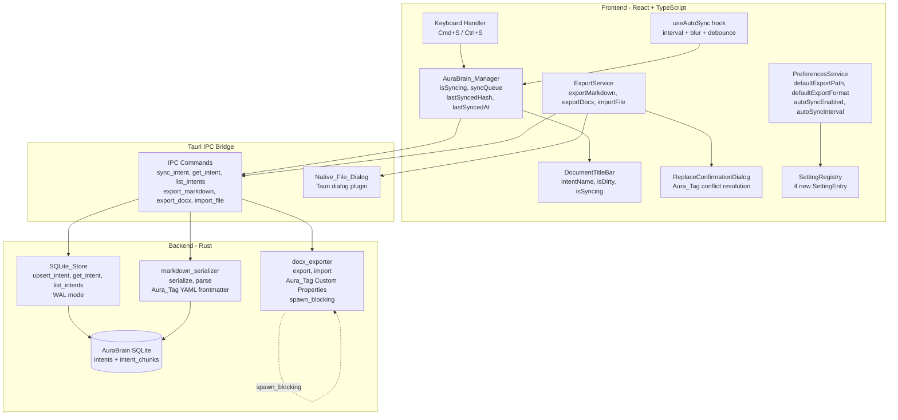
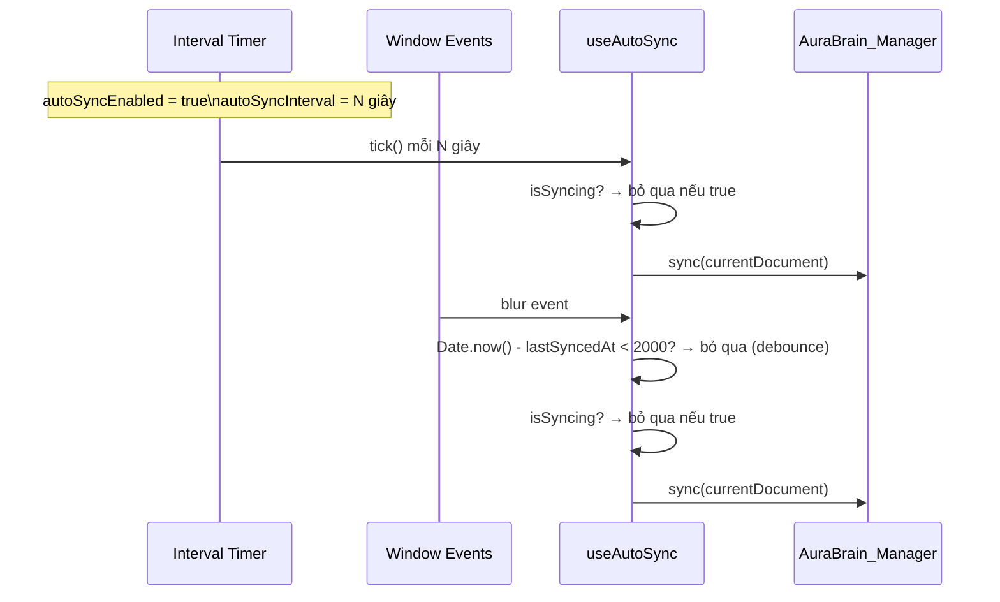
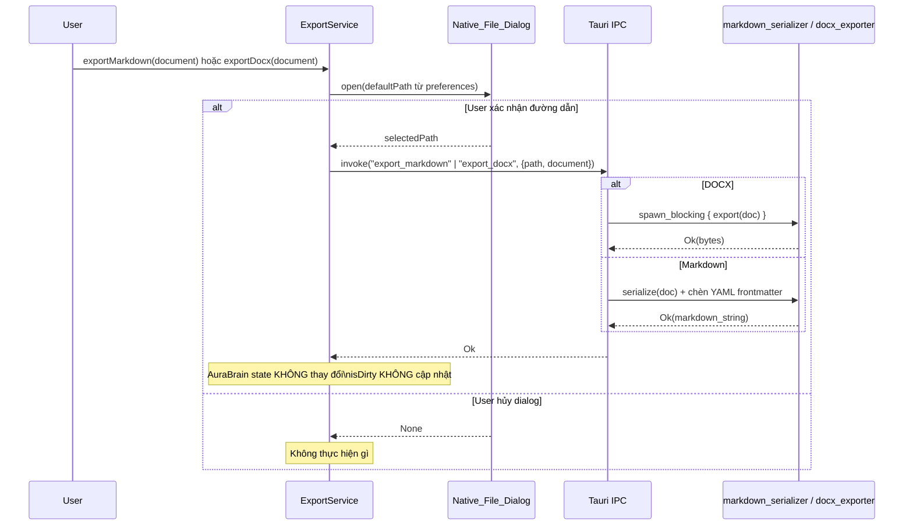
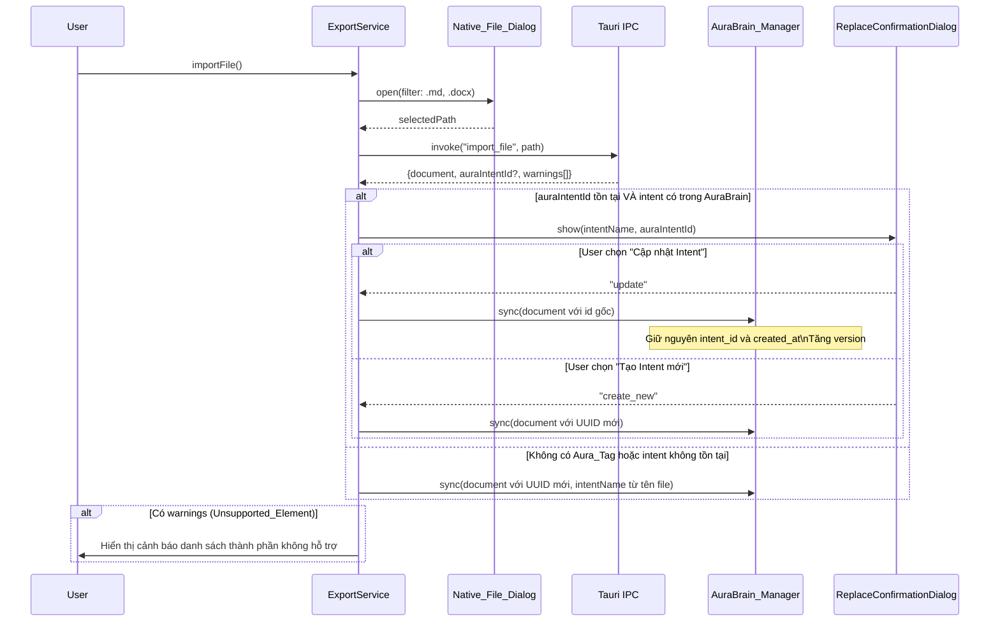

# Design Document: AuraBrain Persistence & Legacy Export

## Tổng quan

WordAI không phải là text editor lưu file truyền thống. WordAI là một **Intent Engine** — nơi người dùng viết ra "ý niệm" (intent), và hệ thống tự động lưu trữ, tổ chức chúng trong một local database ẩn gọi là **AuraBrain** (SQLite).

`Cmd+S` có nghĩa là "đồng bộ ý niệm vào AuraBrain" — không phải "lưu file". Người dùng không bao giờ thấy đường dẫn file, không bao giờ cần nhớ "lưu vào thư mục nào". Xuất ra `.md` hay `.docx` là tính năng **Legacy Export**, dành cho khi cần chia sẻ với các công cụ bên ngoài (Word, GitHub, Obsidian).

**Quyết định thiết kế quan trọng:**

- **SQLite thay vì file**: SQLite ghi nhẹ hơn DOCX nhiều lần, hỗ trợ transaction atomicity, WAL mode cho concurrent reads, và sẵn sàng cho semantic search (vector embedding) trong tương lai.
- **WAL mode**: Write-Ahead Logging cho phép đọc đồng thời trong khi đang ghi, không block UI thread khi sync.
- **Sync_Queue max 1 entry (last-write-wins)**: Người dùng chỉ quan tâm đến trạng thái mới nhất. Giữ nhiều entry trong queue là lãng phí — lệnh sync mới nhất luôn thay thế lệnh cũ.
- **Content_Hash (SHA-256)**: Dirty_Bit dựa trên hash thay vì flag đơn giản, cho phép phát hiện chính xác khi Undo về trạng thái đã sync.
- **Tách biệt Sync và Export**: Sync là silent background operation; Export là explicit user action với Native_File_Dialog.


## Kiến trúc




## Sequence Diagrams

### Luồng Intent Sync (Cmd+S) với Sync_Queue

```mermaid
sequenceDiagram
    participant User
    participant KB as Keyboard Handler
    participant ABM as AuraBrain_Manager
    participant IPC as Tauri IPC
    participant SS as SQLite_Store
    participant DTB as DocumentTitleBar

    User->>KB: Nhấn Cmd+S
    KB->>ABM: sync(document)
    
    alt isSyncing = false
        ABM->>ABM: isSyncing = true
        ABM->>IPC: invoke("sync_intent", document)
        IPC->>SS: upsert_intent(intent) [transaction]
        SS-->>IPC: Ok(version)
        IPC-->>ABM: Ok(version)
        ABM->>ABM: lastSyncedHash = computeHash(content)
        ABM->>ABM: lastSyncedAt = Date.now()
        ABM->>ABM: isSyncing = false
        ABM->>DTB: isDirty = false
        
        alt syncQueue != null
            ABM->>ABM: entry = syncQueue; syncQueue = null
            ABM->>IPC: invoke("sync_intent", entry) [xử lý queue]
        end
    else isSyncing = true
        ABM->>ABM: syncQueue = document [thay thế entry cũ]
        Note over ABM: last-write-wins
    end
    
    alt Lỗi SQLite
        SS-->>IPC: Err(IPCError)
        IPC-->>ABM: Err
        ABM->>ABM: isSyncing = false
        ABM->>DTB: isDirty = true [giữ nguyên]
        ABM->>User: Hiển thị error notification
    end
```

### Luồng Auto-sync (interval + blur + debounce)



### Luồng Export to Markdown / DOCX



### Luồng Import with Aura_Tag Detection




## Components and Interfaces

### AuraBrain_Manager (TypeScript Service)

```typescript
// src/services/auraBrainManager.ts

interface SyncEntry {
  document: Document;
  enqueuedAt: number;
}

interface SyncResult {
  success: boolean;
  version?: number;
  error?: string;
}

interface AuraBrainState {
  isSyncing: boolean;
  syncQueue: SyncEntry | null;   // max 1 entry, last-write-wins
  lastSyncedHash: string | null; // SHA-256 hex của content lần sync gần nhất
  lastSyncedAt: number | null;   // timestamp ms của lần sync gần nhất
}

interface AuraBrainManager {
  // State (reactive)
  readonly state: AuraBrainState;

  // Đồng bộ document vào AuraBrain SQLite
  // Nếu isSyncing=true: đưa vào syncQueue (thay thế entry cũ)
  // Nếu isSyncing=false: thực thi ngay, sau đó xử lý queue nếu có
  sync(document: Document): Promise<SyncResult>;

  // Kiểm tra nội dung hiện tại có khác với lần sync gần nhất không
  isDirty(currentContent: string): boolean;

  // Tính SHA-256 hash của content dùng Web Crypto API
  computeContentHash(content: string): Promise<string>;
}
```

**Implement `computeContentHash` với Web Crypto API:**

```typescript
async function computeContentHash(content: string): Promise<string> {
  const encoder = new TextEncoder();
  const data = encoder.encode(content);
  const hashBuffer = await crypto.subtle.digest('SHA-256', data);
  const hashArray = Array.from(new Uint8Array(hashBuffer));
  return hashArray.map(b => b.toString(16).padStart(2, '0')).join('');
}
```

### DocumentTitleBar (React Component)

```typescript
// src/components/DocumentTitleBar.tsx

interface DocumentTitleBarProps {
  intentName: string | null;  // null → hiển thị "Untitled Intent"
  isDirty: boolean;           // true → hiển thị ● trước tên
  isSyncing: boolean;         // true → hiển thị spinner nhỏ (optional UX)
}

// Render logic:
// isDirty=true  → "● {intentName} — WordAI"
// isDirty=false → "{intentName} — WordAI"
// intentName=null → "Untitled Intent — WordAI"
// KHÔNG BAO GIỜ hiển thị đường dẫn file hay path separator
```

### ExportService (TypeScript Service)

```typescript
// src/services/exportService.ts

interface ExportService {
  // Mở Native_File_Dialog → gọi IPC export_markdown
  // Không thay đổi AuraBrain state sau khi export
  exportMarkdown(document: Document): Promise<void>;

  // Mở Native_File_Dialog → gọi IPC export_docx (Background_Worker)
  // Không thay đổi AuraBrain state sau khi export
  exportDocx(document: Document): Promise<void>;

  // Mở Native_File_Dialog (filter: .md, .docx)
  // Detect Aura_Tag → hiển thị ReplaceConfirmationDialog nếu cần
  importFile(): Promise<void>;
}
```

### ReplaceConfirmationDialog (React Component)

```typescript
// src/components/ReplaceConfirmationDialog.tsx

interface ReplaceConfirmationDialogProps {
  isOpen: boolean;
  intentName: string;          // Tên của Intent đang bị conflict
  auraIntentId: string;        // UUID của Intent gốc
  onUpdateIntent: () => void;  // User chọn "Cập nhật Intent"
  onCreateNew: () => void;     // User chọn "Tạo Intent mới"
  onCancel: () => void;
}
```

### useAutoSync (React Hook)

```typescript
// src/hooks/useAutoSync.ts

interface UseAutoSyncOptions {
  document: Document;
  auraBrainManager: AuraBrainManager;
  autoSyncEnabled: boolean;
  autoSyncInterval: number; // giây, range [5, 60]
}

// Thiết lập interval timer gọi auraBrainManager.sync()
// Lắng nghe window blur event → trigger sync ngay lập tức
// Debounce: bỏ qua blur-triggered sync nếu Date.now() - lastSyncedAt < 2000ms
// Bỏ qua nếu isSyncing = true
function useAutoSync(options: UseAutoSyncOptions): void;
```


## Data Models

### SQLite Schema (AuraBrain)

```sql
-- Bật WAL mode để tối ưu concurrent reads
PRAGMA journal_mode=WAL;

-- Bảng chính lưu trữ intent/document
CREATE TABLE IF NOT EXISTS intents (
    id          TEXT PRIMARY KEY,           -- UUID v4
    intent_name TEXT NOT NULL DEFAULT '',
    raw_content TEXT NOT NULL DEFAULT '',
    created_at  INTEGER NOT NULL,           -- Unix timestamp ms
    updated_at  INTEGER NOT NULL,           -- Unix timestamp ms
    version     INTEGER NOT NULL DEFAULT 1  -- Tăng mỗi lần upsert thành công
);

-- Bảng lưu chunks để chuẩn bị cho semantic search
CREATE TABLE IF NOT EXISTS intent_chunks (
    id          TEXT PRIMARY KEY,           -- UUID v4
    document_id TEXT NOT NULL REFERENCES intents(id) ON DELETE CASCADE,
    chunk_index INTEGER NOT NULL,
    chunk_text  TEXT NOT NULL,
    embedding   BLOB                        -- NULL cho đến khi AI model được tích hợp
);

CREATE INDEX IF NOT EXISTS idx_intent_chunks_document_id ON intent_chunks(document_id);
```

**Lý do chọn SQLite + WAL:**
- WAL mode: readers không bị block bởi writer, phù hợp với auto-sync background
- Transaction atomicity: ghi document + chunks trong một transaction, rollback nếu thất bại
- `embedding BLOB nullable`: sẵn sàng cho vector search mà không cần migration sau này

### Rust Data Models

```rust
// src-tauri/src/models.rs (bổ sung)

use serde::{Deserialize, Serialize};

/// Document object truyền qua IPC
#[derive(Debug, Serialize, Deserialize, Clone)]
pub struct Document {
    pub id: String,           // UUID v4
    pub intent_name: String,
    pub content: Vec<DocumentBlock>,
    pub version: Option<i64>,
    pub created_at: Option<i64>,
    pub updated_at: Option<i64>,
}

/// Các loại block trong document
#[derive(Debug, Serialize, Deserialize, Clone)]
#[serde(tag = "type", rename_all = "snake_case")]
pub enum DocumentBlock {
    Paragraph { text: String, inline: Vec<InlineSpan> },
    Heading { level: u8, text: String },           // level 1-6
    ListItem { ordered: bool, text: String, inline: Vec<InlineSpan> },
    CodeBlock { language: Option<String>, code: String },
    Placeholder(DocxPlaceholder),                  // Unsupported_Element từ DOCX
}

/// Inline formatting spans
#[derive(Debug, Serialize, Deserialize, Clone)]
#[serde(tag = "kind", rename_all = "snake_case")]
pub enum InlineSpan {
    Text { text: String },
    Bold { text: String },
    Italic { text: String },
    Code { text: String },
    BoldItalic { text: String },
}

/// Placeholder cho Unsupported_Element khi import DOCX
#[derive(Debug, Serialize, Deserialize, Clone)]
pub struct DocxPlaceholder {
    pub element_type: String,   // "table", "image", "comment", v.v.
    pub raw_xml: String,        // XML gốc để khôi phục khi export lại
    pub display_hint: String,   // Mô tả hiển thị cho người dùng
}

/// Kết quả import file
#[derive(Debug, Serialize, Deserialize)]
pub struct ImportResult {
    pub document: Document,
    pub aura_intent_id: Option<String>,  // UUID nếu file có Aura_Tag
    pub warnings: Vec<String>,           // Danh sách Unsupported_Element
}
```

### Rust Module Signatures

```rust
// src-tauri/src/sqlite_store.rs

pub struct SqliteStore {
    conn: Arc<Mutex<Connection>>,
}

impl SqliteStore {
    /// Khởi tạo DB tại platform-specific path, bật WAL mode, tạo schema
    pub fn new(app_handle: &AppHandle) -> Result<Self, IPCError>;

    /// Ghi document + chunks trong một transaction duy nhất
    /// Tăng version mỗi lần thành công
    pub fn upsert_intent(&self, doc: &Document) -> Result<i64, IPCError>;

    /// Lấy intent theo id (kèm raw_content)
    pub fn get_intent(&self, id: &str) -> Result<Option<Document>, IPCError>;

    /// Liệt kê tất cả intents (không kèm raw_content, chỉ metadata)
    pub fn list_intents(&self) -> Result<Vec<IntentSummary>, IPCError>;
}

// src-tauri/src/markdown_serializer.rs

/// Chuyển Document → Markdown string với YAML frontmatter Aura_Tag
/// Frontmatter: ---\naura_intent_id: {uuid}\naura_exported_at: {iso}\n---
pub fn serialize(doc: &Document) -> Result<String, IPCError>;

/// Parse Markdown string → Document
/// Đọc YAML frontmatter, extract aura_intent_id (không đưa vào raw_content)
/// Dùng pulldown-cmark
pub fn parse(markdown: &str) -> Result<(Document, Option<String>), IPCError>;

// src-tauri/src/docx_exporter.rs

/// Chuyển Document → DOCX bytes
/// Nhúng Aura_Tag vào Custom Document Properties: AuraIntentId, AuraExportedAt
/// Chạy trong tokio::task::spawn_blocking
pub async fn export(doc: &Document) -> Result<Vec<u8>, IPCError>;

/// Parse DOCX bytes → Document + danh sách warnings
/// Đọc Custom Document Properties để extract AuraIntentId
/// Chuyển Unsupported_Element → DocxPlaceholder
pub async fn import(bytes: &[u8]) -> Result<ImportResult, IPCError>;
```

### IPC Commands

```rust
// Đăng ký trong tauri::Builder

#[tauri::command]
async fn sync_intent(
    document: Document,
    state: State<'_, SqliteStore>,
) -> Result<i64, IPCError>;  // Trả về version mới

#[tauri::command]
async fn get_intent(
    id: String,
    state: State<'_, SqliteStore>,
) -> Result<Option<Document>, IPCError>;

#[tauri::command]
async fn list_intents(
    state: State<'_, SqliteStore>,
) -> Result<Vec<IntentSummary>, IPCError>;

#[tauri::command]
async fn export_markdown(
    path: String,
    document: Document,
) -> Result<(), IPCError>;

#[tauri::command]
async fn export_docx(
    path: String,
    document: Document,
) -> Result<(), IPCError>;

#[tauri::command]
async fn import_file(
    path: String,
) -> Result<ImportResult, IPCError>;
```


## Preferences Schema

```typescript
// Mở rộng src/types/preferences.ts

export interface Preferences {
  general: {
    theme: string;
    autoSave: { enabled: boolean; intervalMinutes: number };
    focusMode: boolean;
    language: string;
    // --- Các preferences mới cho AuraBrain Persistence & Legacy Export ---
    defaultExportPath: string;                    // Thư mục mặc định khi Export; "" = home dir
    defaultExportFormat: 'markdown' | 'docx';    // Định dạng export mặc định
    autoSyncEnabled: boolean;                     // Bật/tắt auto-sync vào AuraBrain
    autoSyncInterval: number;                     // Giây, range [5, 60]
  };
  // ... các tab khác giữ nguyên
}

export const defaultPreferences: Preferences = {
  general: {
    // ... giữ nguyên các field cũ
    defaultExportPath: '',
    defaultExportFormat: 'markdown',
    autoSyncEnabled: true,
    autoSyncInterval: 30,
  },
  // ...
};
```

**Validation cho `autoSyncInterval`:**

```typescript
// Trong PreferencesService hoặc setter
function validateAutoSyncInterval(value: number, previous: number): number {
  if (value < 5 || value > 60) {
    return previous; // Giữ nguyên giá trị hợp lệ trước đó
  }
  return value;
}
```

## SettingRegistry Entries

Bổ sung 4 `SettingEntry` mới vào `src/data/settingRegistry.ts`:

```typescript
// general.defaultExportPath
{
  id: 'general.defaultExportPath',
  label: 'Default Export Path',
  description: 'Thư mục mặc định khi xuất file ra Markdown hoặc DOCX',
  tab: 'general',
  keywords: ['export path', 'default folder', 'export location', 'thư mục xuất'],
  type: 'text',
  defaultValue: '',
},

// general.defaultExportFormat
{
  id: 'general.defaultExportFormat',
  label: 'Default Export Format',
  description: 'Định dạng file mặc định khi xuất document',
  tab: 'general',
  keywords: ['export format', 'file format', 'markdown', 'docx', 'định dạng xuất'],
  type: 'select',
  defaultValue: 'markdown',
},

// general.autoSyncEnabled
{
  id: 'general.autoSyncEnabled',
  label: 'Auto Sync',
  description: 'Tự động đồng bộ ý niệm vào AuraBrain theo định kỳ',
  tab: 'general',
  keywords: ['auto sync', 'autosync', 'automatic sync', 'tự động đồng bộ'],
  type: 'toggle',
  defaultValue: true,
},

// general.autoSyncInterval
{
  id: 'general.autoSyncInterval',
  label: 'Auto Sync Interval',
  description: 'Khoảng thời gian giữa các lần auto-sync (5–60 giây)',
  tab: 'general',
  keywords: ['auto sync interval', 'sync frequency', 'autosync timer', 'khoảng thời gian đồng bộ'],
  type: 'number',
  defaultValue: 30,
},
```


## Aura_Tag Format

### Markdown — YAML Frontmatter

```markdown
---
aura_intent_id: 550e8400-e29b-41d4-a716-446655440000
aura_exported_at: 2025-01-15T10:30:00.000Z
---

# Nội dung document bắt đầu từ đây

...
```

- Đặt ở đầu file, trước mọi nội dung
- `aura_intent_id`: UUID v4 của Intent trong AuraBrain
- `aura_exported_at`: ISO 8601 timestamp
- Khi parse: extract hai trường này, **không** đưa vào `raw_content` của Document
- Tương thích với Obsidian, VSCode, GitHub — hiển thị như metadata bình thường

### DOCX — Custom Document Properties

```
Property Name: AuraIntentId
Property Value: 550e8400-e29b-41d4-a716-446655440000

Property Name: AuraExportedAt
Property Value: 2025-01-15T10:30:00.000Z
```

- Lưu trong `docProps/custom.xml` theo chuẩn Office Open XML
- **Không hiển thị** trong nội dung văn bản khi mở bằng Microsoft Word
- Khi import: đọc từ Custom Document Properties, không phải từ body text


## Correctness Properties

*A property là một đặc tính hoặc hành vi phải đúng trong mọi lần thực thi hợp lệ của hệ thống — về cơ bản là một phát biểu hình thức về những gì hệ thống phải làm. Properties là cầu nối giữa đặc tả dạng ngôn ngữ tự nhiên và các đảm bảo tính đúng đắn có thể kiểm chứng tự động.*

---

### Property 1: Post-sync State Invariant

*Với mọi* document hợp lệ, sau khi `sync()` hoàn tất thành công, `lastSyncedHash` phải bằng SHA-256 hash của content vừa sync, và `isDirty(content)` phải trả về `false`.

**Validates: Requirements 1.2, 1.3, 4.1**

---

### Property 2: Sync_Queue Last-Write-Wins

*Với mọi* chuỗi lệnh sync đến khi `isSyncing = true`, `syncQueue` chỉ được chứa lệnh mới nhất — mọi lệnh trước đó bị thay thế. Sau khi sync hiện tại hoàn tất, lệnh trong queue phải được xử lý.

**Validates: Requirements 1.5, 1.6, 9.4, 9.5**

---

### Property 3: Transaction Atomicity

*Với mọi* thao tác `upsert_intent` bị gián đoạn giữa chừng (lỗi giữa ghi `intents` và ghi `intent_chunks`), database phải không chứa dữ liệu nửa vời — hoặc cả hai bảng được ghi thành công, hoặc không bảng nào thay đổi.

**Validates: Requirements 1.7, 5.4, 5.5, 9.1**

---

### Property 4: Hash-Based Dirty Detection

*Với mọi* cặp (content_A, content_B) trong đó content_A ≠ content_B, `isDirty` phải trả về `true` khi `lastSyncedHash` là hash của content_A và content hiện tại là content_B. Ngược lại, nếu content hiện tại bằng content_A, `isDirty` phải trả về `false`.

**Validates: Requirements 4.2, 4.3, 4.4, 4.5**

---

### Property 5: Auto-sync Debounce

*Với mọi* blur event xảy ra trong vòng 2000ms sau lần sync gần nhất (`Date.now() - lastSyncedAt < 2000`), `useAutoSync` phải không gọi `sync()`. Với blur event xảy ra sau 2000ms, `sync()` phải được gọi (nếu `isSyncing = false`).

**Validates: Requirements 2.2, 2.6, 2.7**

---

### Property 6: Title Bar Format Invariant

*Với mọi* giá trị `intentName` (kể cả null) và `isDirty` (true/false), `DocumentTitleBar` phải render đúng format: `"[●] {intentName|'Untitled Intent'} — WordAI"`, và **không bao giờ** chứa ký tự path separator (`/` hoặc `\`).

**Validates: Requirements 3.1, 3.2, 3.3, 3.4, 3.7**

---

### Property 7: Version Monotonically Increasing

*Với mọi* chuỗi `upsert_intent` thành công trên cùng một intent, `version` phải tăng đơn điệu — mỗi lần upsert thành công, `version` mới phải lớn hơn `version` trước đó đúng 1.

**Validates: Requirements 5.6**

---

### Property 8: Markdown Round-Trip

*Với mọi* `Document` object hợp lệ (chứa Paragraph, Heading, ListItem, CodeBlock), `parse(serialize(doc))` phải tạo ra Document có nội dung văn bản và cấu trúc heading tương đương với document gốc.

**Validates: Requirements 11.1, 11.3**

---

### Property 9: DOCX Round-Trip

*Với mọi* `Document` object hợp lệ chứa các thành phần WordAI hỗ trợ (không có Placeholder), `import(export(doc))` phải bảo toàn toàn bộ nội dung văn bản và cấu trúc heading.

**Validates: Requirements 11.2**

---

### Property 10: Aura_Tag Round-Trip Preservation

*Với mọi* document có `intent_id`, sau khi export (Markdown hoặc DOCX) rồi import lại, `aura_intent_id` trong kết quả import phải bằng `intent_id` gốc — Aura_Tag không bị mất hay thay đổi qua round-trip.

**Validates: Requirements 6.8, 7.8, 11.8**

---

### Property 11: autoSyncInterval Validation

*Với mọi* giá trị `v` được set cho `autoSyncInterval`, nếu `v < 5` hoặc `v > 60`, giá trị được lưu trong preferences phải bằng giá trị hợp lệ trước đó (không phải `v`).

**Validates: Requirements 10.4, 10.5**


## Error Handling

| Tình huống | Hành vi |
|---|---|
| SQLite transaction thất bại | Rollback toàn bộ, trả về `IPCError`, giữ nguyên `isDirty = true`, hiển thị error notification |
| Ghi file export thất bại | Hiển thị thông báo lỗi mô tả rõ nguyên nhân, không thay đổi AuraBrain state |
| User hủy Native_File_Dialog | Không thực hiện gì, không có side effect |
| File import không đọc được | Hiển thị lỗi, không tạo hay cập nhật Intent nào |
| Markdown cú pháp không hợp lệ | Trả về lỗi mô tả vị trí lỗi trong file |
| DOCX chứa Unsupported_Element | Chuyển thành Placeholder, hiển thị cảnh báo danh sách loại thành phần |
| `autoSyncInterval` ngoài [5, 60] | Từ chối giá trị, giữ nguyên giá trị hợp lệ trước đó |
| DOCX export thất bại | Không tạo file không hợp lệ, trả về lỗi qua IPC |
| Auto-sync thất bại | Hiển thị non-blocking notification, giữ nguyên `isDirty = true` |

## Testing Strategy

### Dual Testing Approach

Cả unit test và property-based test đều cần thiết và bổ sung cho nhau:
- **Unit tests**: kiểm tra các ví dụ cụ thể, edge cases, và error conditions
- **Property tests**: kiểm tra các invariant phổ quát trên nhiều input ngẫu nhiên

### Unit Tests

Tập trung vào:
- `DocumentTitleBar`: render đúng format với các tổ hợp props
- `ReplaceConfirmationDialog`: hiển thị đúng khi có Aura_Tag conflict
- `SqliteStore.new()`: DB được tạo đúng path, WAL mode được bật
- Import flow: phát hiện Aura_Tag và routing đúng (update vs create new)
- SettingRegistry: QuickSearch với "auto sync" và "export" trả về đúng entries

### Property-Based Tests

Sử dụng **fast-check** (TypeScript) và **proptest** (Rust). Mỗi test chạy tối thiểu **100 iterations**.

Mỗi property test phải có comment tag theo format:
`// Feature: file-save-management, Property {N}: {property_text}`

| Property | Test | Library |
|---|---|---|
| Property 1: Post-sync State Invariant | Generate random Document, sync, kiểm tra hash và isDirty | fast-check |
| Property 2: Sync_Queue Last-Write-Wins | Generate N sync commands khi isSyncing=true, kiểm tra queue chỉ giữ lệnh cuối | fast-check |
| Property 3: Transaction Atomicity | Inject lỗi giữa chừng upsert, kiểm tra DB không có dữ liệu nửa vời | proptest |
| Property 4: Hash-Based Dirty Detection | Generate cặp (content_A, content_B), kiểm tra isDirty logic | fast-check |
| Property 5: Auto-sync Debounce | Generate timestamps, kiểm tra debounce window 2000ms | fast-check |
| Property 6: Title Bar Format Invariant | Generate random intentName + isDirty, kiểm tra format và không có path separator | fast-check |
| Property 7: Version Monotonically Increasing | Generate N upserts, kiểm tra version tăng đơn điệu | proptest |
| Property 8: Markdown Round-Trip | Generate random Document, serialize → parse, kiểm tra content tương đương | proptest |
| Property 9: DOCX Round-Trip | Generate random Document (không có Placeholder), export → import, kiểm tra content | proptest |
| Property 10: Aura_Tag Round-Trip | Generate random intent_id, export → import, kiểm tra aura_intent_id bảo toàn | proptest |
| Property 11: autoSyncInterval Validation | Generate random numbers, kiểm tra validation reject ngoài [5, 60] | fast-check |
