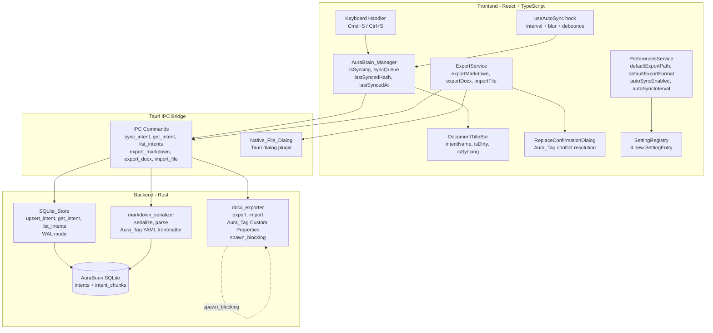
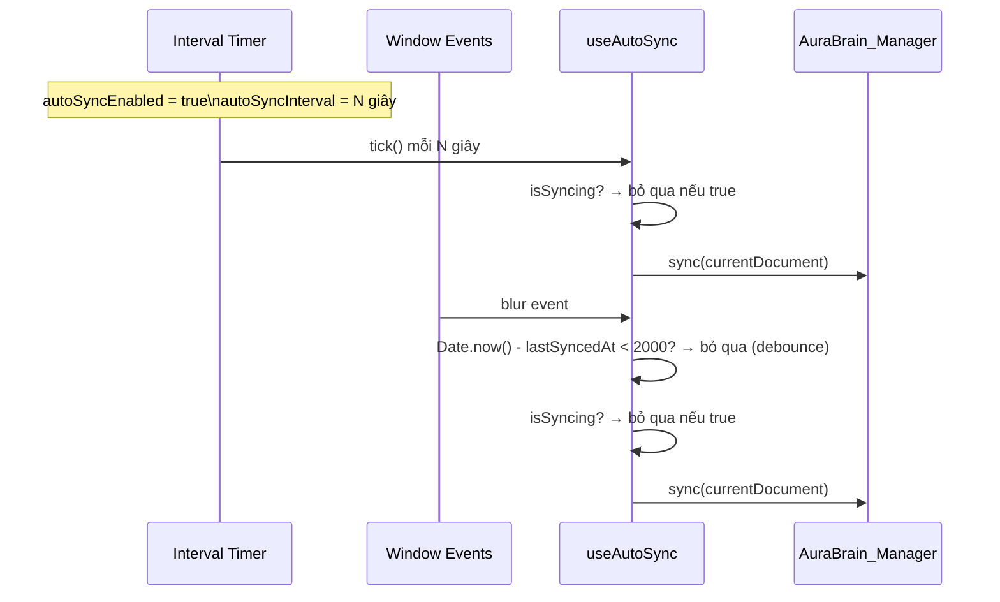
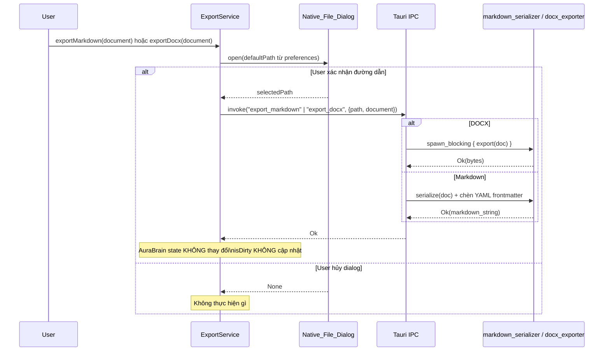
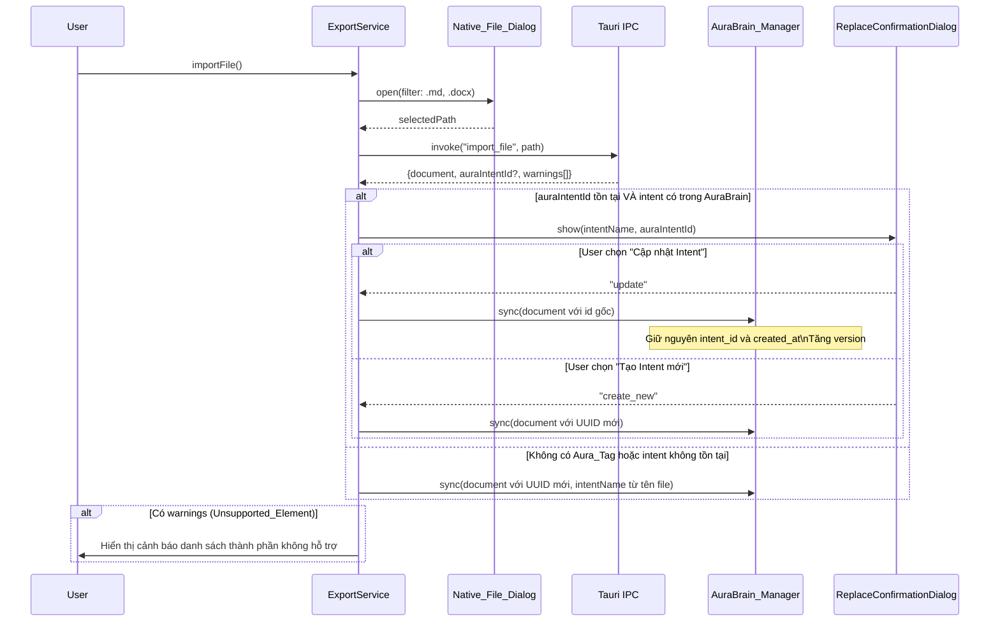
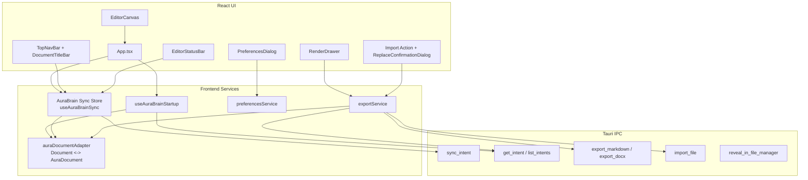
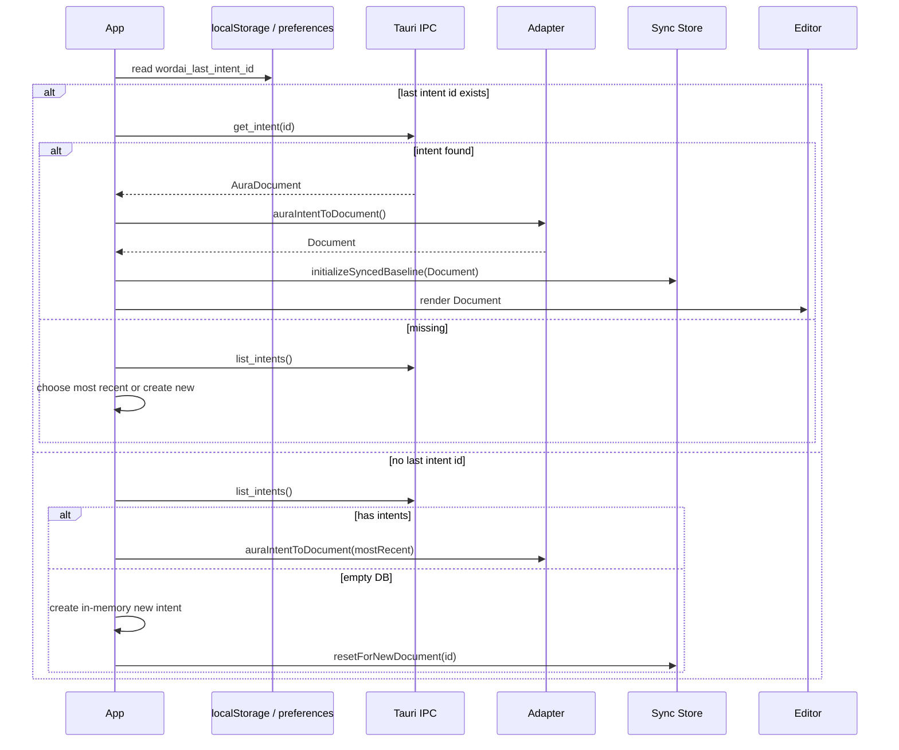
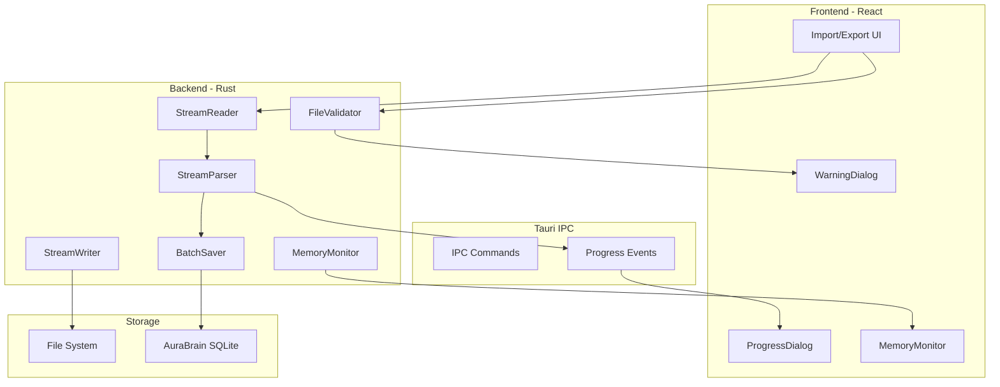
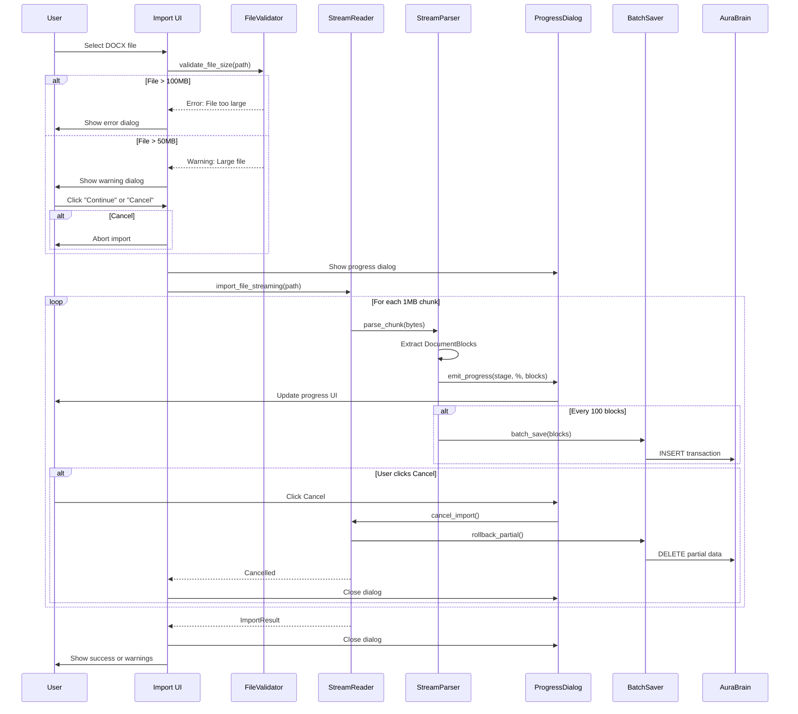

# Design Document: AuraBrain Persistence & Legacy Export

## Tổng quan

WordAI không phải là text editor lưu file truyền thống. WordAI là một **Intent Engine** — nơi người dùng viết ra "ý niệm" (intent), và hệ thống tự động lưu trữ, tổ chức chúng trong một local database ẩn gọi là **AuraBrain** (SQLite).

`Cmd+S` có nghĩa là "đồng bộ ý niệm vào AuraBrain" — không phải "lưu file". Người dùng không bao giờ thấy đường dẫn file, không bao giờ cần nhớ "lưu vào thư mục nào". Xuất ra `.md` hay `.docx` là tính năng **Legacy Export**, dành cho khi cần chia sẻ với các công cụ bên ngoài (Word, GitHub, Obsidian).

**Quyết định thiết kế quan trọng:**

- **SQLite thay vì file**: SQLite ghi nhẹ hơn DOCX nhiều lần, hỗ trợ transaction atomicity, WAL mode cho concurrent reads, và sẵn sàng cho semantic search (vector embedding) trong tương lai.
- **WAL mode**: Write-Ahead Logging cho phép đọc đồng thời trong khi đang ghi, không block UI thread khi sync.
- **Sync_Queue max 1 entry (last-write-wins)**: Người dùng chỉ quan tâm đến trạng thái mới nhất. Giữ nhiều entry trong queue là lãng phí — lệnh sync mới nhất luôn thay thế lệnh cũ.
- **Content_Hash (SHA-256)**: Dirty_Bit dựa trên hash thay vì flag đơn giản, cho phép phát hiện chính xác khi Undo về trạng thái đã sync.
- **Tách biệt Sync và Export**: Sync là silent background operation; Export là explicit user action với Native_File_Dialog.


## Kiến trúc




## Sequence Diagrams

### Luồng Intent Sync (Cmd+S) với Sync_Queue

```mermaid
sequenceDiagram
    participant User
    participant KB as Keyboard Handler
    participant ABM as AuraBrain_Manager
    participant IPC as Tauri IPC
    participant SS as SQLite_Store
    participant DTB as DocumentTitleBar

    User->>KB: Nhấn Cmd+S
    KB->>ABM: sync(document)
    
    alt isSyncing = false
        ABM->>ABM: isSyncing = true
        ABM->>IPC: invoke("sync_intent", document)
        IPC->>SS: upsert_intent(intent) [transaction]
        SS-->>IPC: Ok(version)
        IPC-->>ABM: Ok(version)
        ABM->>ABM: lastSyncedHash = computeHash(content)
        ABM->>ABM: lastSyncedAt = Date.now()
        ABM->>ABM: isSyncing = false
        ABM->>DTB: isDirty = false
        
        alt syncQueue != null
            ABM->>ABM: entry = syncQueue; syncQueue = null
            ABM->>IPC: invoke("sync_intent", entry) [xử lý queue]
        end
    else isSyncing = true
        ABM->>ABM: syncQueue = document [thay thế entry cũ]
        Note over ABM: last-write-wins
    end
    
    alt Lỗi SQLite
        SS-->>IPC: Err(IPCError)
        IPC-->>ABM: Err
        ABM->>ABM: isSyncing = false
        ABM->>DTB: isDirty = true [giữ nguyên]
        ABM->>User: Hiển thị error notification
    end
```

### Luồng Auto-sync (interval + blur + debounce)



### Luồng Export to Markdown / DOCX



### Luồng Import with Aura_Tag Detection




## Components and Interfaces

### AuraBrain_Manager (TypeScript Service)

```typescript
// src/services/auraBrainManager.ts

interface SyncEntry {
  document: Document;
  enqueuedAt: number;
}

interface SyncResult {
  success: boolean;
  version?: number;
  error?: string;
}

interface AuraBrainState {
  isSyncing: boolean;
  syncQueue: SyncEntry | null;   // max 1 entry, last-write-wins
  lastSyncedHash: string | null; // SHA-256 hex của content lần sync gần nhất
  lastSyncedAt: number | null;   // timestamp ms của lần sync gần nhất
}

interface AuraBrainManager {
  // State (reactive)
  readonly state: AuraBrainState;

  // Đồng bộ document vào AuraBrain SQLite
  // Nếu isSyncing=true: đưa vào syncQueue (thay thế entry cũ)
  // Nếu isSyncing=false: thực thi ngay, sau đó xử lý queue nếu có
  sync(document: Document): Promise<SyncResult>;

  // Kiểm tra nội dung hiện tại có khác với lần sync gần nhất không
  isDirty(currentContent: string): boolean;

  // Tính SHA-256 hash của content dùng Web Crypto API
  computeContentHash(content: string): Promise<string>;
}
```

**Implement `computeContentHash` với Web Crypto API:**

```typescript
async function computeContentHash(content: string): Promise<string> {
  const encoder = new TextEncoder();
  const data = encoder.encode(content);
  const hashBuffer = await crypto.subtle.digest('SHA-256', data);
  const hashArray = Array.from(new Uint8Array(hashBuffer));
  return hashArray.map(b => b.toString(16).padStart(2, '0')).join('');
}
```

### DocumentTitleBar (React Component)

```typescript
// src/components/DocumentTitleBar.tsx

interface DocumentTitleBarProps {
  intentName: string | null;  // null → hiển thị "Untitled Intent"
  isDirty: boolean;           // true → hiển thị ● trước tên
  isSyncing: boolean;         // true → hiển thị spinner nhỏ (optional UX)
}

// Render logic:
// isDirty=true  → "● {intentName} — WordAI"
// isDirty=false → "{intentName} — WordAI"
// intentName=null → "Untitled Intent — WordAI"
// KHÔNG BAO GIỜ hiển thị đường dẫn file hay path separator
```

### ExportService (TypeScript Service)

```typescript
// src/services/exportService.ts

interface ExportService {
  // Mở Native_File_Dialog → gọi IPC export_markdown
  // Không thay đổi AuraBrain state sau khi export
  exportMarkdown(document: Document): Promise<void>;

  // Mở Native_File_Dialog → gọi IPC export_docx (Background_Worker)
  // Không thay đổi AuraBrain state sau khi export
  exportDocx(document: Document): Promise<void>;

  // Mở Native_File_Dialog (filter: .md, .docx)
  // Detect Aura_Tag → hiển thị ReplaceConfirmationDialog nếu cần
  importFile(): Promise<void>;
}
```

### ReplaceConfirmationDialog (React Component)

```typescript
// src/components/ReplaceConfirmationDialog.tsx

interface ReplaceConfirmationDialogProps {
  isOpen: boolean;
  intentName: string;          // Tên của Intent đang bị conflict
  auraIntentId: string;        // UUID của Intent gốc
  onUpdateIntent: () => void;  // User chọn "Cập nhật Intent"
  onCreateNew: () => void;     // User chọn "Tạo Intent mới"
  onCancel: () => void;
}
```

### useAutoSync (React Hook)

```typescript
// src/hooks/useAutoSync.ts

interface UseAutoSyncOptions {
  document: Document;
  auraBrainManager: AuraBrainManager;
  autoSyncEnabled: boolean;
  autoSyncInterval: number; // giây, range [5, 60]
}

// Thiết lập interval timer gọi auraBrainManager.sync()
// Lắng nghe window blur event → trigger sync ngay lập tức
// Debounce: bỏ qua blur-triggered sync nếu Date.now() - lastSyncedAt < 2000ms
// Bỏ qua nếu isSyncing = true
function useAutoSync(options: UseAutoSyncOptions): void;
```


## Data Models

### SQLite Schema (AuraBrain)

```sql
-- Bật WAL mode để tối ưu concurrent reads
PRAGMA journal_mode=WAL;

-- Bảng chính lưu trữ intent/document
CREATE TABLE IF NOT EXISTS intents (
    id          TEXT PRIMARY KEY,           -- UUID v4
    intent_name TEXT NOT NULL DEFAULT '',
    raw_content TEXT NOT NULL DEFAULT '',
    created_at  INTEGER NOT NULL,           -- Unix timestamp ms
    updated_at  INTEGER NOT NULL,           -- Unix timestamp ms
    version     INTEGER NOT NULL DEFAULT 1  -- Tăng mỗi lần upsert thành công
);

-- Bảng lưu chunks để chuẩn bị cho semantic search
CREATE TABLE IF NOT EXISTS intent_chunks (
    id          TEXT PRIMARY KEY,           -- UUID v4
    document_id TEXT NOT NULL REFERENCES intents(id) ON DELETE CASCADE,
    chunk_index INTEGER NOT NULL,
    chunk_text  TEXT NOT NULL,
    embedding   BLOB                        -- NULL cho đến khi AI model được tích hợp
);

CREATE INDEX IF NOT EXISTS idx_intent_chunks_document_id ON intent_chunks(document_id);
```

**Lý do chọn SQLite + WAL:**
- WAL mode: readers không bị block bởi writer, phù hợp với auto-sync background
- Transaction atomicity: ghi document + chunks trong một transaction, rollback nếu thất bại
- `embedding BLOB nullable`: sẵn sàng cho vector search mà không cần migration sau này

### Rust Data Models

```rust
// src-tauri/src/models.rs (bổ sung)

use serde::{Deserialize, Serialize};

/// Document object truyền qua IPC
#[derive(Debug, Serialize, Deserialize, Clone)]
pub struct Document {
    pub id: String,           // UUID v4
    pub intent_name: String,
    pub content: Vec<DocumentBlock>,
    pub version: Option<i64>,
    pub created_at: Option<i64>,
    pub updated_at: Option<i64>,
}

/// Các loại block trong document
#[derive(Debug, Serialize, Deserialize, Clone)]
#[serde(tag = "type", rename_all = "snake_case")]
pub enum DocumentBlock {
    Paragraph { text: String, inline: Vec<InlineSpan> },
    Heading { level: u8, text: String },           // level 1-6
    ListItem { ordered: bool, text: String, inline: Vec<InlineSpan> },
    CodeBlock { language: Option<String>, code: String },
    Placeholder(DocxPlaceholder),                  // Unsupported_Element từ DOCX
}

/// Inline formatting spans
#[derive(Debug, Serialize, Deserialize, Clone)]
#[serde(tag = "kind", rename_all = "snake_case")]
pub enum InlineSpan {
    Text { text: String },
    Bold { text: String },
    Italic { text: String },
    Code { text: String },
    BoldItalic { text: String },
}

/// Placeholder cho Unsupported_Element khi import DOCX
#[derive(Debug, Serialize, Deserialize, Clone)]
pub struct DocxPlaceholder {
    pub element_type: String,   // "table", "image", "comment", v.v.
    pub raw_xml: String,        // XML gốc để khôi phục khi export lại
    pub display_hint: String,   // Mô tả hiển thị cho người dùng
}

/// Kết quả import file
#[derive(Debug, Serialize, Deserialize)]
pub struct ImportResult {
    pub document: Document,
    pub aura_intent_id: Option<String>,  // UUID nếu file có Aura_Tag
    pub warnings: Vec<String>,           // Danh sách Unsupported_Element
}
```

### Rust Module Signatures

```rust
// src-tauri/src/sqlite_store.rs

pub struct SqliteStore {
    conn: Arc<Mutex<Connection>>,
}

impl SqliteStore {
    /// Khởi tạo DB tại platform-specific path, bật WAL mode, tạo schema
    pub fn new(app_handle: &AppHandle) -> Result<Self, IPCError>;

    /// Ghi document + chunks trong một transaction duy nhất
    /// Tăng version mỗi lần thành công
    pub fn upsert_intent(&self, doc: &Document) -> Result<i64, IPCError>;

    /// Lấy intent theo id (kèm raw_content)
    pub fn get_intent(&self, id: &str) -> Result<Option<Document>, IPCError>;

    /// Liệt kê tất cả intents (không kèm raw_content, chỉ metadata)
    pub fn list_intents(&self) -> Result<Vec<IntentSummary>, IPCError>;
}

// src-tauri/src/markdown_serializer.rs

/// Chuyển Document → Markdown string với YAML frontmatter Aura_Tag
/// Frontmatter: ---\naura_intent_id: {uuid}\naura_exported_at: {iso}\n---
pub fn serialize(doc: &Document) -> Result<String, IPCError>;

/// Parse Markdown string → Document
/// Đọc YAML frontmatter, extract aura_intent_id (không đưa vào raw_content)
/// Dùng pulldown-cmark
pub fn parse(markdown: &str) -> Result<(Document, Option<String>), IPCError>;

// src-tauri/src/docx_exporter.rs

/// Chuyển Document → DOCX bytes
/// Nhúng Aura_Tag vào Custom Document Properties: AuraIntentId, AuraExportedAt
/// Chạy trong tokio::task::spawn_blocking
pub async fn export(doc: &Document) -> Result<Vec<u8>, IPCError>;

/// Parse DOCX bytes → Document + danh sách warnings
/// Đọc Custom Document Properties để extract AuraIntentId
/// Chuyển Unsupported_Element → DocxPlaceholder
pub async fn import(bytes: &[u8]) -> Result<ImportResult, IPCError>;
```

### IPC Commands

```rust
// Đăng ký trong tauri::Builder

#[tauri::command]
async fn sync_intent(
    document: Document,
    state: State<'_, SqliteStore>,
) -> Result<i64, IPCError>;  // Trả về version mới

#[tauri::command]
async fn get_intent(
    id: String,
    state: State<'_, SqliteStore>,
) -> Result<Option<Document>, IPCError>;

#[tauri::command]
async fn list_intents(
    state: State<'_, SqliteStore>,
) -> Result<Vec<IntentSummary>, IPCError>;

#[tauri::command]
async fn export_markdown(
    path: String,
    document: Document,
) -> Result<(), IPCError>;

#[tauri::command]
async fn export_docx(
    path: String,
    document: Document,
) -> Result<(), IPCError>;

#[tauri::command]
async fn import_file(
    path: String,
) -> Result<ImportResult, IPCError>;
```


## Preferences Schema

```typescript
// Mở rộng src/types/preferences.ts

export interface Preferences {
  general: {
    theme: string;
    autoSave: { enabled: boolean; intervalMinutes: number };
    focusMode: boolean;
    language: string;
    // --- Các preferences mới cho AuraBrain Persistence & Legacy Export ---
    defaultExportPath: string;                    // Thư mục mặc định khi Export; "" = home dir
    defaultExportFormat: 'markdown' | 'docx';    // Định dạng export mặc định
    autoSyncEnabled: boolean;                     // Bật/tắt auto-sync vào AuraBrain
    autoSyncInterval: number;                     // Giây, range [5, 60]
  };
  // ... các tab khác giữ nguyên
}

export const defaultPreferences: Preferences = {
  general: {
    // ... giữ nguyên các field cũ
    defaultExportPath: '',
    defaultExportFormat: 'markdown',
    autoSyncEnabled: true,
    autoSyncInterval: 30,
  },
  // ...
};
```

**Validation cho `autoSyncInterval`:**

```typescript
// Trong PreferencesService hoặc setter
function validateAutoSyncInterval(value: number, previous: number): number {
  if (value < 5 || value > 60) {
    return previous; // Giữ nguyên giá trị hợp lệ trước đó
  }
  return value;
}
```

## SettingRegistry Entries

Bổ sung 4 `SettingEntry` mới vào `src/data/settingRegistry.ts`:

```typescript
// general.defaultExportPath
{
  id: 'general.defaultExportPath',
  label: 'Default Export Path',
  description: 'Thư mục mặc định khi xuất file ra Markdown hoặc DOCX',
  tab: 'general',
  keywords: ['export path', 'default folder', 'export location', 'thư mục xuất'],
  type: 'text',
  defaultValue: '',
},

// general.defaultExportFormat
{
  id: 'general.defaultExportFormat',
  label: 'Default Export Format',
  description: 'Định dạng file mặc định khi xuất document',
  tab: 'general',
  keywords: ['export format', 'file format', 'markdown', 'docx', 'định dạng xuất'],
  type: 'select',
  defaultValue: 'markdown',
},

// general.autoSyncEnabled
{
  id: 'general.autoSyncEnabled',
  label: 'Auto Sync',
  description: 'Tự động đồng bộ ý niệm vào AuraBrain theo định kỳ',
  tab: 'general',
  keywords: ['auto sync', 'autosync', 'automatic sync', 'tự động đồng bộ'],
  type: 'toggle',
  defaultValue: true,
},

// general.autoSyncInterval
{
  id: 'general.autoSyncInterval',
  label: 'Auto Sync Interval',
  description: 'Khoảng thời gian giữa các lần auto-sync (5–60 giây)',
  tab: 'general',
  keywords: ['auto sync interval', 'sync frequency', 'autosync timer', 'khoảng thời gian đồng bộ'],
  type: 'number',
  defaultValue: 30,
},
```


## Aura_Tag Format

### Markdown — YAML Frontmatter

```markdown
---
aura_intent_id: 550e8400-e29b-41d4-a716-446655440000
aura_exported_at: 2025-01-15T10:30:00.000Z
---

# Nội dung document bắt đầu từ đây

...
```

- Đặt ở đầu file, trước mọi nội dung
- `aura_intent_id`: UUID v4 của Intent trong AuraBrain
- `aura_exported_at`: ISO 8601 timestamp
- Khi parse: extract hai trường này, **không** đưa vào `raw_content` của Document
- Tương thích với Obsidian, VSCode, GitHub — hiển thị như metadata bình thường

### DOCX — Custom Document Properties

```
Property Name: AuraIntentId
Property Value: 550e8400-e29b-41d4-a716-446655440000

Property Name: AuraExportedAt
Property Value: 2025-01-15T10:30:00.000Z
```

- Lưu trong `docProps/custom.xml` theo chuẩn Office Open XML
- **Không hiển thị** trong nội dung văn bản khi mở bằng Microsoft Word
- Khi import: đọc từ Custom Document Properties, không phải từ body text


## Correctness Properties

*A property là một đặc tính hoặc hành vi phải đúng trong mọi lần thực thi hợp lệ của hệ thống — về cơ bản là một phát biểu hình thức về những gì hệ thống phải làm. Properties là cầu nối giữa đặc tả dạng ngôn ngữ tự nhiên và các đảm bảo tính đúng đắn có thể kiểm chứng tự động.*

---

### Property 1: Post-sync State Invariant

*Với mọi* document hợp lệ, sau khi `sync()` hoàn tất thành công, `lastSyncedHash` phải bằng SHA-256 hash của content vừa sync, và `isDirty(content)` phải trả về `false`.

**Validates: Requirements 1.2, 1.3, 4.1**

---

### Property 2: Sync_Queue Last-Write-Wins

*Với mọi* chuỗi lệnh sync đến khi `isSyncing = true`, `syncQueue` chỉ được chứa lệnh mới nhất — mọi lệnh trước đó bị thay thế. Sau khi sync hiện tại hoàn tất, lệnh trong queue phải được xử lý.

**Validates: Requirements 1.5, 1.6, 9.4, 9.5**

---

### Property 3: Transaction Atomicity

*Với mọi* thao tác `upsert_intent` bị gián đoạn giữa chừng (lỗi giữa ghi `intents` và ghi `intent_chunks`), database phải không chứa dữ liệu nửa vời — hoặc cả hai bảng được ghi thành công, hoặc không bảng nào thay đổi.

**Validates: Requirements 1.7, 5.4, 5.5, 9.1**

---

### Property 4: Hash-Based Dirty Detection

*Với mọi* cặp (content_A, content_B) trong đó content_A ≠ content_B, `isDirty` phải trả về `true` khi `lastSyncedHash` là hash của content_A và content hiện tại là content_B. Ngược lại, nếu content hiện tại bằng content_A, `isDirty` phải trả về `false`.

**Validates: Requirements 4.2, 4.3, 4.4, 4.5**

---

### Property 5: Auto-sync Debounce

*Với mọi* blur event xảy ra trong vòng 2000ms sau lần sync gần nhất (`Date.now() - lastSyncedAt < 2000`), `useAutoSync` phải không gọi `sync()`. Với blur event xảy ra sau 2000ms, `sync()` phải được gọi (nếu `isSyncing = false`).

**Validates: Requirements 2.2, 2.6, 2.7**

---

### Property 6: Title Bar Format Invariant

*Với mọi* giá trị `intentName` (kể cả null) và `isDirty` (true/false), `DocumentTitleBar` phải render đúng format: `"[●] {intentName|'Untitled Intent'} — WordAI"`, và **không bao giờ** chứa ký tự path separator (`/` hoặc `\`).

**Validates: Requirements 3.1, 3.2, 3.3, 3.4, 3.7**

---

### Property 7: Version Monotonically Increasing

*Với mọi* chuỗi `upsert_intent` thành công trên cùng một intent, `version` phải tăng đơn điệu — mỗi lần upsert thành công, `version` mới phải lớn hơn `version` trước đó đúng 1.

**Validates: Requirements 5.6**

---

### Property 8: Markdown Round-Trip

*Với mọi* `Document` object hợp lệ (chứa Paragraph, Heading, ListItem, CodeBlock), `parse(serialize(doc))` phải tạo ra Document có nội dung văn bản và cấu trúc heading tương đương với document gốc.

**Validates: Requirements 11.1, 11.3**

---

### Property 9: DOCX Round-Trip

*Với mọi* `Document` object hợp lệ chứa các thành phần WordAI hỗ trợ (không có Placeholder), `import(export(doc))` phải bảo toàn toàn bộ nội dung văn bản và cấu trúc heading.

**Validates: Requirements 11.2**

---

### Property 10: Aura_Tag Round-Trip Preservation

*Với mọi* document có `intent_id`, sau khi export (Markdown hoặc DOCX) rồi import lại, `aura_intent_id` trong kết quả import phải bằng `intent_id` gốc — Aura_Tag không bị mất hay thay đổi qua round-trip.

**Validates: Requirements 6.8, 7.8, 11.8**

---

### Property 11: autoSyncInterval Validation

*Với mọi* giá trị `v` được set cho `autoSyncInterval`, nếu `v < 5` hoặc `v > 60`, giá trị được lưu trong preferences phải bằng giá trị hợp lệ trước đó (không phải `v`).

**Validates: Requirements 10.4, 10.5**


## Error Handling

| Tình huống | Hành vi |
|---|---|
| SQLite transaction thất bại | Rollback toàn bộ, trả về `IPCError`, giữ nguyên `isDirty = true`, hiển thị error notification |
| Ghi file export thất bại | Hiển thị thông báo lỗi mô tả rõ nguyên nhân, không thay đổi AuraBrain state |
| User hủy Native_File_Dialog | Không thực hiện gì, không có side effect |
| File import không đọc được | Hiển thị lỗi, không tạo hay cập nhật Intent nào |
| Markdown cú pháp không hợp lệ | Trả về lỗi mô tả vị trí lỗi trong file |
| DOCX chứa Unsupported_Element | Chuyển thành Placeholder, hiển thị cảnh báo danh sách loại thành phần |
| `autoSyncInterval` ngoài [5, 60] | Từ chối giá trị, giữ nguyên giá trị hợp lệ trước đó |
| DOCX export thất bại | Không tạo file không hợp lệ, trả về lỗi qua IPC |
| Auto-sync thất bại | Hiển thị non-blocking notification, giữ nguyên `isDirty = true` |

## Testing Strategy

### Dual Testing Approach

Cả unit test và property-based test đều cần thiết và bổ sung cho nhau:
- **Unit tests**: kiểm tra các ví dụ cụ thể, edge cases, và error conditions
- **Property tests**: kiểm tra các invariant phổ quát trên nhiều input ngẫu nhiên

### Unit Tests

Tập trung vào:
- `DocumentTitleBar`: render đúng format với các tổ hợp props
- `ReplaceConfirmationDialog`: hiển thị đúng khi có Aura_Tag conflict
- `SqliteStore.new()`: DB được tạo đúng path, WAL mode được bật
- Import flow: phát hiện Aura_Tag và routing đúng (update vs create new)
- SettingRegistry: QuickSearch với "auto sync" và "export" trả về đúng entries

### Property-Based Tests

Sử dụng **fast-check** (TypeScript) và **proptest** (Rust). Mỗi test chạy tối thiểu **100 iterations**.

Mỗi property test phải có comment tag theo format:
`// Feature: file-save-management, Property {N}: {property_text}`

| Property | Test | Library |
|---|---|---|
| Property 1: Post-sync State Invariant | Generate random Document, sync, kiểm tra hash và isDirty | fast-check |
| Property 2: Sync_Queue Last-Write-Wins | Generate N sync commands khi isSyncing=true, kiểm tra queue chỉ giữ lệnh cuối | fast-check |
| Property 3: Transaction Atomicity | Inject lỗi giữa chừng upsert, kiểm tra DB không có dữ liệu nửa vời | proptest |
| Property 4: Hash-Based Dirty Detection | Generate cặp (content_A, content_B), kiểm tra isDirty logic | fast-check |
| Property 5: Auto-sync Debounce | Generate timestamps, kiểm tra debounce window 2000ms | fast-check |
| Property 6: Title Bar Format Invariant | Generate random intentName + isDirty, kiểm tra format và không có path separator | fast-check |
| Property 7: Version Monotonically Increasing | Generate N upserts, kiểm tra version tăng đơn điệu | proptest |
| Property 8: Markdown Round-Trip | Generate random Document, serialize → parse, kiểm tra content tương đương | proptest |
| Property 9: DOCX Round-Trip | Generate random Document (không có Placeholder), export → import, kiểm tra content | proptest |
| Property 10: Aura_Tag Round-Trip | Generate random intent_id, export → import, kiểm tra aura_intent_id bảo toàn | proptest |
| Property 11: autoSyncInterval Validation | Generate random numbers, kiểm tra validation reject ngoài [5, 60] | fast-check |

---

## Completion Design Addendum: Production-Ready AuraBrain Workflow

Phần này bổ sung thiết kế hoàn thiện dựa trên trạng thái hiện tại của codebase: backend SQLite/serializer đã có, nhưng primary React workflow vẫn còn lẫn legacy file save, `useAutoSync` chưa được nối vào app, và frontend `Document` chưa khớp trực tiếp với Rust `AuraDocument`.

Mục tiêu của addendum:
- `Cmd+S` và auto-sync luôn ghi vào AuraBrain SQLite.
- Editor restore document từ AuraBrain, không từ legacy file path.
- Export/import Markdown/DOCX hoạt động từ UI hiện tại.
- TypeScript build sạch.
- Người dùng có thể tạo, viết, sync, đóng/mở lại, export và import mà không cần thao tác file save thủ công.

### Canonical Data Boundary

Hiện tại tồn tại hai model:

```typescript
// Legacy/current editor model
interface Document {
  id: string;
  title: string;
  content: string;
  metadata: DocumentMetadata;
  version: number;
  lastModified: Date;
}

// AuraBrain IPC model expected by Rust
interface AuraIntentDocument {
  id: string;
  intent_name: string;
  content: DocumentBlock[];
  version?: number;
  created_at?: number;
  updated_at?: number;
}
```

Không được truyền `Document` trực tiếp vào `sync_intent`, `export_markdown`, hoặc `export_docx`. Tất cả AuraBrain IPC phải đi qua adapter.

#### Adapter Module

Tạo module:

```text
src/services/auraDocumentAdapter.ts
```

Interface đề xuất:

```typescript
export type AuraDocumentBlock =
  | { type: 'paragraph'; text: string; inline: AuraInlineSpan[] }
  | { type: 'heading'; level: number; text: string }
  | { type: 'list_item'; ordered: boolean; text: string; inline: AuraInlineSpan[] }
  | { type: 'code_block'; language?: string | null; code: string }
  | { type: 'placeholder'; element_type: string; raw_xml: string; display_hint: string };

export type AuraInlineSpan =
  | { kind: 'text'; text: string }
  | { kind: 'bold'; text: string }
  | { kind: 'italic'; text: string }
  | { kind: 'code'; text: string }
  | { kind: 'bold_italic'; text: string };

export interface AuraIntentDocument {
  id: string;
  intent_name: string;
  content: AuraDocumentBlock[];
  version?: number | null;
  created_at?: number | null;
  updated_at?: number | null;
}

export interface AdapterWarning {
  code: 'MALFORMED_CONTENT' | 'UNSUPPORTED_BLOCK' | 'UNSUPPORTED_INLINE';
  message: string;
}

export interface AdapterResult<T> {
  value: T;
  warnings: AdapterWarning[];
}

export function documentToAuraIntent(document: Document): AdapterResult<AuraIntentDocument>;
export function auraIntentToDocument(intent: AuraIntentDocument): AdapterResult<Document>;
export function computeAuraPlainText(intent: AuraIntentDocument): string;
```

Parsing strategy cho `Document.content`:

1. Nếu `content` parse được thành block JSON từ editor hiện tại, map từng block sang `DocumentBlock`.
2. Nếu `content` là plain text, tạo một `Paragraph` block cho mỗi paragraph tách bằng blank line.
3. Nếu một dòng bắt đầu bằng `#`, `##`, ..., map thành heading.
4. Nếu một dòng bắt đầu bằng `- ` hoặc `* `, map thành unordered `ListItem`.
5. Nếu một dòng bắt đầu bằng `1. `, `2. `, ..., map thành ordered `ListItem`.
6. Nếu có fenced code block Markdown, map thành `CodeBlock`.
7. Nếu parse lỗi, fallback toàn bộ visible text thành một `Paragraph` và trả `AdapterWarning`.

Adapter phải là nơi duy nhất biết cả legacy `Document` và AuraBrain `AuraDocument`. Các service khác chỉ nhận hoặc trả một model rõ ràng.

### Updated Frontend Architecture



### Sync Store Design

`auraBrainManager` hiện có mutable module state nhưng React phải copy `isSyncing` và `lastSyncedAt` thủ công. Cần nâng cấp thành observable store.

Tạo hoặc mở rộng:

```text
src/services/auraBrainManager.ts
src/hooks/useAuraBrainSync.ts
```

State đề xuất:

```typescript
interface AuraBrainSyncState {
  activeDocumentId: string | null;
  isSyncing: boolean;
  queuedDocument: Document | null;
  lastSyncedHashByDocumentId: Record<string, string>;
  lastSyncedAtByDocumentId: Record<string, number>;
  lastErrorByDocumentId: Record<string, string | null>;
}
```

Public API:

```typescript
function subscribe(listener: () => void): () => void;
function getSnapshot(): AuraBrainSyncState;
function useAuraBrainSyncState(): AuraBrainSyncState;

async function syncDocument(document: Document, reason: 'manual' | 'auto' | 'blur' | 'import'): Promise<SyncResult>;
async function initializeSyncedBaseline(document: Document): Promise<void>;
function resetForNewDocument(documentId: string): void;
async function isDocumentDirty(document: Document): Promise<boolean>;
```

Important behavior:

- `syncDocument` chuyển `Document -> AuraDocument` trước IPC.
- Nếu `isSyncing = true`, queue chỉ giữ document mới nhất.
- Kết quả queued không được coi là persisted cho đến khi IPC queued thực sự thành công.
- UI chỉ clear dirty khi `lastSyncedHashByDocumentId[doc.id]` bằng hash hiện tại.
- Khi đổi document, dirty state phải đọc theo `document.id`, không dùng global hash.

### App Startup and Restore

Thay restore key:

```text
wordai_last_document_path  -> legacy only
wordai_last_intent_id      -> primary AuraBrain restore key
```

Startup sequence:



Migration rule:

- Existing `wordai_last_document_path` may be read only by a migration path.
- If legacy file exists, load it once, convert to AuraDocument, sync into AuraBrain, store new `wordai_last_intent_id`, then stop using legacy path.

### Manual Sync Flow

```mermaid
sequenceDiagram
    participant User
    participant App
    participant Store as AuraBrain Sync Store
    participant Adapter
    participant IPC
    participant UI

    User->>App: Cmd+S / Ctrl+S
    App->>Store: syncDocument(currentDocument, "manual")
    Store->>Store: isSyncing=true; notify()
    UI->>UI: show "Syncing..."
    Store->>Adapter: documentToAuraIntent()
    Adapter-->>Store: AuraDocument + warnings
    Store->>IPC: sync_intent(AuraDocument)
    alt success
        IPC-->>Store: version
        Store->>Store: update hash, lastSyncedAt, clear error
        Store->>UI: notify clean + synced timestamp
    else failure
        IPC-->>Store: IPCError
        Store->>Store: keep dirty, set error
        Store->>UI: notify error toast
    end
```

### Auto-Sync Integration

`useAutoSync` phải được gọi từ `App` sau khi document và preferences sẵn sàng:

```typescript
useAutoSync({
  document,
  autoSyncEnabled: preferences.general.autoSyncEnabled,
  autoSyncInterval: preferences.general.autoSyncInterval,
  shouldSync: () => syncStore.isDirty(document),
  sync: () => syncStore.syncDocument(document, 'auto'),
});
```

Behavior:

- Interval chỉ sync dirty document.
- Blur sync chạy ngay nếu dirty và không nằm trong debounce window.
- Preference update thay đổi timer mà không restart.
- Failure dùng cùng error surface với manual sync.

### Export/Import UI Integration

`RenderDrawer` không được gọi `export_document`. Nó phải gọi:

```typescript
await exportMarkdown(currentDocument)
await exportDocx(currentDocument)
```

`exportService` chịu trách nhiệm:

1. Load preferences để lấy `defaultExportPath`.
2. Mở save dialog với filter và extension đúng.
3. Adapter `Document -> AuraDocument`.
4. Gọi IPC `export_markdown` hoặc `export_docx`.
5. Return structured result cho UI:

```typescript
type ExportResult =
  | { status: 'cancelled' }
  | { status: 'success'; path: string }
  | { status: 'error'; message: string };
```

Import command:

```typescript
type ImportFlowResult =
  | { status: 'cancelled' }
  | { status: 'opened'; document: Document; warnings: string[] }
  | { status: 'error'; message: string };
```

Import side effects:

- No Aura_Tag: create new intent, sync, open, clean.
- Aura_Tag exists and intent found: show `ReplaceConfirmationDialog`.
- Update existing: keep id and created timestamp, sync, open, clean.
- Create new: new UUID, sync, open, clean.
- Warnings: show non-blocking UI.

### Preferences and Platform Path

Avoid untyped runtime checks such as `window.__TAURI_INTERNALS__`.

Create helper:

```text
src/services/platformService.ts
```

Responsibilities:

- Detect platform via typed Tauri APIs where available.
- Return display label: Finder on macOS, Explorer on Windows, file manager otherwise.
- Return AuraBrain path from backend when possible.

Recommended IPC:

```rust
#[tauri::command]
fn get_aurabrain_storage_path(app: tauri::AppHandle) -> Result<String, IPCError>
```

The frontend should not reconstruct app data paths by string guessing.

### Build Readiness Rules

Before marking completion:

```text
cd apps/wordai-editor && npm run build
cd apps/wordai-editor && npm test
cd apps/wordai-editor/src-tauri && cargo test
```

All must pass.

Known current blockers that completion tasks must address:

- `window.__TAURI_INTERNALS__` is not typed and fails TypeScript.
- Some `Record<Tab, ...>` maps do not include `about`.
- Some imports/props are unused under current TypeScript settings.
- `RenderDrawer` references `export_document`, which is not registered.
- `useAutoSync` exists but is not mounted in `App`.
- Frontend `Document` is passed where backend expects `AuraDocument`.

### Additional Properties

### Property 12: Adapter Shape Correctness

*Với mọi* frontend `Document`, `documentToAuraIntent(document)` phải tạo object có `intent_name` và `content` là array `DocumentBlock[]`, không chứa legacy-only fields như `title`, `metadata`, `lastModified`.

**Validates: Requirements 14.1-14.9**

---

### Property 13: Dirty State Isolation by Document

*Với mọi* hai document A và B có content khác nhau, sync A không được làm dirty state của B thành clean, và sync B không được thay đổi baseline hash của A.

**Validates: Requirements 16.6, 20.2**

---

### Property 14: Dirty-Only Auto-Sync

*Với mọi* auto-sync tick khi current content hash bằng baseline hash, `sync_intent` không được gọi.

**Validates: Requirements 15.6, 15.7**

---

### Property 15: Export Does Not Mutate Sync State

*Với mọi* document dirty hoặc clean, export Markdown/DOCX thành công không được thay đổi Dirty_Bit, `lastSyncedHash`, `lastSyncedAt`, hoặc `version` trong AuraBrain.

**Validates: Requirements 6.5, 7.5, 18.1-18.6**


---

## Large File Handling Design

### Overview

WordAI cần xử lý file DOCX lớn (50-100MB) mà không crash, không làm đơ UI, và cung cấp feedback rõ ràng cho người dùng. Thiết kế này bổ sung streaming import/export, progress tracking, memory monitoring, và resource limits.

### Architecture for Large Files



### Streaming Import Flow



### Components and Interfaces

#### FileValidator (Rust)

```rust
// src-tauri/src/file_validator.rs

pub struct FileValidator;

#[derive(Debug, Serialize, Deserialize)]
pub struct FileSizeInfo {
    pub size_bytes: u64,
    pub size_mb: f64,
    pub estimated_import_time_seconds: u64,
}

impl FileValidator {
    /// Check file size and return info for UI warnings
    pub async fn validate_file_size(path: &str) -> Result<FileSizeInfo, IPCError> {
        let metadata = tokio::fs::metadata(path).await?;
        let size_bytes = metadata.len();
        let size_mb = size_bytes as f64 / (1024.0 * 1024.0);
        
        // Estimate: ~2 seconds per 10MB
        let estimated_import_time_seconds = (size_mb / 10.0 * 2.0).ceil() as u64;
        
        Ok(FileSizeInfo {
            size_bytes,
            size_mb,
            estimated_import_time_seconds,
        })
    }
    
    /// Validate file size against limits
    pub fn check_size_limits(size_mb: f64) -> Result<SizeWarningLevel, IPCError> {
        if size_mb > 100.0 {
            Err(IPCError::FileTooLarge {
                size_mb,
                max_mb: 100.0,
            })
        } else if size_mb > 50.0 {
            Ok(SizeWarningLevel::Warning)
        } else if size_mb > 10.0 {
            Ok(SizeWarningLevel::Info)
        } else {
            Ok(SizeWarningLevel::None)
        }
    }
}

#[derive(Debug, Serialize, Deserialize)]
pub enum SizeWarningLevel {
    None,
    Info,      // > 10MB: show progress
    Warning,   // > 50MB: show warning dialog
}
```

#### StreamingDocxImporter (Rust)

```rust
// src-tauri/src/streaming_docx_importer.rs

use tokio::io::{AsyncReadExt, BufReader};
use tokio::fs::File;

pub struct StreamingDocxImporter {
    reader: BufReader<File>,
    chunk_size: usize,
    total_bytes: u64,
    bytes_read: u64,
}

#[derive(Debug, Serialize, Deserialize, Clone)]
pub struct ImportProgress {
    pub stage: ImportStage,
    pub progress_percent: u8,  // 0-100
    pub current_block: usize,
    pub total_blocks: Option<usize>,
    pub estimated_time_remaining_seconds: u64,
}

#[derive(Debug, Serialize, Deserialize, Clone)]
#[serde(rename_all = "snake_case")]
pub enum ImportStage {
    ReadingFile,
    ParsingDocx,
    ConvertingBlocks,
    SavingToAurabrain,
}

impl StreamingDocxImporter {
    pub async fn new(path: &str) -> Result<Self, IPCError> {
        let file = File::open(path).await?;
        let metadata = file.metadata().await?;
        let total_bytes = metadata.len();
        
        let reader = BufReader::with_capacity(1024 * 1024, file); // 1MB buffer
        
        Ok(Self {
            reader,
            chunk_size: 1024 * 1024, // 1MB chunks
            total_bytes,
            bytes_read: 0,
        })
    }
    
    /// Import file with progress callbacks
    pub async fn import_with_progress<F>(
        &mut self,
        progress_callback: F,
    ) -> Result<ImportResult, IPCError>
    where
        F: Fn(ImportProgress) + Send + 'static,
    {
        let mut blocks = Vec::new();
        let mut buffer = vec![0u8; self.chunk_size];
        
        // Stage 1: Reading file
        progress_callback(ImportProgress {
            stage: ImportStage::ReadingFile,
            progress_percent: 0,
            current_block: 0,
            total_blocks: None,
            estimated_time_remaining_seconds: 0,
        });
        
        let mut file_bytes = Vec::new();
        loop {
            let n = self.reader.read(&mut buffer).await?;
            if n == 0 {
                break;
            }
            
            file_bytes.extend_from_slice(&buffer[..n]);
            self.bytes_read += n as u64;
            
            let progress = (self.bytes_read as f64 / self.total_bytes as f64 * 100.0) as u8;
            progress_callback(ImportProgress {
                stage: ImportStage::ReadingFile,
                progress_percent: progress,
                current_block: 0,
                total_blocks: None,
                estimated_time_remaining_seconds: 0,
            });
        }
        
        // Stage 2: Parsing DOCX
        progress_callback(ImportProgress {
            stage: ImportStage::ParsingDocx,
            progress_percent: 0,
            current_block: 0,
            total_blocks: None,
            estimated_time_remaining_seconds: 0,
        });
        
        let parse_result = tokio::task::spawn_blocking(move || {
            docx_parser::parse_incremental(&file_bytes, |block_index, total| {
                // Emit progress during parsing
                let progress = (block_index as f64 / total as f64 * 100.0) as u8;
                progress_callback(ImportProgress {
                    stage: ImportStage::ParsingDocx,
                    progress_percent: progress,
                    current_block: block_index,
                    total_blocks: Some(total),
                    estimated_time_remaining_seconds: 0,
                });
            })
        }).await??;
        
        Ok(parse_result)
    }
}
```

#### BatchSaver (Rust)

```rust
// src-tauri/src/batch_saver.rs

pub struct BatchSaver {
    conn: Arc<Mutex<Connection>>,
    batch_size: usize,
}

impl BatchSaver {
    pub fn new(conn: Arc<Mutex<Connection>>) -> Self {
        Self {
            conn,
            batch_size: 100, // Save 100 blocks per transaction
        }
    }
    
    /// Save document blocks in batches to avoid huge transactions
    pub async fn save_in_batches(
        &self,
        intent_id: &str,
        blocks: Vec<DocumentBlock>,
    ) -> Result<(), IPCError> {
        let total_blocks = blocks.len();
        
        for (batch_index, chunk) in blocks.chunks(self.batch_size).enumerate() {
            let conn = self.conn.lock().await;
            let tx = conn.transaction()?;
            
            for (i, block) in chunk.iter().enumerate() {
                let chunk_index = batch_index * self.batch_size + i;
                tx.execute(
                    "INSERT INTO intent_chunks (id, document_id, chunk_index, chunk_text) 
                     VALUES (?1, ?2, ?3, ?4)",
                    params![
                        Uuid::new_v4().to_string(),
                        intent_id,
                        chunk_index,
                        serde_json::to_string(block)?,
                    ],
                )?;
            }
            
            tx.commit()?;
            
            // Yield to allow cancellation checks
            tokio::task::yield_now().await;
        }
        
        Ok(())
    }
}
```

#### ProgressDialog (React Component)

```typescript
// src/components/ProgressDialog.tsx

interface ProgressDialogProps {
  isOpen: boolean;
  title: string;
  stage: ImportStage;
  progressPercent: number;
  currentBlock: number;
  totalBlocks: number | null;
  estimatedTimeRemaining: number; // seconds
  onCancel: () => void;
}

export function ProgressDialog(props: ProgressDialogProps) {
  const stageLabels: Record<ImportStage, string> = {
    reading_file: 'Đang đọc file...',
    parsing_docx: 'Đang phân tích DOCX...',
    converting_blocks: 'Đang chuyển đổi nội dung...',
    saving_to_aurabrain: 'Đang lưu vào AuraBrain...',
  };
  
  return (
    <Dialog open={props.isOpen} onClose={() => {}}>
      <DialogTitle>{props.title}</DialogTitle>
      <DialogContent>
        <Box sx={{ width: '100%', mb: 2 }}>
          <Typography variant="body2" color="text.secondary" gutterBottom>
            {stageLabels[props.stage]}
          </Typography>
          
          <LinearProgress 
            variant="determinate" 
            value={props.progressPercent} 
            sx={{ height: 8, borderRadius: 4 }}
          />
          
          <Box sx={{ display: 'flex', justifyContent: 'space-between', mt: 1 }}>
            <Typography variant="caption" color="text.secondary">
              {props.progressPercent}%
            </Typography>
            
            {props.totalBlocks && (
              <Typography variant="caption" color="text.secondary">
                {props.currentBlock} / {props.totalBlocks} blocks
              </Typography>
            )}
          </Box>
          
          {props.estimatedTimeRemaining > 0 && (
            <Typography variant="caption" color="text.secondary" sx={{ mt: 1 }}>
              Còn khoảng {props.estimatedTimeRemaining}s
            </Typography>
          )}
        </Box>
        
        <Button 
          onClick={props.onCancel}
          variant="outlined"
          color="error"
          fullWidth
        >
          Hủy
        </Button>
      </DialogContent>
    </Dialog>
  );
}
```

#### MemoryMonitor (Rust)

```rust
// src-tauri/src/memory_monitor.rs

use sysinfo::{System, SystemExt};

pub struct MemoryMonitor {
    system: System,
    warning_threshold_percent: f64,  // 80%
    critical_threshold_percent: f64, // 90%
}

#[derive(Debug, Serialize, Deserialize)]
pub struct MemoryStatus {
    pub used_mb: u64,
    pub available_mb: u64,
    pub total_mb: u64,
    pub usage_percent: f64,
    pub level: MemoryLevel,
}

#[derive(Debug, Serialize, Deserialize, PartialEq)]
#[serde(rename_all = "snake_case")]
pub enum MemoryLevel {
    Normal,
    Warning,   // > 80%
    Critical,  // > 90%
}

impl MemoryMonitor {
    pub fn new() -> Self {
        Self {
            system: System::new_all(),
            warning_threshold_percent: 80.0,
            critical_threshold_percent: 90.0,
        }
    }
    
    pub fn check_memory(&mut self) -> MemoryStatus {
        self.system.refresh_memory();
        
        let total = self.system.total_memory();
        let available = self.system.available_memory();
        let used = total - available;
        
        let usage_percent = (used as f64 / total as f64) * 100.0;
        
        let level = if usage_percent >= self.critical_threshold_percent {
            MemoryLevel::Critical
        } else if usage_percent >= self.warning_threshold_percent {
            MemoryLevel::Warning
        } else {
            MemoryLevel::Normal
        };
        
        MemoryStatus {
            used_mb: used / 1024 / 1024,
            available_mb: available / 1024 / 1024,
            total_mb: total / 1024 / 1024,
            usage_percent,
            level,
        }
    }
    
    pub fn should_pause_operation(&mut self) -> bool {
        let status = self.check_memory();
        status.level == MemoryLevel::Critical
    }
}
```

### IPC Commands for Large Files

```rust
// src-tauri/src/commands.rs

#[tauri::command]
async fn validate_import_file_size(
    path: String,
) -> Result<FileSizeInfo, IPCError> {
    FileValidator::validate_file_size(&path).await
}

#[tauri::command]
async fn import_file_streaming(
    path: String,
    window: tauri::Window,
) -> Result<ImportResult, IPCError> {
    let mut importer = StreamingDocxImporter::new(&path).await?;
    
    let result = importer.import_with_progress(move |progress| {
        // Emit progress event to frontend
        window.emit("import-progress", progress).ok();
    }).await?;
    
    Ok(result)
}

#[tauri::command]
fn get_memory_status() -> Result<MemoryStatus, IPCError> {
    let mut monitor = MemoryMonitor::new();
    Ok(monitor.check_memory())
}

#[tauri::command]
fn get_resource_limits() -> ResourceLimits {
    ResourceLimits {
        max_file_size_mb: 100,
        max_document_blocks: 50_000,
        max_memory_per_operation_mb: 500,
        max_raw_content_size_mb: 50,
    }
}
```

### Frontend Import Flow with Size Validation

```typescript
// src/services/importService.ts

export class ImportService {
  async importFile(): Promise<void> {
    // Step 1: Select file
    const filePath = await dialog.open({
      filters: [
        { name: 'Documents', extensions: ['md', 'docx'] }
      ]
    });
    
    if (!filePath) return;
    
    // Step 2: Validate file size
    const sizeInfo = await invoke<FileSizeInfo>(
      'validate_import_file_size',
      { path: filePath }
    );
    
    // Step 3: Show warning for large files
    if (sizeInfo.size_mb > 100) {
      await dialog.message(
        `File quá lớn (${sizeInfo.size_mb.toFixed(1)}MB). ` +
        `WordAI hiện chỉ hỗ trợ file DOCX tối đa 100MB.`,
        { type: 'error', title: 'File quá lớn' }
      );
      return;
    }
    
    if (sizeInfo.size_mb > 50) {
      const confirmed = await dialog.confirm(
        `File này có kích thước ${sizeInfo.size_mb.toFixed(1)}MB.\n\n` +
        `Import có thể mất khoảng ${sizeInfo.estimated_import_time_seconds}s ` +
        `và tiêu tốn nhiều RAM.\n\nBạn có muốn tiếp tục?`,
        { type: 'warning', title: 'File lớn' }
      );
      
      if (!confirmed) return;
    }
    
    // Step 4: Show progress dialog for files > 10MB
    const showProgress = sizeInfo.size_mb > 10;
    let progressDialog: ProgressDialogHandle | null = null;
    
    if (showProgress) {
      progressDialog = showProgressDialog({
        title: 'Đang import file...',
        onCancel: () => {
          // TODO: Implement cancellation
        }
      });
    }
    
    // Step 5: Listen to progress events
    const unlisten = await listen<ImportProgress>('import-progress', (event) => {
      if (progressDialog) {
        progressDialog.update(event.payload);
      }
    });
    
    try {
      // Step 6: Import with streaming
      const result = await invoke<ImportResult>('import_file_streaming', {
        path: filePath
      });
      
      // Step 7: Handle result
      if (result.warnings.length > 0) {
        await dialog.message(
          `Import thành công nhưng có cảnh báo:\n\n` +
          result.warnings.join('\n'),
          { type: 'warning', title: 'Import hoàn tất' }
        );
      }
      
      // Continue with Aura_Tag detection...
      
    } catch (error) {
      await dialog.message(
        `Import thất bại: ${error}`,
        { type: 'error', title: 'Lỗi import' }
      );
    } finally {
      unlisten();
      progressDialog?.close();
    }
  }
}
```

### Resource Limits Configuration

```typescript
// src/constants/resourceLimits.ts

export const RESOURCE_LIMITS = {
  MAX_FILE_SIZE_MB: 100,
  MAX_DOCUMENT_BLOCKS: 50_000,
  MAX_MEMORY_PER_OPERATION_MB: 500,
  MAX_RAW_CONTENT_SIZE_MB: 50,
  
  // Progress thresholds
  SHOW_PROGRESS_THRESHOLD_MB: 10,
  SHOW_WARNING_THRESHOLD_MB: 50,
  
  // Performance targets
  TARGET_IMPORT_TIME_PER_10MB_SECONDS: 5,
  TARGET_EXPORT_TIME_PER_1000_BLOCKS_SECONDS: 3,
} as const;
```

### Error Handling for Large Files

| Tình huống | Hành vi |
|-----------|---------|
| File > 100MB | Reject ngay với error dialog, không attempt import |
| File 50-100MB | Show warning dialog, cho phép user cancel hoặc continue |
| Memory > 90% during import | Pause operation, show memory warning dialog |
| User cancels import | Stop immediately, rollback partial data, clean up |
| Import timeout (>5 minutes) | Cancel automatically, show timeout error |
| Disk space insufficient | Fail gracefully, show disk space error |
| DOCX corrupted | Fail with descriptive error, don't create partial intent |

### Testing Strategy for Large Files

#### Unit Tests

- `FileValidator`: validate size limits, estimate import time
- `StreamingDocxImporter`: read chunks, emit progress events
- `BatchSaver`: save in batches, handle transaction failures
- `MemoryMonitor`: detect memory levels, trigger warnings

#### Integration Tests

- Import 10MB file: verify < 5s, < 100MB memory
- Import 50MB file: verify < 15s, < 500MB memory
- Import with cancellation: verify clean rollback
- Import with memory pressure: verify graceful pause

#### Property Tests

```typescript
// Feature: file-save-management, Property 16: Import Memory Bound
// Với mọi file DOCX hợp lệ có size <= 50MB, 
// peak memory usage trong quá trình import phải <= 500MB
fc.assert(
  fc.property(
    fc.integer({ min: 1, max: 50 }), // file size in MB
    async (sizeMB) => {
      const testFile = generateTestDocx(sizeMB);
      const memoryBefore = getMemoryUsage();
      
      await importFileStreaming(testFile);
      
      const memoryPeak = getMemoryPeak();
      const memoryUsed = memoryPeak - memoryBefore;
      
      expect(memoryUsed).toBeLessThan(500 * 1024 * 1024); // 500MB
    }
  ),
  { numRuns: 20 }
);
```

### Additional Correctness Properties

### Property 16: Import Memory Bound

*Với mọi* file DOCX hợp lệ có size <= 50MB, peak memory usage trong quá trình import phải <= 500MB.

**Validates: Requirements 21.14, 23.8**

---

### Property 17: Import Cancellation Cleanup

*Với mọi* import operation bị cancel giữa chừng, AuraBrain không được chứa partial intent data và file system không được chứa temporary files.

**Validates: Requirements 21.9, 21.12**

---

### Property 18: Progress Monotonicity

*Với mọi* import/export operation, progress percentage phải tăng đơn điệu từ 0 đến 100, không được giảm hoặc nhảy cóc.

**Validates: Requirements 21.4, 21.7, 22.3, 22.5**

---

### Property 19: Batch Save Atomicity

*Với mọi* batch save operation thất bại giữa chừng, các batches đã commit trước đó phải được giữ nguyên, và batch đang xử lý phải được rollback hoàn toàn.

**Validates: Requirements 21.8, 23.4**

---

### Property 20: Export Size Estimation Accuracy

*Với mọi* document, estimated export size phải trong khoảng ±20% của actual export size.

**Validates: Requirements 22.1, 22.2**


---

## Large File Handling (Bổ sung)

### Giới hạn kích thước và chiến lược xử lý

| Kích thước file | Chiến lược |
|---|---|
| < 5MB | Import trực tiếp, không cần progress indicator |
| 5MB – 20MB | Import với progress indicator, không cần cảnh báo |
| 20MB – 100MB | Hiển thị cảnh báo + ước tính thời gian, progress indicator bắt buộc |
| > 100MB | Từ chối, hiển thị lỗi rõ ràng |

### ImportProgressEvent (Tauri Event)

```rust
// src-tauri/src/docx_exporter.rs

#[derive(Debug, Serialize, Clone)]
pub struct ImportProgressEvent {
    pub stage: ImportStage,
    pub blocks_processed: usize,
    pub blocks_estimated: usize,
    pub percent: u8,  // 0-100
}

#[derive(Debug, Serialize, Clone)]
#[serde(rename_all = "snake_case")]
pub enum ImportStage {
    ReadingFile,
    ParsingDocument,
    ConvertingBlocks,
    SavingToAuraBrain,
}
```

Frontend lắng nghe event:
```typescript
// src/services/exportService.ts
import { listen } from '@tauri-apps/api/event';

const unlisten = await listen<ImportProgressEvent>('import-progress', (event) => {
  setImportProgress(event.payload);
});
```

### Cancellation Token (Rust)

```rust
// src-tauri/src/docx_exporter.rs

use std::sync::atomic::{AtomicBool, Ordering};
use std::sync::Arc;

pub type CancellationToken = Arc<AtomicBool>;

pub fn new_cancellation_token() -> CancellationToken {
    Arc::new(AtomicBool::new(false))
}

pub fn cancel(token: &CancellationToken) {
    token.store(true, Ordering::SeqCst);
}

pub fn is_cancelled(token: &CancellationToken) -> bool {
    token.load(Ordering::SeqCst)
}
```

Trong `import()`:
```rust
pub async fn import(
    bytes: &[u8],
    app_handle: &AppHandle,
    cancel_token: CancellationToken,
) -> Result<ImportResult, IPCError> {
    // Mỗi 50 blocks, check cancel token
    if is_cancelled(&cancel_token) {
        return Err(IPCError::ImportCancelled);
    }
    // Emit progress event
    app_handle.emit("import-progress", ImportProgressEvent { ... })?;
    // ...
}
```

### IPC Commands bổ sung

```rust
// Lưu active cancel token trong Tauri state
#[tauri::command]
async fn cancel_import(
    state: State<'_, ImportCancelState>,
) -> Result<(), IPCError>;

// Kiểm tra kích thước file trước khi import
#[tauri::command]
async fn get_file_size(path: String) -> Result<u64, IPCError>;
```

### ImportProgressDialog (React Component)

```typescript
// src/components/ImportProgressDialog.tsx

interface ImportProgressDialogProps {
  isOpen: boolean;
  progress: ImportProgressEvent | null;
  onCancel: () => void;
}

// Hiển thị:
// - Stage label: "Reading file...", "Parsing document...", etc.
// - Progress bar: 0-100%
// - Block count: "1,234 / ~5,000 blocks"
// - Cancel button
```

### FileSizeWarningDialog (React Component)

```typescript
// src/components/FileSizeWarningDialog.tsx

interface FileSizeWarningDialogProps {
  isOpen: boolean;
  fileSizeMB: number;
  estimatedSeconds: number;
  onConfirm: () => void;
  onCancel: () => void;
}

// Hiển thị:
// - "File này có kích thước {fileSizeMB} MB"
// - "Ước tính thời gian import: ~{estimatedSeconds} giây"
// - "Tiếp tục" và "Hủy" buttons
```

### Cập nhật Error Handling

Các tình huống bổ sung cho large file handling:

| Tình huống | Hành vi |
|---|---|
| File import > 100MB | Từ chối ngay, hiển thị lỗi "File quá lớn (>100MB). Giới hạn hiện tại là 100MB." |
| File import 20-100MB | Hiển thị FileSizeWarningDialog với kích thước và ước tính thời gian |
| Import bị cancel | Dừng xử lý, dọn dẹp memory, không tạo/cập nhật Intent |
| Memory vượt 3x file size | Log warning, tiếp tục nhưng emit cảnh báo qua IPC |
| Batch ghi thất bại | Rollback batch, trả về partial import error với số block đã lưu |

### Correctness Properties bổ sung (Large File Handling)

---

### Property 21: File Size Rejection

*Với mọi* file có kích thước > 100MB, `Import_Module` phải từ chối và trả về lỗi mà không đọc nội dung file.

**Validates: Requirements 25.3, 25.7**

---

### Property 22: Cancellation Completeness

*Với mọi* import đang diễn ra, khi cancel token được kích hoạt, `DOCX_Exporter` phải dừng xử lý trong vòng 50 blocks tiếp theo và không để lại dữ liệu tạm thời.

**Validates: Requirements 26.5, 27.4, 27.5**

---

### Property 23: Progress Monotonicity (Large File)

*Với mọi* chuỗi `ImportProgressEvent` được emit trong một lần import, `blocks_processed` phải tăng đơn điệu và `percent` phải không giảm.

**Validates: Requirements 26.2, 27.3**
