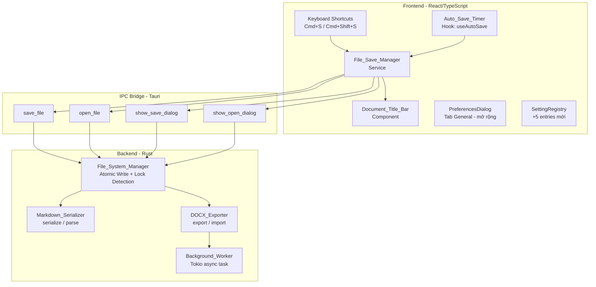
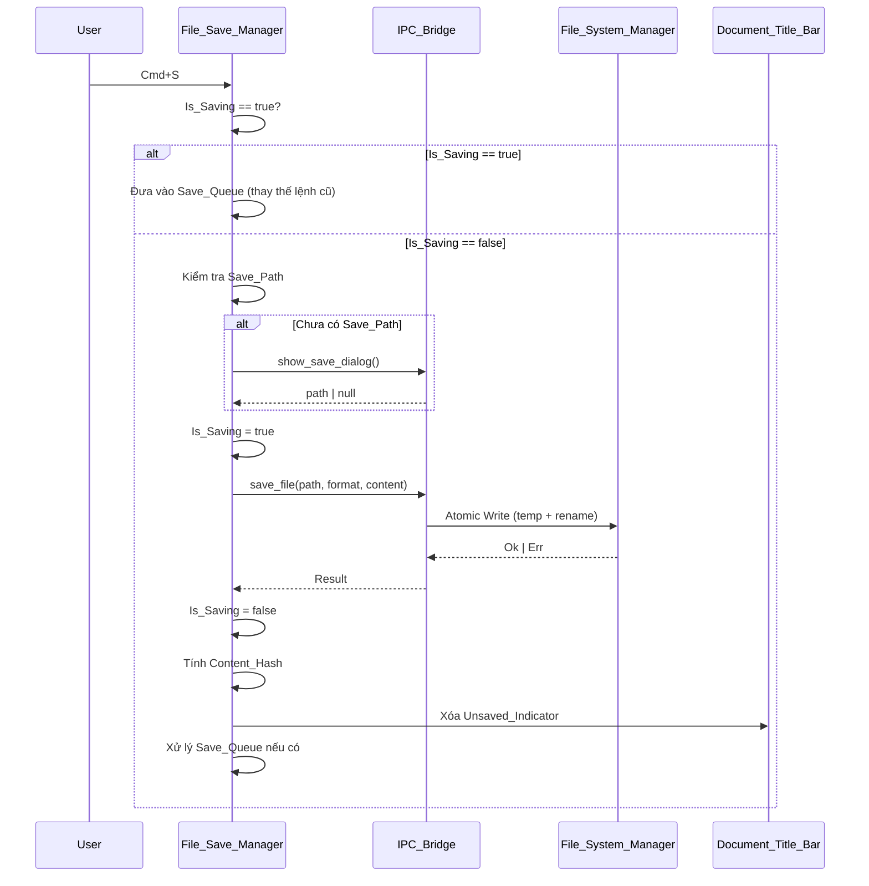
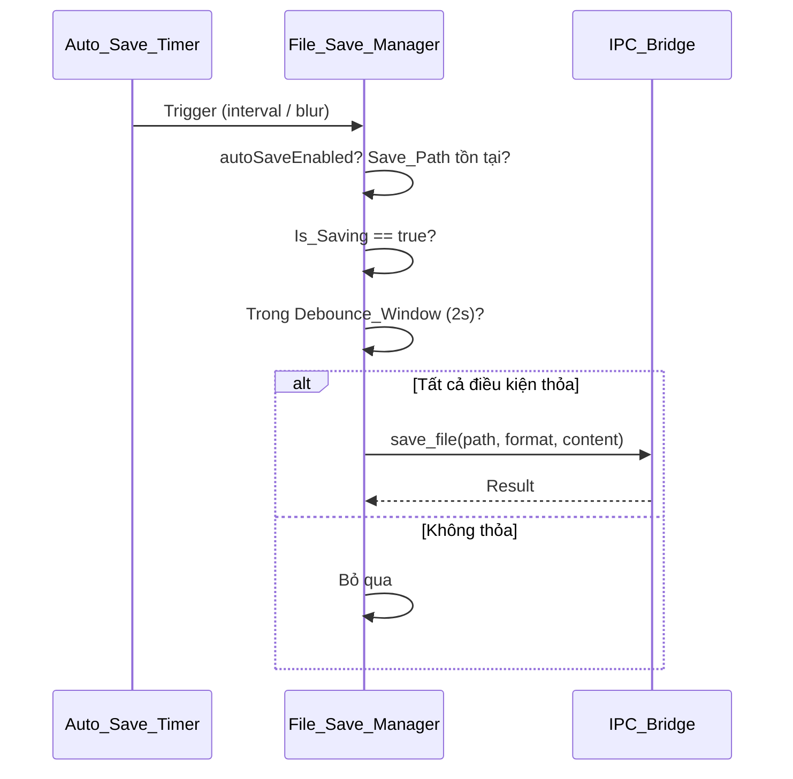

# Design Document: File Save Management

## Tổng quan

File Save Management mở rộng WordAI Editor từ lưu trữ nội bộ (in-memory / app storage) sang lưu file thực sự trên hệ thống file của người dùng. Tính năng bổ sung ba chế độ lưu: **Save** (Cmd+S), **Save As** (Cmd+Shift+S), và **Auto Save** (theo interval hoặc khi mất focus), hỗ trợ hai định dạng đầu ra: Markdown (`.md`) và DOCX (`.docx`).

Thiết kế tuân theo kiến trúc Tauri hiện có: frontend React/TypeScript giao tiếp với Rust backend qua IPC_Bridge. Tính năng này mở rộng `File_System_Manager` (Rust), bổ sung `Markdown_Serializer` và `DOCX_Exporter` ở backend, đồng thời thêm `File_Save_Manager` service và `Document_Title_Bar` component ở frontend.

## Kiến trúc



### Luồng Save (Cmd+S)



### Luồng Auto Save



## Components và Interfaces

### File_Save_Manager (Frontend Service)

Service trung tâm điều phối toàn bộ luồng lưu file. Quản lý trạng thái `Is_Saving`, `Save_Queue`, `Content_Hash`, và `Debounce_Window`.

```typescript
// src/services/fileSaveManager.ts

export type SaveFormat = 'markdown' | 'docx';

export interface SaveState {
  savePath: string | null;       // Đường dẫn tuyệt đối hiện tại
  saveFormat: SaveFormat;        // Định dạng hiện tại
  isSaving: boolean;             // Is_Saving flag
  isDirty: boolean;              // Dirty_Bit (so sánh Content_Hash)
  lastSavedHash: string | null;  // Content_Hash tại lần lưu gần nhất
  lastSavedAt: number | null;    // Timestamp (ms) lần lưu gần nhất
}

export interface SaveQueueEntry {
  content: string;
  format: SaveFormat;
  path: string;
}

export interface FileSaveManager {
  // Trạng thái
  getState(): SaveState;

  // Lệnh Save (Cmd+S)
  save(content: string): Promise<SaveResult>;

  // Lệnh Save As (Cmd+Shift+S)
  saveAs(content: string): Promise<SaveResult>;

  // Save a Copy
  saveCopy(content: string): Promise<SaveResult>;

  // Mở file
  openFile(): Promise<OpenResult>;

  // Cập nhật dirty state khi nội dung thay đổi
  markDirty(currentContent: string): void;

  // Đăng ký callback khi trạng thái thay đổi
  subscribe(listener: (state: SaveState) => void): () => void;
}

export interface SaveResult {
  success: boolean;
  path?: string;
  error?: string;
}

export interface OpenResult {
  success: boolean;
  document?: import('../types/document').Document;
  path?: string;
  error?: string;
}
```

**Quyết định thiết kế**: `File_Save_Manager` được implement như một singleton module (không phải class) với internal state, tương tự pattern của `PreferencesService` hiện có. Subscribe/notify pattern để `Document_Title_Bar` phản ứng với thay đổi trạng thái.

**Save_Queue**: Lưu tối đa 1 entry. Khi `Is_Saving = true` và nhận lệnh Save mới, entry cũ bị thay thế bởi entry mới (last-write-wins). Khi `Is_Saving` chuyển về `false`, xử lý entry trong queue nếu có.

**Debounce_Window**: Sau khi một lệnh Save hoàn tất, lưu `lastSavedAt = Date.now()`. Auto Save triggered bởi blur event sẽ bị bỏ qua nếu `Date.now() - lastSavedAt < 2000`.

### Document_Title_Bar (Frontend Component)

```typescript
// src/components/DocumentTitleBar.tsx

export interface DocumentTitleBarProps {
  savePath: string | null;   // null → "Untitled"
  isDirty: boolean;          // true → hiển thị "●"
  isSaving: boolean;         // true → hiển thị spinner nhỏ
}

// Render logic:
// isDirty  → "● {filename} - WordAI"
// !isDirty → "{filename} - WordAI"
// savePath null → "Untitled - WordAI"
```

**Quyết định thiết kế**: Component nhận props từ parent (App.tsx) thay vì subscribe trực tiếp vào `File_Save_Manager`, để dễ test và tránh coupling. App.tsx subscribe vào `File_Save_Manager` và truyền state xuống.

### IPC Commands mới

```typescript
// src/types/ipc.ts - bổ sung

export type IPCCommand =
  | 'save_document'
  | 'load_document'
  | 'create_document'
  | 'request_ai_suggestion'
  | 'send_chat_message'
  | 'export_to_pdf'
  | 'get_version_history'
  | 'check_ai_service_health'
  // Mới - File Save Management
  | 'save_file'
  | 'open_file'
  | 'show_save_dialog'
  | 'show_open_dialog';
```

```typescript
// Signatures IPC mới

// Lưu file ra hệ thống file
invoke('save_file', {
  path: string,           // Đường dẫn tuyệt đối
  format: SaveFormat,     // 'markdown' | 'docx'
  content: string,        // Nội dung document (JSON serialized Document)
}): Promise<void>

// Mở và parse file từ hệ thống file
invoke('open_file', {
  path: string,
}): Promise<Document>

// Mở Native Save Dialog
invoke('show_save_dialog', {
  defaultPath: string,    // Thư mục mặc định
  formatFilter: SaveFormat,
}): Promise<string | null>  // null nếu user hủy

// Mở Native Open Dialog
invoke('show_open_dialog', {
  defaultPath: string,
}): Promise<string | null>  // null nếu user hủy
```

### Preferences mới

```typescript
// src/types/preferences.ts - bổ sung vào interface Preferences.general

general: {
  theme: string;
  autoSave: { enabled: boolean; intervalMinutes: number; };
  focusMode: boolean;
  language: string;
  // Mới - File Save Management
  defaultSavePath: string;       // '' = dùng home directory
  defaultOpenPath: string;       // '' = dùng home directory
  defaultSaveFormat: SaveFormat; // 'markdown' | 'docx'
  autoSaveEnabled: boolean;      // true
  autoSaveInterval: number;      // giây: 10-3600 (md), 30-3600 (docx)
}
```

**Quyết định thiết kế**: `autoSaveEnabled` và `autoSaveInterval` là các field riêng biệt thay vì lồng vào `autoSave` object hiện có, để tránh breaking change với code đang dùng `general.autoSave.enabled`.

### SettingRegistry - 5 entries mới

```typescript
// src/data/settingRegistry.ts - bổ sung

{
  id: 'general.defaultSavePath',
  label: 'Default Save Path',
  description: 'Thư mục mặc định khi lưu file mới',
  tab: 'general',
  keywords: ['save path', 'default folder', 'save location', 'thư mục lưu'],
  type: 'text',
  defaultValue: '',
},
{
  id: 'general.defaultOpenPath',
  label: 'Default Open Path',
  description: 'Thư mục mặc định khi mở file',
  tab: 'general',
  keywords: ['open path', 'default folder', 'open location', 'thư mục mở'],
  type: 'text',
  defaultValue: '',
},
{
  id: 'general.defaultSaveFormat',
  label: 'Default Save Format',
  description: 'Định dạng file mặc định khi lưu',
  tab: 'general',
  keywords: ['save format', 'file format', 'markdown', 'docx', 'định dạng lưu'],
  type: 'select',
  defaultValue: 'markdown',
},
{
  id: 'general.autoSaveEnabled',
  label: 'Auto Save',
  description: 'Tự động lưu file ra đĩa theo định kỳ',
  tab: 'general',
  keywords: ['auto save', 'autosave', 'automatic save', 'tự động lưu'],
  type: 'toggle',
  defaultValue: true,
},
{
  id: 'general.autoSaveInterval',
  label: 'Auto Save Interval',
  description: 'Khoảng thời gian giữa các lần auto save (giây)',
  tab: 'general',
  keywords: ['auto save interval', 'save frequency', 'autosave timer', 'khoảng thời gian lưu'],
  type: 'number',
  defaultValue: 30,
},
```

## Data Models

### Rust - Mô hình dữ liệu mới

```rust
// src-tauri/src/models.rs - bổ sung

/// Định dạng file đầu ra
#[derive(Debug, Clone, Serialize, Deserialize, PartialEq)]
#[serde(rename_all = "lowercase")]
pub enum SaveFormat {
    Markdown,
    Docx,
}

/// Kết quả save file ra hệ thống
#[derive(Debug, Clone, Serialize, Deserialize)]
pub struct SaveFileResult {
    pub path: String,
    pub format: SaveFormat,
    pub bytes_written: u64,
}

/// Placeholder cho Unsupported_Element trong DOCX
#[derive(Debug, Clone, Serialize, Deserialize)]
pub struct DocxPlaceholder {
    pub element_type: String,   // "table", "image", "comment", v.v.
    pub raw_xml: String,        // XML gốc để khôi phục khi export lại
    pub display_hint: String,   // Mô tả hiển thị cho người dùng
}

/// Document block mở rộng để hỗ trợ Placeholder
#[derive(Debug, Clone, Serialize, Deserialize)]
#[serde(tag = "type")]
pub enum DocumentBlock {
    Paragraph { text: String, formatting: Vec<InlineFormat> },
    Heading { level: u8, text: String },
    ListItem { ordered: bool, text: String, depth: u8 },
    CodeBlock { language: Option<String>, code: String },
    Placeholder(DocxPlaceholder),
}

/// Inline formatting
#[derive(Debug, Clone, Serialize, Deserialize)]
pub struct InlineFormat {
    pub start: usize,
    pub end: usize,
    pub kind: FormatKind,
}

#[derive(Debug, Clone, Serialize, Deserialize)]
#[serde(rename_all = "lowercase")]
pub enum FormatKind {
    Bold,
    Italic,
    Code,
    Link { url: String },
}
```

### Rust - File_System_Manager mở rộng

```rust
// src-tauri/src/file_manager.rs - hàm mới

/// Ghi file với Atomic Write (temp + rename)
/// Requirements: 12.1, 12.2, 12.3, 12.4
pub fn atomic_write(path: &Path, content: &[u8]) -> Result<(), IPCError>;

/// Đọc file và trả về bytes thô
pub fn read_file_bytes(path: &Path) -> Result<Vec<u8>, IPCError>;

/// Kiểm tra file có đang bị lock bởi process khác không
pub fn check_file_lock(path: &Path) -> Result<bool, IPCError>;

/// Kiểm tra thư mục có quyền ghi không
pub fn check_write_permission(dir: &Path) -> Result<bool, IPCError>;
```

**Atomic Write implementation**:
```rust
pub fn atomic_write(path: &Path, content: &[u8]) -> Result<(), IPCError> {
    // 1. Tạo temp file cùng thư mục: "{path}.{uuid}.tmp"
    let temp_path = path.with_extension(format!("{}.tmp", uuid::Uuid::new_v4()));
    
    // 2. Ghi content vào temp file
    fs::write(&temp_path, content).map_err(|e| /* cleanup + error */)?;
    
    // 3. Atomic rename đè lên file đích
    fs::rename(&temp_path, path).map_err(|e| {
        let _ = fs::remove_file(&temp_path); // cleanup
        /* error */
    })?;
    
    Ok(())
}
```

### Rust - Markdown_Serializer

```rust
// src-tauri/src/markdown_serializer.rs (module mới)

/// Serialize Document thành chuỗi Markdown
/// Requirements: 3.1, 3.2, 3.3, 3.4
pub fn serialize(doc: &Document) -> Result<String, IPCError>;

/// Parse chuỗi Markdown thành Document
/// Requirements: 10.3, 11.1, 11.3, 11.4
pub fn parse(markdown: &str, doc_id: &str) -> Result<Document, IPCError>;
```

**Quyết định thiết kế**: Sử dụng crate `pulldown-cmark` để parse Markdown (đã phổ biến trong Rust ecosystem). Serialize tự implement để đảm bảo round-trip fidelity.

### Rust - DOCX_Exporter

```rust
// src-tauri/src/docx_exporter.rs (module mới)

/// Export Document thành bytes DOCX
/// Chạy trên Background_Worker (Tokio async task)
/// Requirements: 4.1, 4.2, 4.3, 4.4
pub async fn export(doc: &Document) -> Result<Vec<u8>, IPCError>;

/// Import bytes DOCX thành Document
/// Unsupported_Element → Placeholder
/// Requirements: 10.4, 11.2, 11.5, 11.6
pub async fn import(bytes: &[u8], doc_id: &str) -> Result<(Document, Vec<String>), IPCError>;
// Vec<String> = danh sách loại Unsupported_Element gặp phải
```

**Quyết định thiết kế**: Sử dụng crate `docx-rs` để tạo và đọc DOCX. Export/import chạy trong `tokio::task::spawn_blocking` để không chặn async runtime.

### IPC Command Handlers mới (Rust)

```rust
// src-tauri/src/lib.rs - bổ sung

/// Lưu file ra hệ thống file với Atomic Write
/// Requirements: 1.2, 3.1, 4.1, 12.1-12.4
#[tauri::command]
async fn save_file(
    path: String,
    format: SaveFormat,
    content: String,  // JSON-serialized Document
) -> Result<SaveFileResult, IPCError>;

/// Mở và parse file từ hệ thống file
/// Requirements: 10.3, 10.4, 10.6, 10.7, 10.8
#[tauri::command]
async fn open_file(path: String) -> Result<Document, IPCError>;

/// Mở Native Save Dialog qua Tauri dialog plugin
/// Requirements: 9.1, 9.2, 9.3, 9.4
#[tauri::command]
async fn show_save_dialog(
    app: tauri::AppHandle,
    default_path: String,
    format_filter: SaveFormat,
) -> Result<Option<String>, IPCError>;

/// Mở Native Open Dialog qua Tauri dialog plugin
/// Requirements: 9.1, 10.1, 10.2
#[tauri::command]
async fn show_open_dialog(
    app: tauri::AppHandle,
    default_path: String,
) -> Result<Option<String>, IPCError>;
```

### Content_Hash

```typescript
// Tính Content_Hash bằng SHA-256 (Web Crypto API)
async function computeContentHash(content: string): Promise<string> {
  const encoder = new TextEncoder();
  const data = encoder.encode(content);
  const hashBuffer = await crypto.subtle.digest('SHA-256', data);
  const hashArray = Array.from(new Uint8Array(hashBuffer));
  return hashArray.map(b => b.toString(16).padStart(2, '0')).join('');
}
```

**Dirty_Bit logic**: `isDirty = currentHash !== lastSavedHash`. Khi user Undo và hash khớp với `lastSavedHash`, `isDirty` tự động về `false` → `Document_Title_Bar` xóa `●`.

