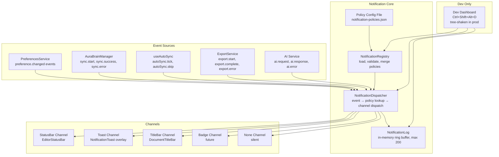
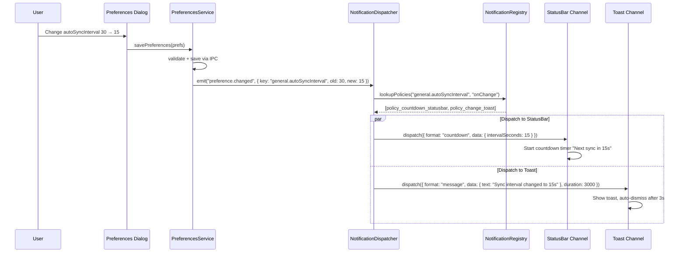
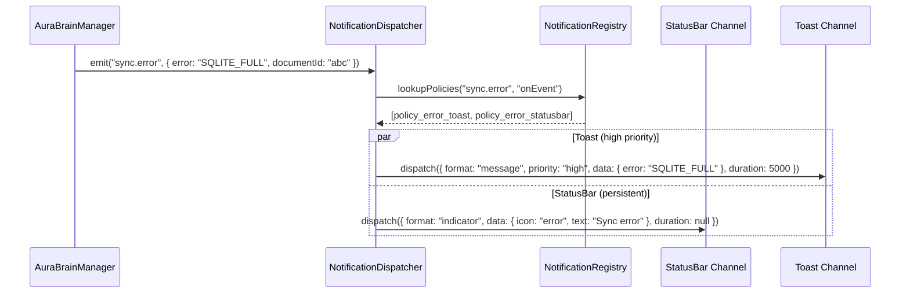
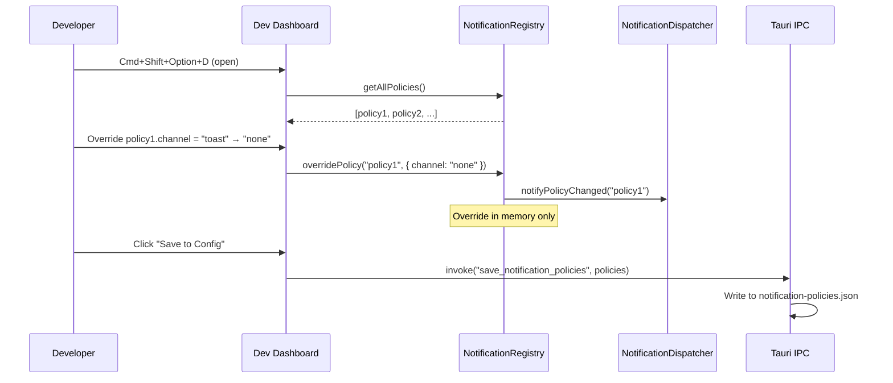

# Design Document: Config-First Notification System

## Tổng quan

Hệ thống Notification của WordAI tuân theo triết lý **Config-First** — mọi hành vi thông báo đều được định nghĩa trong file config JSON, không hardcode trong source. Code chỉ đọc config và thực thi.

**Quyết định thiết kế quan trọng:**

- **1:N Policy per Preference**: Mỗi preference có thể có nhiều policies đồng thời (ví dụ: countdown trên statusBar + toast khi thay đổi). Cho phép linh hoạt tối đa.
- **File Config as Source of Truth**: Policies lưu trong JSON file, có thể version control, chia sẻ giữa team, override tại runtime qua Dev Dashboard.
- **Channel-based Architecture**: Notifications được route tới channels (statusBar, toast, titleBar, badge, none). Mỗi channel có renderer riêng.
- **Dev Dashboard tree-shaken**: Dashboard chỉ tồn tại trong dev build, hoàn toàn invisible trong production.
- **Event-driven Dispatch**: Preferences emit events → Dispatcher lookup policies → Route tới channels. Loose coupling.
- **Backward Compatible Defaults**: Default policies reproduce behavior hiện tại (status bar "Synced · Ns ago", title bar ●). Không breaking change.

---

## Kiến trúc



---

## Sequence Diagrams

### Luồng Preference Change → Notification Dispatch



### Luồng System Event → Notification



### Luồng Dev Dashboard Override



---

## Components and Interfaces

### NotificationPolicy (Data Model)

```typescript
// src/types/notification.ts

type NotificationChannel = 'statusBar' | 'toast' | 'titleBar' | 'badge' | 'none';
type NotificationFormat = 'countdown' | 'elapsed' | 'message' | 'indicator' | 'progress';
type NotificationPriority = 'low' | 'medium' | 'high' | 'critical';
type TriggerType = 'onChange' | 'onThreshold' | 'onError' | 'periodic' | 'onEvent';
type ThresholdOperator = '>' | '<' | '>=' | '<=' | '==' | '!=';

interface ThresholdConfig {
  operator: ThresholdOperator;
  value: unknown;
}

interface PeriodicConfig {
  intervalMs: number;
}

interface NotificationPolicy {
  /** Unique identifier for this policy */
  id: string;
  
  /** Preference key (e.g. "general.autoSyncInterval") or event key (e.g. "sync.error") */
  sourceKey: string;
  
  /** Channel to deliver notification */
  channel: NotificationChannel;
  
  /** Display format */
  format: NotificationFormat;
  
  /** Priority for ordering within same channel */
  priority: NotificationPriority;
  
  /** Duration in ms. null = persistent until state change */
  duration: number | null;
  
  /** If true, notification is suppressed entirely */
  silent: boolean;
  
  /** When to trigger this notification */
  trigger: TriggerType;
  
  /** Template string with {variable} placeholders */
  template?: string;
  
  /** Threshold config (required when trigger = 'onThreshold') */
  threshold?: ThresholdConfig;
  
  /** Periodic config (required when trigger = 'periodic') */
  periodic?: PeriodicConfig;
  
  /** Human-readable description for Dev Dashboard */
  description?: string;
}
```

### Policy Config File Schema

```typescript
// src/types/notification.ts

interface PolicyConfigFile {
  /** Schema version for future migration */
  schemaVersion: 1;
  
  /** Array of all notification policies */
  policies: NotificationPolicy[];
}
```

### NotificationRegistry (Service)

```typescript
// src/services/notificationRegistry.ts

interface NotificationRegistry {
  /** Load policies from config file (IPC) + merge with defaults */
  initialize(): Promise<void>;
  
  /** Get all active policies */
  getAllPolicies(): NotificationPolicy[];
  
  /** Lookup policies matching a sourceKey and trigger type */
  lookupPolicies(sourceKey: string, trigger: TriggerType): NotificationPolicy[];
  
  /** Override a policy at runtime (in-memory, not persisted) */
  overridePolicy(policyId: string, overrides: Partial<NotificationPolicy>): void;
  
  /** Persist current policies (including overrides) to config file */
  saveToConfig(): Promise<void>;
  
  /** Reset all overrides, reload from config file */
  resetToDefaults(): Promise<void>;
  
  /** Subscribe to policy changes */
  subscribe(listener: () => void): () => void;
  
  /** Get current snapshot (for useSyncExternalStore) */
  getSnapshot(): Readonly<NotificationPolicy[]>;
}
```

### NotificationDispatcher (Service)

```typescript
// src/services/notificationDispatcher.ts

interface NotificationEvent {
  /** Source key matching policy sourceKey */
  sourceKey: string;
  
  /** Event type for trigger matching */
  trigger: TriggerType;
  
  /** Data payload for template resolution */
  data: Record<string, unknown>;
  
  /** Timestamp of event */
  timestamp: number;
}

interface ActiveNotification {
  id: string;
  policyId: string;
  channel: NotificationChannel;
  format: NotificationFormat;
  priority: NotificationPriority;
  duration: number | null;
  resolvedContent: string;
  data: Record<string, unknown>;
  state: 'pending' | 'active' | 'dismissed';
  createdAt: number;
  dismissAt: number | null;
}

interface NotificationDispatcher {
  /** Dispatch an event — looks up policies and routes to channels */
  dispatch(event: NotificationEvent): void;
  
  /** Dismiss a specific notification by id */
  dismiss(notificationId: string): void;
  
  /** Dismiss all notifications for a channel */
  dismissChannel(channel: NotificationChannel): void;
  
  /** Get active notifications for a specific channel */
  getChannelNotifications(channel: NotificationChannel): ActiveNotification[];
  
  /** Subscribe to channel updates */
  subscribeChannel(channel: NotificationChannel, listener: () => void): () => void;
  
  /** Get notification log (dev mode) */
  getLog(): ActiveNotification[];
  
  /** Simulate an event (dev mode) */
  simulate(event: NotificationEvent): void;
}
```

### Channel Hooks (React Integration)

```typescript
// src/hooks/useNotificationChannel.ts

/** Subscribe to notifications for a specific channel */
function useNotificationChannel(channel: NotificationChannel): ActiveNotification[];

/** Subscribe to the highest-priority active notification for a channel */
function useTopNotification(channel: NotificationChannel): ActiveNotification | null;
```

### Dev Dashboard (Component)

```typescript
// src/components/DevDashboard.tsx (tree-shaken in prod)

interface DevDashboardProps {
  isOpen: boolean;
  onClose: () => void;
}

// Sections:
// 1. Policy Table — editable grid of all policies
// 2. Live Preferences — realtime preference values
// 3. Notification Log — timeline of dispatched notifications
// 4. Event Simulator — trigger events manually
// 5. Actions — Save to Config, Reset to Defaults
```

---

## Data Models

### Default Policy Config File

```json
{
  "schemaVersion": 1,
  "policies": [
    {
      "id": "sync-status-elapsed",
      "sourceKey": "sync.success",
      "channel": "statusBar",
      "format": "elapsed",
      "priority": "low",
      "duration": null,
      "silent": false,
      "trigger": "onEvent",
      "template": "Synced · {seconds}s ago",
      "description": "Show elapsed time since last sync on status bar"
    },
    {
      "id": "sync-status-syncing",
      "sourceKey": "sync.start",
      "channel": "statusBar",
      "format": "indicator",
      "priority": "medium",
      "duration": null,
      "silent": false,
      "trigger": "onEvent",
      "template": "Syncing...",
      "description": "Show syncing indicator on status bar"
    },
    {
      "id": "sync-error-toast",
      "sourceKey": "sync.error",
      "channel": "toast",
      "format": "message",
      "priority": "high",
      "duration": 5000,
      "silent": false,
      "trigger": "onEvent",
      "template": "Sync failed: {error}",
      "description": "Toast notification when sync fails"
    },
    {
      "id": "sync-error-statusbar",
      "sourceKey": "sync.error",
      "channel": "statusBar",
      "format": "indicator",
      "priority": "high",
      "duration": null,
      "silent": false,
      "trigger": "onEvent",
      "template": "⚠ Sync error",
      "description": "Persistent error indicator on status bar"
    },
    {
      "id": "dirty-titlebar-indicator",
      "sourceKey": "document.dirty",
      "channel": "titleBar",
      "format": "indicator",
      "priority": "medium",
      "duration": null,
      "silent": false,
      "trigger": "onEvent",
      "template": "●",
      "description": "Unsaved indicator on title bar"
    },
    {
      "id": "dirty-statusbar",
      "sourceKey": "document.dirty",
      "channel": "statusBar",
      "format": "message",
      "priority": "low",
      "duration": null,
      "silent": false,
      "trigger": "onEvent",
      "template": "Unsaved changes",
      "description": "Unsaved changes text on status bar"
    },
    {
      "id": "autosync-interval-countdown",
      "sourceKey": "general.autoSyncInterval",
      "channel": "statusBar",
      "format": "countdown",
      "priority": "low",
      "duration": null,
      "silent": true,
      "trigger": "periodic",
      "periodic": { "intervalMs": 1000 },
      "template": "Next sync in {remainingSeconds}s",
      "description": "Countdown to next auto-sync (disabled by default)"
    },
    {
      "id": "preference-change-toast",
      "sourceKey": "preference.*",
      "channel": "toast",
      "format": "message",
      "priority": "low",
      "duration": 2000,
      "silent": true,
      "trigger": "onChange",
      "template": "{label} changed to {newValue}",
      "description": "Toast when any preference changes (disabled by default)"
    },
    {
      "id": "export-success-toast",
      "sourceKey": "export.complete",
      "channel": "toast",
      "format": "message",
      "priority": "medium",
      "duration": 3000,
      "silent": false,
      "trigger": "onEvent",
      "template": "Exported to {path}",
      "description": "Toast when export completes successfully"
    },
    {
      "id": "export-error-toast",
      "sourceKey": "export.error",
      "channel": "toast",
      "format": "message",
      "priority": "high",
      "duration": 5000,
      "silent": false,
      "trigger": "onEvent",
      "template": "Export failed: {error}",
      "description": "Toast when export fails"
    },
    {
      "id": "ai-service-unavailable",
      "sourceKey": "ai.unavailable",
      "channel": "toast",
      "format": "message",
      "priority": "high",
      "duration": 5000,
      "silent": false,
      "trigger": "onEvent",
      "template": "AI service unavailable. Check connection.",
      "description": "Toast when AI service becomes unavailable"
    }
  ]
}
```

---

## File Structure

```
src/
├── config/
│   └── default-notification-policies.json    ← Bundled defaults
│
├── types/
│   └── notification.ts                       ← All notification types
│
├── services/
│   ├── notificationRegistry.ts               ← Policy loading, validation, merge
│   ├── notificationDispatcher.ts             ← Event → policy → channel routing
│   └── notificationChannels.ts               ← Channel implementations
│
├── hooks/
│   ├── useNotificationChannel.ts             ← React hook for channel subscription
│   └── useDevDashboard.ts                    ← Dev dashboard state (dev only)
│
├── components/
│   ├── NotificationToast.tsx                 ← Toast/snackbar overlay
│   └── DevDashboard.tsx                      ← Dev-only dashboard (lazy loaded)
│
└── (existing components updated)
    ├── EditorStatusBar.tsx                    ← Subscribe to statusBar channel
    └── DocumentTitleBar.tsx                   ← Subscribe to titleBar channel
```

---

## Integration Strategy

### Phase 1: Core Infrastructure (không breaking change)
- Tạo types, registry, dispatcher
- Load default config
- Emit events từ existing services (ABM, PreferencesService)
- Dev Dashboard functional

### Phase 2: Channel Migration
- EditorStatusBar subscribe vào statusBar channel
- DocumentTitleBar subscribe vào titleBar channel
- Toast component mới
- Fallback: nếu notification system chưa ready, giữ behavior cũ

### Phase 3: Full Config-First
- Tất cả notification behavior driven by config
- Remove hardcoded logic từ components
- Dev Dashboard có thể override mọi thứ

---

## Correctness Properties

### Property 1: Policy Lookup Completeness
*Với mọi* event được dispatch, nếu tồn tại ít nhất một policy matching `sourceKey` và `trigger`, dispatcher phải route event tới đúng channel(s) — không bỏ sót policy nào.

### Property 2: Silent Policy Suppression
*Với mọi* policy có `silent: true`, dispatcher phải không phát bất kỳ notification nào tới channel — kể cả khi trigger condition thỏa mãn.

### Property 3: Duration Auto-Dismiss
*Với mọi* notification có `duration` khác null, notification phải chuyển sang `dismissed` sau đúng `duration` milliseconds (±100ms tolerance).

### Property 4: Priority Ordering
*Với mọi* tập notifications active trên cùng channel, chúng phải được sắp xếp theo priority: critical > high > medium > low.

### Property 5: Config Merge Idempotency
*Với mọi* cặp (default config, user config), merge(default, user) phải cho kết quả giống nhau bất kể thứ tự load — user policies override default policies cùng `id`.

### Property 6: Notification Log Bounded
*Với mọi* chuỗi dispatch events, Notification_Log phải không vượt quá 200 entries — entries cũ nhất bị loại bỏ theo FIFO.

### Property 7: Dev Dashboard Isolation
*Với mọi* production build, Dev Dashboard code phải không tồn tại trong bundle — bundle size không tăng khi thêm Dev Dashboard features.

---

## Error Handling

| Tình huống | Hành vi |
|---|---|
| Config file không tồn tại | Sử dụng bundled defaults, log info |
| Config file corrupt/invalid JSON | Backup file cũ, tạo mới từ defaults, log warning |
| Schema version không tương thích | Attempt migration, fallback defaults nếu fail |
| Template variable không resolve | Hiển thị `[unknown]` thay vì crash |
| Channel renderer throw error | Catch, log error, dismiss notification, không crash app |
| IPC save config fail | Show toast error, giữ in-memory state |
| Quá nhiều notifications cùng lúc | Channel renderer chỉ hiển thị top-N theo priority |

