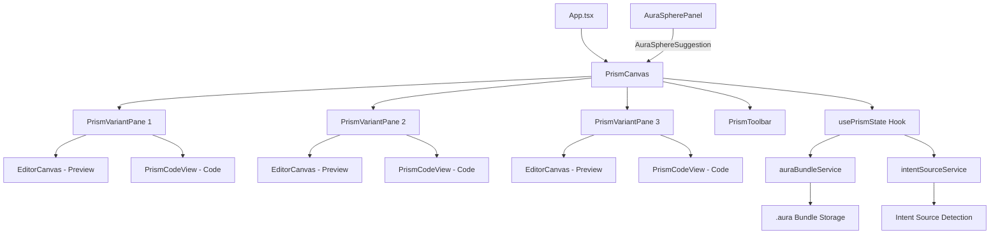
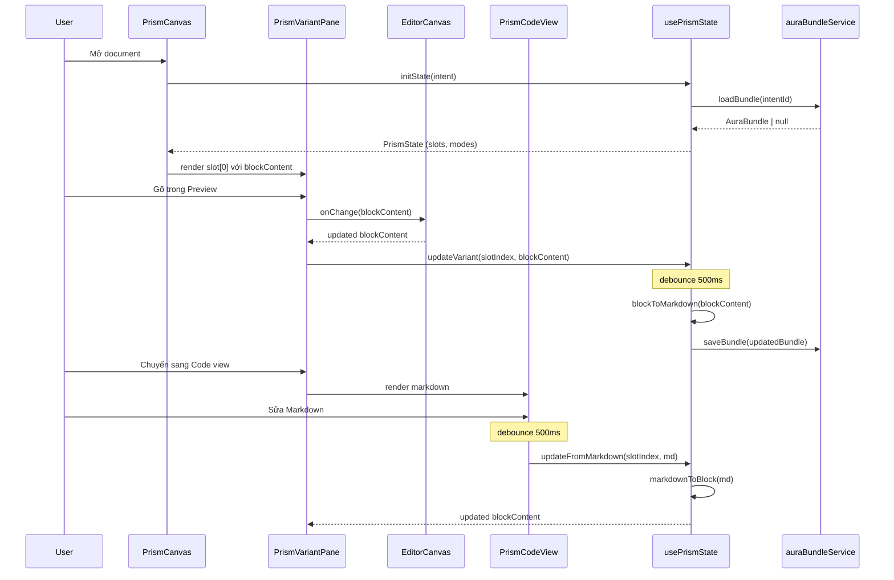
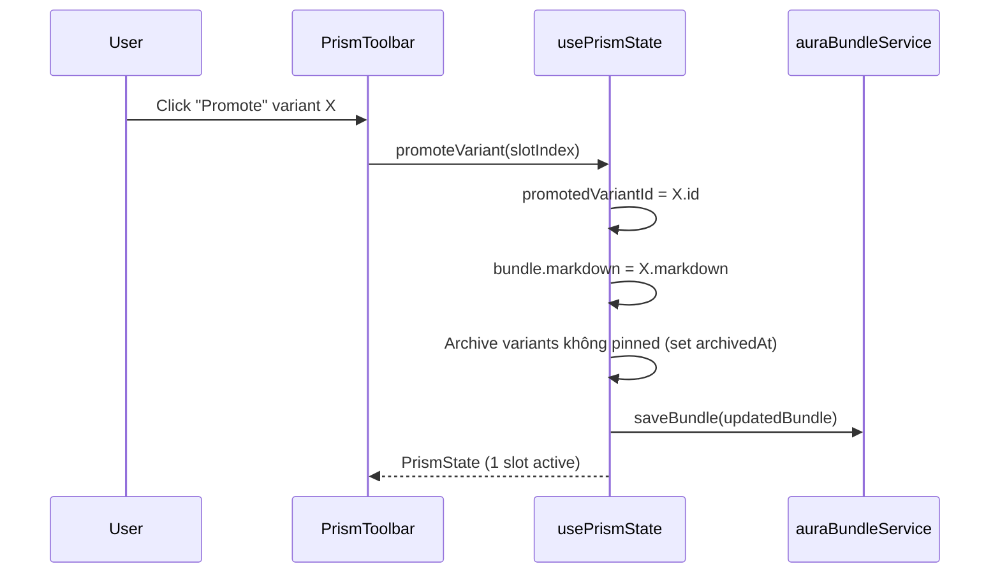
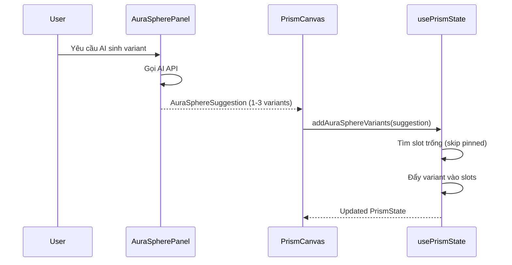

# Tài liệu Thiết kế: Prism Multi-Variant Editor

## Overview

Prism là một layer bọc ngoài `EditorCanvas` hiện tại, cho phép người dùng chỉnh sửa đồng thời tối đa 3 biến thể (variant) nội dung cạnh nhau. Mục tiêu chính là **không re-architect** editor hiện tại mà chỉ thêm layer quản lý multi-variant phía trên.

Nguyên tắc cốt lõi: **Single source of truth = Intent**. Variant chỉ là biểu diễn của trạng thái nội dung, không phải entity độc lập. Code view là transformer (Block JSON ↔ Markdown), không phải editor riêng. Persist tối thiểu — UI state per-session, nội dung trong Intent hoặc `.aura` bundle.

Prism tích hợp với AuraSphere để nhận các variant do AI sinh ra, hỗ trợ workflow so sánh và chọn lựa nội dung tối ưu.

## Architecture

### Sơ đồ tổng thể



### Sơ đồ luồng dữ liệu (Data Flow)



### Sơ đồ Promote Variant



### Sơ đồ AuraSphere Integration



## Components and Interfaces

### Component 1: PrismCanvas

**Mục đích**: Root component thay thế `EditorCanvas` trực tiếp trong App.tsx. Quản lý layout 1/2/3 cột và dispatch các action chính.

**Interface**:
```typescript
interface PrismCanvasProps {
  document: Document;
  onDocumentChange: (doc: Document) => void;
  onAITrigger: (selection: TextSelection) => void;
  isAIPanelOpen: boolean;
  saveError?: IPCError | null;
  hasUnsavedChanges?: boolean;
  onManualSave?: () => void;
  onOpenExport?: () => void;
  onOpenVersionHistory?: () => void;
  fontSize?: number;
  onFontSizeChange?: (size: number) => void;
  auraSuggestion?: AuraSphereSuggestion | null;
}
```

**Trách nhiệm**:
- Quản lý layout responsive 1/2/3 cột dựa trên số variant active
- Dispatch action: addVariant, discardVariant, promoteVariant
- Nhận AuraSphereSuggestion và phân phối vào slots trống
- Forward props tương thích với EditorCanvas cho slot chính (slot 0)

### Component 2: PrismVariantPane

**Mục đích**: Một cột trong layout — chứa view tabs (Preview/Code) và render EditorCanvas hoặc PrismCodeView tương ứng.

**Interface**:
```typescript
interface PrismVariantPaneProps {
  variant: PrismVariant;
  slotIndex: PrismSlotIndex;
  viewMode: PrismViewMode;
  codeSubTab: PrismCodeSubTab;
  isFocused: boolean;
  syncScroll: boolean;
  onViewModeChange: (mode: PrismViewMode) => void;
  onCodeSubTabChange: (tab: PrismCodeSubTab) => void;
  onFocus: () => void;
  onContentChange: (blockContent: string) => void;
  onMarkdownChange: (markdown: string) => void;
  onDiscard: () => void;
  onPromote: () => void;
  onPin: () => void;
  fontSize?: number;
}
```

**Trách nhiệm**:
- Render tab bar (Preview | Code) với indicator active
- Khi Preview: mount `EditorCanvas` với variant.blockContent
- Khi Code: mount `PrismCodeView` với markdown tương ứng
- Hiển thị label, pin status, dirty indicator
- Giữ scroll position khi toggle view mode

### Component 3: PrismCodeView

**Mục đích**: Code editor hiển thị Markdown/OOXML/HTML/.aura với syntax highlighting. Sử dụng CodeMirror 6.

**Interface**:
```typescript
interface PrismCodeViewProps {
  content: string;
  subTab: PrismCodeSubTab;
  readonly: boolean;
  onChange: (content: string) => void;
  fontSize?: number;
}
```

**Trách nhiệm**:
- Render CodeMirror 6 editor với language mode phù hợp (markdown/xml/html/json)
- OOXML tab luôn readonly
- Emit onChange với debounce nội bộ
- Lazy load — chỉ mount khi user mở Code view

### Component 4: PrismToolbar

**Mục đích**: Header chung cho PrismCanvas — chứa nút thêm variant, toggle sync scroll, và actions.

**Interface**:
```typescript
interface PrismToolbarProps {
  variantCount: number;
  maxVariants: number;
  syncScroll: boolean;
  onAddVariant: () => void;
  onToggleSyncScroll: () => void;
}
```

**Trách nhiệm**:
- Nút "+ Variant" (disabled khi đã đạt max 3)
- Toggle sync scroll on/off
- Hiển thị số variant hiện tại

### Hook: usePrismState

**Mục đích**: Hook quản lý toàn bộ state của Prism — slots, modes, focus, và sync với auraBundleService.

**Interface**:
```typescript
interface UsePrismStateReturn {
  state: PrismState;
  addVariant: (variant?: Partial<PrismVariant>) => void;
  discardVariant: (slotIndex: PrismSlotIndex) => void;
  promoteVariant: (slotIndex: PrismSlotIndex) => void;
  updateVariantContent: (slotIndex: PrismSlotIndex, blockContent: string) => void;
  updateFromMarkdown: (slotIndex: PrismSlotIndex, markdown: string) => void;
  setViewMode: (slotIndex: PrismSlotIndex, mode: PrismViewMode) => void;
  setCodeSubTab: (slotIndex: PrismSlotIndex, tab: PrismCodeSubTab) => void;
  setFocus: (slotIndex: PrismSlotIndex) => void;
  toggleSyncScroll: () => void;
  pinVariant: (slotIndex: PrismSlotIndex) => void;
  addAuraSphereVariants: (suggestion: AuraSphereSuggestion) => void;
}

function usePrismState(intentId: string, initialContent: string): UsePrismStateReturn;
```

## Data Models

### Model 1: PrismVariant

```typescript
type PrismSlotIndex = 0 | 1 | 2;
type PrismViewMode = 'preview' | 'code';
type PrismCodeSubTab = 'markdown' | 'aura' | 'ooxml' | 'html';

interface PrismVariant {
  id: string;                  // UUID ổn định trong session, dùng làm React key
  label: string;               // "Trang trọng" / "Thân mật" / tên do user đặt
  blockContent: string;        // JSON string cho react-block-text
  source: PrismSourceFormat;   // nguồn gốc của variant
  promptRef?: string;          // ID prompt AuraSphere nếu do AI sinh
  pinned: boolean;             // true = không bị ghi đè khi AuraSphere push
  dirty: boolean;              // true = có thay đổi chưa persist
}
```

**Quy tắc validation**:
- `id` phải là UUID hợp lệ, không rỗng
- `label` không rỗng, tối đa 50 ký tự
- `blockContent` phải là JSON hợp lệ cho react-block-text
- `source` phải match 1 trong 4 kind hợp lệ
- Tối đa 3 variant active (không tính archived) tại mọi thời điểm

### Model 2: PrismState

```typescript
interface PrismState {
  slots: (PrismVariant | null)[];   // length === 3, null = slot trống
  modes: PrismViewMode[];           // length === 3, song song với slots
  codeSubTabs: PrismCodeSubTab[];   // length === 3
  focusedSlot: PrismSlotIndex;      // slot đang active
  syncScroll: boolean;              // đồng bộ scroll giữa các pane
}
```

**Quy tắc validation**:
- `slots.length === 3` luôn luôn
- `modes.length === 3` luôn luôn
- `codeSubTabs.length === 3` luôn luôn
- `focusedSlot` phải trỏ tới slot không null
- Ít nhất 1 slot phải không null (slot 0 luôn có variant chính)

### Model 3: PrismSourceFormat

```typescript
type PrismSourceFormat =
  | { kind: 'markdown'; filePath?: string }
  | { kind: 'html'; filePath?: string }
  | { kind: 'docx'; filePath: string }    // bắt buộc có filePath, luôn readonly
  | { kind: 'aura'; bundle: AuraBundle };
```

### Model 4: AuraBundle

```typescript
interface AuraBundle {
  $schema: 'https://wordai.app/schemas/aura/v1.json';
  version: 1;
  intentId: string;
  canonical: 'markdown';
  markdown: string;                // bản đang được Promote (hoặc bản gần nhất)
  variants: AuraVariantEntry[];
  promotedVariantId: string | null;
  lastModified: string;            // ISO 8601
}

interface AuraVariantEntry {
  id: string;
  label: string;
  markdown: string;
  createdBy: 'user' | 'aurasphere';
  promptRef?: string;              // ID prompt + context AuraSphere đã dùng
  createdAt: string;               // ISO 8601
  archivedAt?: string;             // ISO 8601, undefined = active
}
```

**Quy tắc validation**:
- `$schema` phải đúng URL schema v1
- `version` phải === 1
- `intentId` không rỗng
- `variants` chỉ chứa entries có `archivedAt == null` khi render UI
- `promotedVariantId` nếu không null phải match 1 variant.id trong mảng
- `lastModified` phải là ISO 8601 hợp lệ

### Model 5: AuraSphereSuggestion

```typescript
interface AuraSphereSuggestion {
  variants: {
    label: string;
    markdown: string;
    promptRef: string;
  }[];  // 1 ≤ length ≤ 3
}
```

## Algorithmic Pseudocode

### Algorithm 1: Transform Pipeline (Block JSON ⇄ Markdown)

```typescript
/**
 * Pipeline chuyển đổi giữa Block JSON và Markdown
 * Debounce 500ms cho mỗi hướng chuyển đổi
 */

// ALGORITHM: syncPreviewToCode
// INPUT: blockContent (JSON string từ react-block-text)
// OUTPUT: markdown string tương ứng
// PRECONDITION: blockContent là JSON hợp lệ cho react-block-text
// POSTCONDITION: markdown chứa nội dung tương đương (có thể lossy cho unsupported syntax)

function syncPreviewToCode(blockContent: string): string {
  const blocks = JSON.parse(blockContent);
  let markdown = '';
  
  for (const block of blocks) {
    switch (block.type) {
      case 'header':
        markdown += '#'.repeat(block.level) + ' ' + block.text + '\n\n';
        break;
      case 'paragraph':
        markdown += block.text + '\n\n';
        break;
      case 'list':
        for (const item of block.items) {
          markdown += (block.ordered ? `${item.index}. ` : '- ') + item.text + '\n';
        }
        markdown += '\n';
        break;
      case 'quote':
        markdown += '> ' + block.text + '\n\n';
        break;
      case 'todo':
        markdown += `- [${block.checked ? 'x' : ' '}] ${block.text}\n`;
        break;
      case 'code':
        markdown += '```' + (block.language || '') + '\n' + block.text + '\n```\n\n';
        break;
      default:
        // Unsupported block type → render as code block (lossy)
        markdown += '```\n' + JSON.stringify(block) + '\n```\n\n';
    }
  }
  
  return markdown.trimEnd();
}
```

### Algorithm 2: Markdown → Block JSON

```typescript
// ALGORITHM: syncCodeToPreview
// INPUT: markdown string
// OUTPUT: blockContent (JSON string cho react-block-text)
// PRECONDITION: markdown là string (có thể rỗng)
// POSTCONDITION: 
//   - Nếu parse thành công: trả về JSON hợp lệ cho react-block-text
//   - Nếu parse thất bại: throw ParseError, caller giữ blockContent cũ
// LOOP INVARIANT: Mỗi line đã xử lý tạo ra ≥ 0 blocks hợp lệ

function syncCodeToPreview(markdown: string): string {
  const lines = markdown.split('\n');
  const blocks: Block[] = [];
  let i = 0;

  while (i < lines.length) {
    const line = lines[i];

    // Header detection: ^#{1-6}\s
    const headerMatch = line.match(/^(#{1,6})\s+(.+)$/);
    if (headerMatch) {
      blocks.push({
        id: generateBlockId(),
        type: 'header',
        level: headerMatch[1].length,
        text: headerMatch[2],
      });
      i++;
      continue;
    }

    // Code block: ```
    if (line.startsWith('```')) {
      const language = line.slice(3).trim();
      const codeLines: string[] = [];
      i++;
      while (i < lines.length && !lines[i].startsWith('```')) {
        codeLines.push(lines[i]);
        i++;
      }
      blocks.push({
        id: generateBlockId(),
        type: 'code',
        language,
        text: codeLines.join('\n'),
      });
      i++; // skip closing ```
      continue;
    }

    // Quote: ^>\s
    if (line.startsWith('> ')) {
      blocks.push({
        id: generateBlockId(),
        type: 'quote',
        text: line.slice(2),
      });
      i++;
      continue;
    }

    // Todo: ^- \[(x| )\]
    const todoMatch = line.match(/^- \[(x| )\]\s+(.+)$/);
    if (todoMatch) {
      blocks.push({
        id: generateBlockId(),
        type: 'todo',
        checked: todoMatch[1] === 'x',
        text: todoMatch[2],
      });
      i++;
      continue;
    }

    // List item: ^[-*]\s hoặc ^\d+\.\s
    const ulMatch = line.match(/^[-*]\s+(.+)$/);
    const olMatch = line.match(/^(\d+)\.\s+(.+)$/);
    if (ulMatch || olMatch) {
      // Collect consecutive list items
      const items: ListItem[] = [];
      const ordered = !!olMatch;
      while (i < lines.length) {
        const currentUl = lines[i].match(/^[-*]\s+(.+)$/);
        const currentOl = lines[i].match(/^(\d+)\.\s+(.+)$/);
        if (ordered && currentOl) {
          items.push({ index: parseInt(currentOl[1]), text: currentOl[2] });
        } else if (!ordered && currentUl) {
          items.push({ index: items.length + 1, text: currentUl[1] });
        } else {
          break;
        }
        i++;
      }
      blocks.push({ id: generateBlockId(), type: 'list', ordered, items });
      continue;
    }

    // Paragraph (non-empty line)
    if (line.trim()) {
      blocks.push({ id: generateBlockId(), type: 'paragraph', text: line });
    }
    i++;
  }

  return JSON.stringify(blocks);
}
```

### Algorithm 3: Promote Variant

```typescript
// ALGORITHM: promoteVariant
// INPUT: state (PrismState), slotIndex (PrismSlotIndex)
// OUTPUT: updated PrismState + updated AuraBundle
// PRECONDITION: 
//   - state.slots[slotIndex] !== null
//   - state.slots[slotIndex].blockContent là JSON hợp lệ
// POSTCONDITION:
//   - promotedVariantId === variant.id
//   - bundle.markdown === variant's markdown
//   - Tất cả variant khác không pinned có archivedAt = now()
//   - UI chỉ render variants có archivedAt == null
//   - State trở về 1 slot active (slot 0 = promoted content)

function promoteVariant(
  state: PrismState,
  slotIndex: PrismSlotIndex,
  bundle: AuraBundle
): { newState: PrismState; newBundle: AuraBundle } {
  const variant = state.slots[slotIndex];
  if (!variant) throw new Error('Cannot promote null slot');

  const promotedMarkdown = blockToMarkdown(variant.blockContent);
  const now = new Date().toISOString();

  // Archive tất cả variant khác không pinned
  const updatedVariants = bundle.variants.map(v => {
    if (v.id === variant.id) return v;
    if (state.slots.find(s => s?.id === v.id && s.pinned)) return v;
    if (v.archivedAt) return v; // đã archived
    return { ...v, archivedAt: now };
  });

  const newBundle: AuraBundle = {
    ...bundle,
    markdown: promotedMarkdown,
    promotedVariantId: variant.id,
    variants: updatedVariants,
    lastModified: now,
  };

  // Reset state: slot 0 = promoted variant, clear others
  const newState: PrismState = {
    slots: [variant, null, null],
    modes: ['preview', 'preview', 'preview'],
    codeSubTabs: ['markdown', 'markdown', 'markdown'],
    focusedSlot: 0,
    syncScroll: state.syncScroll,
  };

  return { newState, newBundle };
}
```

### Algorithm 4: Add AuraSphere Variants

```typescript
// ALGORITHM: addAuraSphereVariants
// INPUT: state (PrismState), suggestion (AuraSphereSuggestion)
// OUTPUT: updated PrismState
// PRECONDITION:
//   - suggestion.variants.length >= 1 && <= 3
//   - Mỗi variant trong suggestion có label, markdown, promptRef hợp lệ
// POSTCONDITION:
//   - Slot pinned không bị ghi đè
//   - Variant mới được đẩy vào slot trống (ưu tiên slot index thấp)
//   - Slot 0 (user's content) được giữ nguyên nếu có content
// LOOP INVARIANT: Số slot pinned không thay đổi sau operation

function addAuraSphereVariants(
  state: PrismState,
  suggestion: AuraSphereSuggestion
): PrismState {
  const newSlots = [...state.slots] as (PrismVariant | null)[];
  let suggestionIndex = 0;

  for (let i = 0; i < 3 && suggestionIndex < suggestion.variants.length; i++) {
    const slot = newSlots[i];
    
    // Skip slot 0 nếu có content (giữ bản user)
    if (i === 0 && slot !== null) continue;
    // Skip slot pinned
    if (slot?.pinned) continue;
    // Skip slot có content dirty chưa save
    if (slot?.dirty) continue;

    const sv = suggestion.variants[suggestionIndex];
    newSlots[i] = {
      id: crypto.randomUUID(),
      label: sv.label,
      blockContent: markdownToBlock(sv.markdown),
      source: { kind: 'aura', bundle: {} as AuraBundle }, // sẽ được resolve sau
      promptRef: sv.promptRef,
      pinned: false,
      dirty: false,
    };
    suggestionIndex++;
  }

  return { ...state, slots: newSlots };
}
```

### Algorithm 5: Intent Source Detection

```typescript
// ALGORITHM: detectSource
// INPUT: intent (Document với metadata)
// OUTPUT: PrismSourceFormat
// PRECONDITION: intent không null
// POSTCONDITION: Trả về đúng 1 trong 4 kind, không bao giờ throw

function detectSource(intent: Document): PrismSourceFormat {
  const sourcePath = intent.metadata?.sourcePath;

  if (sourcePath) {
    if (sourcePath.endsWith('.docx')) {
      return { kind: 'docx', filePath: sourcePath };
    }
    if (sourcePath.endsWith('.md') || sourcePath.endsWith('.markdown')) {
      return { kind: 'markdown', filePath: sourcePath };
    }
    if (sourcePath.endsWith('.html') || sourcePath.endsWith('.htm')) {
      return { kind: 'html', filePath: sourcePath };
    }
  }

  // Kiểm tra .aura bundle trong store
  const bundle = auraBundleService.loadBundle(intent.id);
  if (bundle) {
    return { kind: 'aura', bundle };
  }

  // Fallback: coi như Markdown thuần
  return { kind: 'markdown' };
}
```

### Algorithm 6: Debounced Markdown Sync (useMarkdownSync hook)

```typescript
// ALGORITHM: useMarkdownSync
// INPUT: blockContent (string), direction ('toCode' | 'toPreview')
// OUTPUT: synced content ở hướng ngược lại
// PRECONDITION: blockContent hoặc markdown là string hợp lệ
// POSTCONDITION:
//   - Sau debounce 500ms, content được transform
//   - Nếu parse lỗi: giữ content cũ, set parseError = true
//   - requestIdleCallback được sử dụng để không block main thread

function useMarkdownSync(
  slotIndex: PrismSlotIndex,
  blockContent: string,
  onSynced: (result: SyncResult) => void
): void {
  const timeoutRef = useRef<number | null>(null);
  const lastContentRef = useRef(blockContent);

  useEffect(() => {
    if (blockContent === lastContentRef.current) return;
    lastContentRef.current = blockContent;

    // Clear previous debounce
    if (timeoutRef.current) clearTimeout(timeoutRef.current);

    timeoutRef.current = window.setTimeout(() => {
      // Sử dụng requestIdleCallback để parse không block UI
      requestIdleCallback(() => {
        try {
          const markdown = blockToMarkdown(blockContent);
          onSynced({ markdown, parseError: false });
        } catch (error) {
          onSynced({ markdown: null, parseError: true, error });
        }
      });
    }, 500);

    return () => {
      if (timeoutRef.current) clearTimeout(timeoutRef.current);
    };
  }, [blockContent, onSynced]);
}

interface SyncResult {
  markdown: string | null;
  parseError: boolean;
  error?: unknown;
}
```

## Key Functions với Formal Specifications

### Function 1: blockToMarkdown()

```typescript
function blockToMarkdown(blockContent: string): string
```

**Preconditions:**
- `blockContent` là JSON string hợp lệ
- JSON parse ra mảng các block objects
- Mỗi block có ít nhất `type` và `text` field

**Postconditions:**
- Trả về Markdown string hợp lệ
- Heading blocks → `# ` syntax tương ứng level
- List blocks → `- ` hoặc `1. ` syntax
- Quote blocks → `> ` prefix
- Todo blocks → `- [x] ` hoặc `- [ ] ` syntax
- Code blocks → fenced code blocks
- Unsupported types → fenced code block chứa JSON (lossy nhưng không mất data)
- Output không bao giờ null/undefined

**Loop Invariants:**
- Mỗi block trong input tạo ra ≥ 1 line trong output
- Thứ tự blocks được bảo toàn

### Function 2: markdownToBlock()

```typescript
function markdownToBlock(markdown: string): string
```

**Preconditions:**
- `markdown` là string (có thể rỗng)

**Postconditions:**
- Trả về JSON string hợp lệ cho react-block-text
- Mỗi block có unique `id` (UUID)
- Heading syntax → block type 'header' với level tương ứng
- List syntax → block type 'list'
- Empty input → JSON array rỗng `[]`
- Throw `ParseError` nếu markdown chứa cấu trúc không thể parse

**Loop Invariants:**
- Tại mỗi iteration, `i` (line index) tăng ít nhất 1
- Tổng số blocks ≤ tổng số non-empty lines

### Function 3: auraBundleService.loadBundle()

```typescript
function loadBundle(intentId: string): AuraBundle | null
```

**Preconditions:**
- `intentId` là string không rỗng

**Postconditions:**
- Trả về `AuraBundle` nếu tồn tại bundle cho intentId trong app data dir
- Trả về `null` nếu không tìm thấy
- Bundle trả về phải pass schema validation (auraSchema)
- Không throw — lỗi I/O trả về null

### Function 4: auraBundleService.saveBundle()

```typescript
function saveBundle(bundle: AuraBundle): Promise<void>
```

**Preconditions:**
- `bundle` pass schema validation (auraSchema)
- `bundle.intentId` không rỗng
- `bundle.lastModified` là ISO 8601 hợp lệ

**Postconditions:**
- Bundle được ghi vào app data dir dưới dạng JSON
- File path: `{appDataDir}/aura/{intentId}.aura.json`
- Overwrite nếu file đã tồn tại (không versioning)
- Throw nếu ghi thất bại (disk full, permission denied)

### Function 5: intentSourceService.detectSource()

```typescript
function detectSource(intent: Document): PrismSourceFormat
```

**Preconditions:**
- `intent` không null
- `intent.id` là string không rỗng

**Postconditions:**
- Trả về đúng 1 PrismSourceFormat
- Nếu `metadata.sourcePath` kết thúc `.docx` → kind 'docx'
- Nếu `metadata.sourcePath` kết thúc `.md`/`.markdown` → kind 'markdown'
- Nếu `metadata.sourcePath` kết thúc `.html`/`.htm` → kind 'html'
- Nếu có bundle trong store → kind 'aura'
- Fallback → kind 'markdown' (không bao giờ throw)

## Example Usage

```typescript
// Example 1: Khởi tạo PrismCanvas trong App.tsx
import { PrismCanvas } from './components/prism/PrismCanvas';

// Thay thế <EditorCanvas .../> bằng <PrismCanvas .../>
<PrismCanvas
  document={document}
  onDocumentChange={handleDocumentChange}
  onAITrigger={handleAITrigger}
  isAIPanelOpen={isAIPanelOpen}
  saveError={syncView.syncError ? { code: 'SYNC_ERROR', message: syncView.syncError } : null}
  hasUnsavedChanges={syncView.isDirty}
  onManualSave={handleManualSync}
  onOpenExport={openRenderDrawer}
  onOpenVersionHistory={openVersionHistory}
  fontSize={fontSize}
  onFontSizeChange={handleFontSizeChange}
  auraSuggestion={latestSuggestion}
/>

// Example 2: usePrismState hook usage
function PrismCanvas({ document, ... }: PrismCanvasProps) {
  const {
    state,
    addVariant,
    discardVariant,
    promoteVariant,
    updateVariantContent,
    setViewMode,
    toggleSyncScroll,
    addAuraSphereVariants,
  } = usePrismState(document.id, document.content);

  // Khi nhận suggestion từ AuraSphere
  useEffect(() => {
    if (auraSuggestion) {
      addAuraSphereVariants(auraSuggestion);
    }
  }, [auraSuggestion]);

  // Render layout dựa trên số slot active
  const activeSlots = state.slots.filter(Boolean);
  const columnCount = activeSlots.length;

  return (
    <div style={{ display: 'grid', gridTemplateColumns: `repeat(${columnCount}, 1fr)` }}>
      {state.slots.map((variant, i) => variant && (
        <PrismVariantPane
          key={variant.id}
          variant={variant}
          slotIndex={i as PrismSlotIndex}
          viewMode={state.modes[i]}
          isFocused={state.focusedSlot === i}
          onContentChange={(content) => updateVariantContent(i as PrismSlotIndex, content)}
          onPromote={() => promoteVariant(i as PrismSlotIndex)}
          onDiscard={() => discardVariant(i as PrismSlotIndex)}
        />
      ))}
    </div>
  );
}

// Example 3: Transform pipeline
import { blockToMarkdown, markdownToBlock } from '../utils/blockToMarkdown';

const markdown = blockToMarkdown(variant.blockContent);
// User edits markdown in CodeMirror...
const updatedBlocks = markdownToBlock(editedMarkdown);
updateVariantContent(slotIndex, updatedBlocks);
```

## Correctness Properties

*A property is a characteristic or behavior that should hold true across all valid executions of a system — essentially, a formal statement about what the system should do. Properties serve as the bridge between human-readable specifications and machine-verifiable correctness guarantees.*

### Property 1: Round-trip Text Preservation (Lossy-safe)

*For any* valid blockContent (JSON cho react-block-text), chuyển đổi qua blockToMarkdown rồi markdownToBlock phải bảo toàn toàn bộ text content — chỉ formatting có thể thay đổi, text không bao giờ bị mất. Block types không được hỗ trợ được render thành fenced code block chứa JSON.

```typescript
forAll(validBlockContent, (content) => {
  const markdown = blockToMarkdown(content);
  const roundTripped = markdownToBlock(markdown);
  const originalText = extractPlainText(content);
  const roundTrippedText = extractPlainText(roundTripped);
  return originalText === roundTrippedText;
});
```

**Validates: Requirements 4.4, 4.5, 4.6**

### Property 2: Slot Structural Invariant

*For any* PrismState sau bất kỳ operation nào (add, discard, promote, AuraSphere push), mảng slots luôn có length === 3, slot 0 luôn không null, và số slot active nằm trong khoảng [1, 3].

```typescript
forAll(prismState, (state) => {
  return state.slots.length === 3
    && state.slots[0] !== null
    && state.slots.filter(Boolean).length >= 1
    && state.slots.filter(Boolean).length <= 3;
});
```

**Validates: Requirements 1.2, 1.3**

### Property 3: Promote Correctness

*For any* valid PrismState và slotIndex trỏ tới slot không null, sau khi promote: promotedVariantId === variant.id, bundle.markdown === blockToMarkdown(variant.blockContent), và state trở về 1 slot active (slot 0 = promoted content).

```typescript
forAll(validState, slotIndex, (state, idx) => {
  const { newState, newBundle } = promoteVariant(state, idx, bundle);
  const expectedMd = blockToMarkdown(state.slots[idx]!.blockContent);
  return newBundle.markdown === expectedMd
    && newBundle.promotedVariantId === state.slots[idx]!.id
    && newState.slots.filter(Boolean).length === 1
    && newState.slots[0]!.id === state.slots[idx]!.id;
});
```

**Validates: Requirements 7.1, 7.2, 7.4**

### Property 4: Pin/Protected Slot Invariant

*For any* addAuraSphereVariants operation hoặc promote operation, slot có pinned=true không bao giờ bị ghi đè hoặc archive. Đồng thời, slot 0 có content không bị ghi đè bởi AuraSphere, và slot dirty không bị ghi đè.

```typescript
forAll(stateWithPinnedSlots, suggestion, (state, sugg) => {
  const pinnedBefore = state.slots
    .filter(s => s?.pinned)
    .map(s => s!.id);
  const newState = addAuraSphereVariants(state, sugg);
  const pinnedAfter = newState.slots
    .filter(s => s?.pinned)
    .map(s => s!.id);
  return arraysEqual(pinnedBefore, pinnedAfter);
});
```

**Validates: Requirements 7.3, 7.5, 8.2, 8.3, 8.4**

### Property 5: Archive Idempotency

*For any* variant đã có archivedAt, promote lại không thay đổi archivedAt của variant đó — chỉ variant active không pinned mới bị archive.

```typescript
forAll(bundleWithArchivedVariants, (bundle) => {
  const archivedBefore = bundle.variants
    .filter(v => v.archivedAt)
    .map(v => ({ id: v.id, archivedAt: v.archivedAt }));
  const { newBundle } = promoteVariant(someState, 0, bundle);
  const archivedAfter = newBundle.variants
    .filter(v => archivedBefore.some(ab => ab.id === v.id))
    .map(v => ({ id: v.id, archivedAt: v.archivedAt }));
  return deepEqual(archivedBefore, archivedAfter);
});
```

**Validates: Requirements 7.3**

### Property 6: AuraBundle Schema Validity

*For any* operation trên bundle (save, promote, addVariant), output bundle luôn pass auraSchema validation — bao gồm đầy đủ trường bắt buộc, lastModified là ISO 8601, và version === 1.

```typescript
forAll(bundleOperation, (op) => {
  const result = op(validBundle);
  return auraSchema.safeParse(result).success === true;
});
```

**Validates: Requirements 5.2, 5.4, 5.5, 5.6**

### Property 7: Source Detection Determinism

*For any* Intent với metadata.sourcePath, detectSource trả về kind tương ứng với file extension (.docx → 'docx', .md/.markdown → 'markdown', .html/.htm → 'html') và không bao giờ throw exception.

```typescript
forAll(intentWithSourcePath, (intent) => {
  const result = detectSource(intent); // never throws
  if (intent.metadata?.sourcePath?.endsWith('.docx')) {
    return result.kind === 'docx';
  }
  if (intent.metadata?.sourcePath?.match(/\.(md|markdown)$/)) {
    return result.kind === 'markdown';
  }
  if (intent.metadata?.sourcePath?.match(/\.(html|htm)$/)) {
    return result.kind === 'html';
  }
  return true; // fallback cases
});
```

**Validates: Requirements 6.1, 6.2, 6.3, 6.6**

### Property 8: Parse Error State Preservation

*For any* invalid Markdown input, markdownToBlock throw ParseError và usePrismState giữ nguyên blockContent cũ — state trước và sau lỗi parse phải có cùng blockContent.

```typescript
forAll(invalidMarkdown, previousBlockContent, (md, prevContent) => {
  try {
    markdownToBlock(md);
    return true; // valid markdown, no error
  } catch (e) {
    // State should preserve previous content
    const stateAfter = handleMarkdownChange(md, prevContent);
    return stateAfter.blockContent === prevContent;
  }
});
```

**Validates: Requirements 4.7, 10.2**

### Property 9: AuraSphere Partial Failure Resilience

*For any* AuraSphereSuggestion chứa mix variant có markdown hợp lệ và không hợp lệ, usePrismState chỉ thêm các variant parse thành công và bỏ qua variant parse thất bại — số variant được thêm bằng số variant có markdown hợp lệ (trong giới hạn slot trống).

```typescript
forAll(mixedSuggestion, validState, (sugg, state) => {
  const validVariants = sugg.variants.filter(v => canParse(v.markdown));
  const emptySlots = countAvailableSlots(state);
  const newState = addAuraSphereVariants(state, sugg);
  const addedCount = countActive(newState) - countActive(state);
  return addedCount === Math.min(validVariants.length, emptySlots);
});
```

**Validates: Requirements 10.6**

### Property 10: Add Variant Lowest-Index Placement

*For any* PrismState có ít nhất 1 slot trống, addVariant đặt variant mới vào slot trống có index thấp nhất.

```typescript
forAll(stateWithEmptySlot, (state) => {
  const firstEmpty = state.slots.findIndex(s => s === null);
  const newState = addVariant(state);
  return newState.slots[firstEmpty] !== null
    && state.slots.slice(0, firstEmpty).every((s, i) => newState.slots[i] === s);
});
```

**Validates: Requirements 1.4**

## Error Handling

### Error Scenario 1: Markdown Parse Failure

**Điều kiện**: User nhập Markdown không hợp lệ trong Code view (ví dụ: unclosed code block)
**Phản hồi**: 
- Giữ `blockContent` cũ không thay đổi
- Set `dirty = true` trên variant
- Hiển thị error banner trong PrismCodeView: "Lỗi cú pháp Markdown — Preview giữ nguyên nội dung trước đó"
**Phục hồi**: User sửa Markdown → debounce 500ms → parse lại → nếu thành công, xóa banner và cập nhật Preview

### Error Scenario 2: AuraBundle Load Failure

**Điều kiện**: File `.aura.json` bị corrupt hoặc không đọc được
**Phản hồi**:
- `loadBundle()` trả về `null`
- `detectSource()` fallback sang kind 'markdown'
- Prism hoạt động bình thường với 1 variant (content từ Intent)
- Log warning để debug
**Phục hồi**: User có thể tạo variant mới → bundle mới được tạo và save

### Error Scenario 3: AuraBundle Save Failure

**Điều kiện**: Disk full hoặc permission denied khi ghi `.aura.json`
**Phản hồi**:
- `saveBundle()` throw error
- usePrismState catch và set `saveError` state
- Hiển thị toast notification: "Không thể lưu variant — kiểm tra dung lượng ổ đĩa"
- Variant vẫn tồn tại trong memory (session state)
**Phục hồi**: User giải phóng disk space → retry save tự động ở lần debounce tiếp theo

### Error Scenario 4: AuraSphere Returns Invalid Suggestion

**Điều kiện**: AI trả về suggestion với variants rỗng hoặc markdown không parse được
**Phản hồi**:
- Validate suggestion trước khi xử lý
- Nếu `variants.length === 0`: ignore, log warning
- Nếu markdown parse fail cho 1 variant: skip variant đó, xử lý các variant còn lại
- Hiển thị toast nếu tất cả variants đều fail
**Phục hồi**: User có thể yêu cầu AuraSphere sinh lại

### Error Scenario 5: Exceed Maximum Variants

**Điều kiện**: User cố thêm variant khi đã có 3 slot active
**Phản hồi**:
- `addVariant()` không thực hiện action
- Nút "+ Variant" disabled với tooltip "Tối đa 3 biến thể"
**Phục hồi**: User discard hoặc promote 1 variant để giải phóng slot

## Testing Strategy

### Unit Testing Approach

**Tool**: Vitest + fast-check (đã có trong devDependencies)

**Key test cases**:
1. `blockToMarkdown` / `markdownToBlock` round-trip cho 20+ ví dụ chuẩn:
   - Heading (h1-h6), paragraph, list (ordered/unordered), todo, quote, code block, link
2. `auraSchema` validate: accept bundle hợp lệ, reject bundle thiếu field / sai type
3. `detectSource` logic: test mỗi file extension + fallback
4. `promoteVariant` logic: verify archive, promotedVariantId, markdown update
5. `addAuraSphereVariants`: verify pin protection, slot filling order

**Property-Based Testing** (fast-check):
- Round-trip text preservation
- Slot invariant maintenance
- Pin protection guarantee
- Schema validity after mutations

### Component Testing Approach

**Tool**: React Testing Library + Vitest

**Key test cases**:
1. `PrismCanvas` mount → mở 2 Variant → Promote slot 2 → state về 1 Variant với content slot 2
2. View toggle (Preview ↔ Code) giữ scroll position
3. Code view nhập Markdown sai → banner lỗi, Preview không thay đổi
4. Pin variant → AuraSphere push không ghi đè slot pinned
5. Discard variant → slot trở thành null, layout co lại
6. Sync scroll toggle → scroll position đồng bộ giữa các pane

### Integration Testing Approach

**Tool**: Playwright (E2E, giai đoạn sau)

**Key scenarios**:
- Keyboard shortcuts: `Cmd+1/2/3` chuyển focus slot, `Cmd+P` promote, `Cmd+Enter` add variant
- Full workflow: Mở document → AuraSphere sinh 2 variant → so sánh → Promote → verify content
- Persistence: Tạo variant → reload app → verify bundle được restore

## Performance Considerations

| Vấn đề | Giải pháp | Metric mục tiêu |
|--------|-----------|-----------------|
| 3 instance EditorCanvas cùng render | Lazy mount: Variant ngoài focus ở mode read-mostly (không setup keyboard listeners global) | First paint < 100ms cho slot chính |
| Debounce parse 3 lần song song | Mỗi pane có hook `useMarkdownSync` riêng, `requestIdleCallback` cho parse, timeout 500ms | Parse không block main thread > 16ms |
| Sync scroll giữa 3 pane | `IntersectionObserver` + `% scrollTop`, không listen `scroll` event raw | Scroll jank < 1 frame drop |
| Code view với file lớn | CodeMirror 6 virtualization — chỉ load lazy khi user mở Code view | Code view mount < 200ms |
| Layout reflow khi add/remove variant | CSS Grid transition, không re-mount existing panes | Layout shift < 50ms |

## Security Considerations

- **File path validation**: `intentSourceService.detectSource()` phải validate file path trước khi đọc — không cho phép path traversal (`../`)
- **Markdown injection**: `markdownToBlock()` phải sanitize HTML entities trong markdown input trước khi tạo block content
- **AuraBundle integrity**: Schema validation (zod) cho mọi bundle load từ disk — reject bundle không match schema
- **AuraSphere response**: Validate và sanitize AI-generated markdown trước khi inject vào editor
- **OOXML readonly enforcement**: Code view cho `.docx` source PHẢI luôn readonly — không có code path nào cho phép ghi ngược

## Dependencies

| Dependency | Mục đích | Đã có? |
|-----------|----------|--------|
| `react-block-text` | Block editor core | ✅ Có (^0.0.23) |
| `@codemirror/view` + `@codemirror/state` | Code view editor | ❌ Cần thêm |
| `@codemirror/lang-markdown` | Markdown syntax highlighting | ❌ Cần thêm |
| `@codemirror/lang-html` | HTML syntax highlighting | ❌ Cần thêm |
| `@codemirror/lang-json` | JSON syntax highlighting (.aura tab) | ❌ Cần thêm |
| `zod` | Schema validation cho AuraBundle | ❌ Cần thêm |
| `fast-check` | Property-based testing | ✅ Có (^4.6.0) |
| `vitest` | Unit/component testing | ✅ Có (^4.1.1) |
| `@testing-library/react` | Component testing | ✅ Có (^16.3.2) |

### Cấu trúc file mới

```
apps/wordai-editor/src/components/prism/
├── PrismCanvas.tsx          // Root component, thay thế EditorCanvas trong App
├── PrismVariantPane.tsx     // 1 cột — view tabs + Preview/Code
├── PrismCodeView.tsx        // CodeMirror 6 wrapper với sub-tabs
├── PrismToolbar.tsx         // Header: + Variant, Sync scroll toggle
└── usePrismState.ts         // Hook quản lý slots[], modes[], focus

apps/wordai-editor/src/services/
├── auraBundleService.ts     // Load/save .aura JSON từ app data dir
└── intentSourceService.ts   // Detect format gốc của Intent

apps/wordai-editor/src/utils/
├── blockToMarkdown.ts       // Block JSON → Markdown transformer
├── markdownToBlock.ts       // Markdown → Block JSON parser
└── auraSchema.ts            // Zod schema cho .aura v1
```
