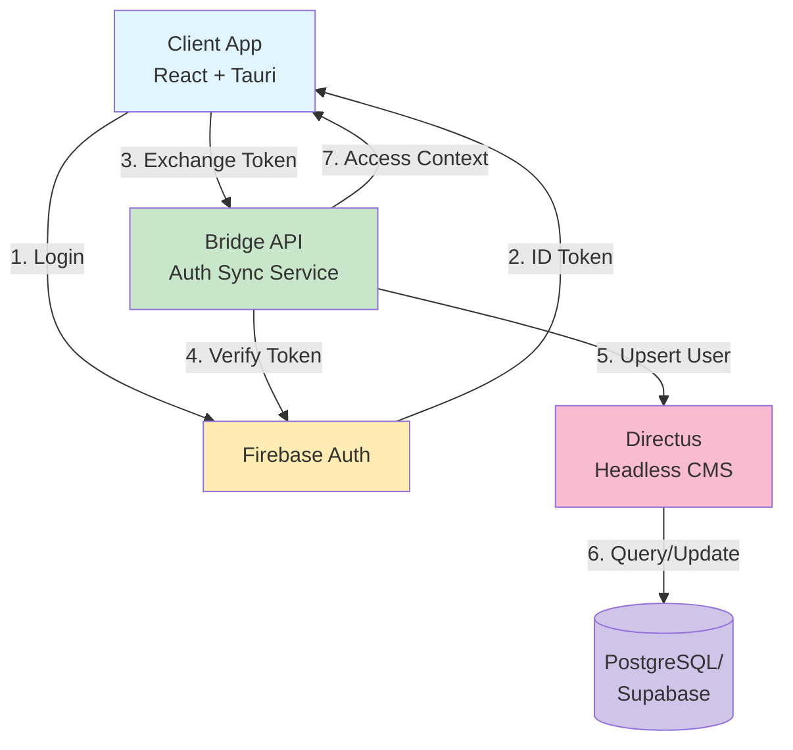
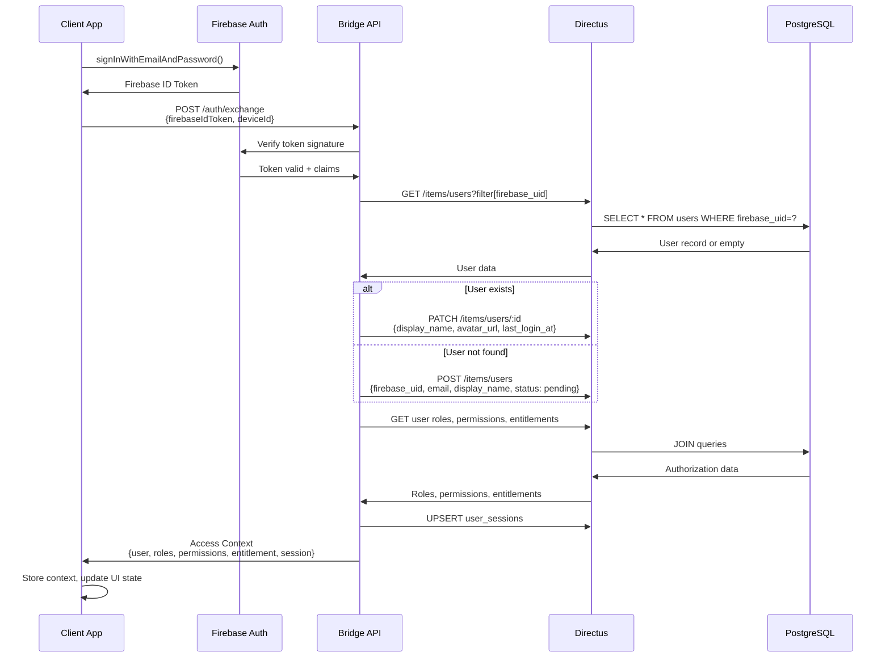
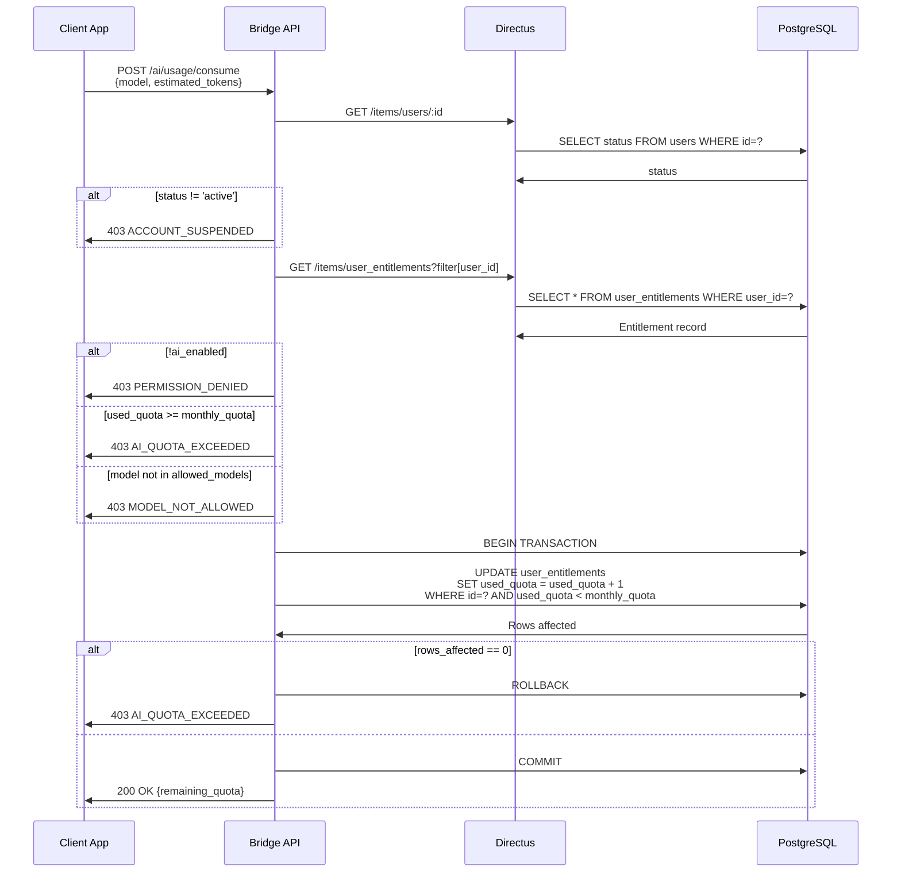
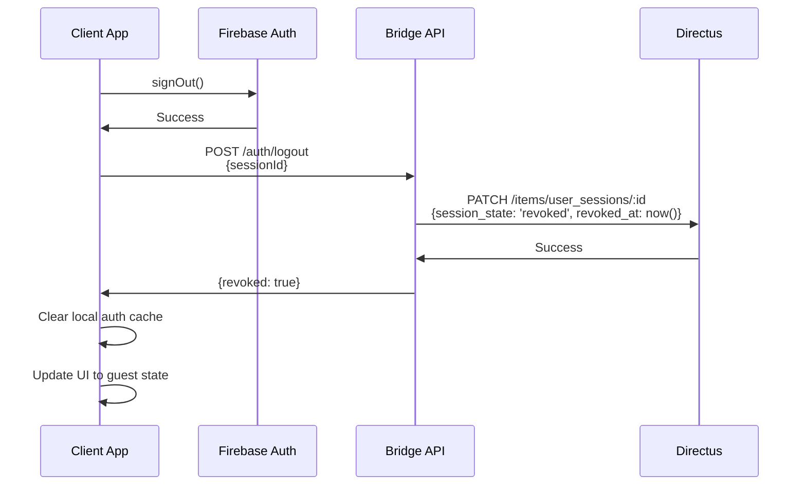

# Design Document: User Management

## Overview

The User Management system provides comprehensive authentication, authorization, profile management, and AI entitlement control for the WordAI desktop application. The system integrates Firebase Authentication for identity verification with Directus/Lumibase for user data management, connected through a Bridge API that serves as the integration layer.

### Design Goals

1. **Separation of Concerns**: Firebase handles authentication (AuthN), Directus manages authorization and user data (AuthZ), and the Bridge API unifies the two systems
2. **Security First**: Cryptographic token verification, rate limiting, audit logging, and principle of least privilege
3. **Scalability**: Support for multi-device sessions, atomic quota management, and efficient authorization policy evaluation
4. **Maintainability**: Version-controlled schema migrations, comprehensive audit trails, and clear error taxonomy
5. **Reliability**: Idempotent operations, transaction-based consistency, and graceful error handling

### Key Capabilities

- **User Lifecycle Management**: Complete state machine for user accounts (pending → active → suspended → deleted)
- **Role-Based Access Control**: Flexible role and permission system with centralized policy management
- **AI Entitlement & Quota**: Per-user quota management with atomic consumption and automatic reset
- **Multi-Device Sessions**: Device-bound sessions with selective revocation capability
- **Comprehensive Audit Logging**: Immutable audit trail for all sensitive operations
- **Admin Panel**: Directus CMS interface for user administration with full audit support

---

## Architecture

### System Components



### Component Responsibilities

#### Client App (React + Tauri)
- **Responsibilities**: User interface, Firebase authentication flow, session state management, API communication
- **Key Operations**: Login/logout, profile display, AI feature access control, session management UI
- **State Management**: Stores Access Context, derives AI access state (guest/active/quota_exceeded/suspended)

#### Firebase Auth
- **Responsibilities**: Identity provider, token issuance, token refresh, user authentication
- **Key Operations**: Sign in/sign out, ID token generation, token verification via public keys
- **Integration**: Provides Firebase UID and user claims to Bridge API

#### Bridge API
- **Responsibilities**: Token verification, user synchronization, authorization policy evaluation, quota management
- **Key Operations**: Token exchange, session management, quota consumption, access context construction
- **Security**: Verifies Firebase tokens, protects Directus admin token, implements rate limiting

#### Directus (Lumibase)
- **Responsibilities**: Schema management, API configuration, permission policies, admin CMS interface
- **Key Operations**: Collection management, field-level access control, audit workflow, data validation
- **Integration**: Provides REST API for Bridge, CMS interface for administrators

#### PostgreSQL/Supabase
- **Responsibilities**: Data persistence, constraint enforcement, transaction management
- **Key Operations**: CRUD operations, foreign key enforcement, check constraints, indexing
- **Schema**: Managed through Lumibase migrations with version control

### Data Flow Sequences

#### Authentication Flow



#### AI Request Authorization Flow



#### Logout Flow



---

## Components and Interfaces

### Bridge API Endpoints

#### POST /auth/exchange

**Purpose**: Exchange Firebase ID token for application access context

**Request**:
```typescript
interface ExchangeRequest {
  firebaseIdToken: string;  // JWT from Firebase Auth
  deviceId: string;          // Unique device identifier
  clientVersion?: string;    // Optional client version
}
```

**Response**:
```typescript
interface ExchangeResponse {
  user: {
    id: string;
    firebase_uid: string;
    email: string;
    display_name: string;
    avatar_url: string | null;
    status: 'pending' | 'active' | 'suspended' | 'deleted';
    last_login_at: string;
  };
  roles: string[];           // ['user', 'pro']
  permissions: string[];     // ['ai.use', 'ai.use.pro_model']
  entitlement: {
    ai_enabled: boolean;
    plan_code: 'free' | 'pro' | 'enterprise';
    monthly_quota: number;
    used_quota: number;
    quota_reset_at: string;
    allowed_models: string[];
    max_requests_per_minute: number;
  };
  session: {
    id: string;
    device_id: string;
    session_state: 'active';
    last_seen_at: string;
  };
}
```

**Error Responses**:
- `400 Bad Request`: Malformed request
- `401 TOKEN_EXPIRED_OR_INVALID`: Invalid or expired Firebase token
- `429 RATE_LIMIT_EXCEEDED`: Too many requests
- `500 Internal Server Error`: Server error with trace_id
- `502 Bad Gateway`: Directus API error with trace_id

**Implementation Notes**:
- Idempotent: Multiple calls with same token and device_id return equivalent responses
- Performance target: < 2 seconds for first-time user creation
- Creates audit_log entry with action "user_created" for new users

---

#### POST /auth/logout

**Purpose**: Revoke user session and terminate access

**Request**:
```typescript
interface LogoutRequest {
  sessionId: string;  // Session ID to revoke
}
```

**Response**:
```typescript
interface LogoutResponse {
  revoked: boolean;
  revoked_at: string;
}
```

**Error Responses**:
- `400 Bad Request`: Missing or invalid session_id
- `404 Not Found`: Session not found
- `500 Internal Server Error`: Server error with trace_id

**Implementation Notes**:
- Idempotent: Revoking already-revoked session succeeds
- Creates audit_log entry with action "session_revoked"
- Revocation effective within 60 seconds

---

#### GET /auth/context

**Purpose**: Retrieve fresh access context from Directus

**Request**: No body (uses session authentication)

**Response**: Same as ExchangeResponse

**Error Responses**:
- `401 AUTH_REQUIRED`: No valid session
- `403 SESSION_REVOKED`: Session has been revoked
- `500 Internal Server Error`: Server error with trace_id

**Implementation Notes**:
- Always fetches fresh data from Directus (no caching)
- Used to refresh context after error responses

---

#### GET /users/me

**Purpose**: Retrieve current user profile

**Request**: No body (uses session authentication)

**Response**:
```typescript
interface UserProfile {
  id: string;
  firebase_uid: string;
  email: string;
  display_name: string;
  avatar_url: string | null;
  status: 'pending' | 'active' | 'suspended' | 'deleted';
  risk_level: 'low' | 'medium' | 'high';
  created_at: string;
  updated_at: string;
  last_login_at: string;
}
```

**Error Responses**:
- `401 AUTH_REQUIRED`: No valid session
- `403 SESSION_REVOKED`: Session has been revoked
- `500 Internal Server Error`: Server error with trace_id

---

#### PATCH /users/me

**Purpose**: Update user profile (limited fields)

**Request**:
```typescript
interface UpdateProfileRequest {
  display_name?: string;
  avatar_url?: string | null;
}
```

**Response**: Updated UserProfile

**Error Responses**:
- `400 Bad Request`: Invalid field values
- `401 AUTH_REQUIRED`: No valid session
- `403 PERMISSION_DENIED`: Attempted to modify restricted fields
- `403 SESSION_REVOKED`: Session has been revoked
- `500 Internal Server Error`: Server error with trace_id

**Implementation Notes**:
- Only display_name and avatar_url can be modified
- Attempting to modify other fields returns PERMISSION_DENIED
- Validates display_name length (1-100 characters)

---

#### GET /users/me/sessions

**Purpose**: List all active sessions for current user

**Request**: No body (uses session authentication)

**Response**:
```typescript
interface SessionList {
  sessions: Array<{
    id: string;
    device_id: string;
    session_state: 'active';
    last_seen_at: string;
    created_at: string;
  }>;
}
```

**Error Responses**:
- `401 AUTH_REQUIRED`: No valid session
- `500 Internal Server Error`: Server error with trace_id

---

#### POST /users/me/sessions/revoke

**Purpose**: Revoke a specific session or all sessions

**Request**:
```typescript
interface RevokeSessionRequest {
  sessionId?: string;  // Specific session to revoke
  revokeAll?: boolean; // Revoke all sessions except current
}
```

**Response**:
```typescript
interface RevokeSessionResponse {
  revoked_count: number;
  revoked_session_ids: string[];
}
```

**Error Responses**:
- `400 Bad Request`: Invalid request (must specify sessionId or revokeAll)
- `401 AUTH_REQUIRED`: No valid session
- `404 Not Found`: Session not found
- `500 Internal Server Error`: Server error with trace_id

**Implementation Notes**:
- Creates audit_log entry for each revoked session
- Revocation effective within 60 seconds

---

#### GET /ai/entitlement

**Purpose**: Retrieve current AI entitlement and quota status

**Request**: No body (uses session authentication)

**Response**:
```typescript
interface AIEntitlement {
  ai_enabled: boolean;
  plan_code: 'free' | 'pro' | 'enterprise';
  monthly_quota: number;
  used_quota: number;
  remaining_quota: number;  // Computed: monthly_quota - used_quota
  quota_reset_at: string;
  allowed_models: string[];
  max_requests_per_minute: number;
}
```

**Error Responses**:
- `401 AUTH_REQUIRED`: No valid session
- `403 SESSION_REVOKED`: Session has been revoked
- `500 Internal Server Error`: Server error with trace_id

---

#### POST /ai/usage/consume

**Purpose**: Validate AI access and atomically consume quota

**Request**:
```typescript
interface ConsumeUsageRequest {
  model: string;              // Model being used
  estimated_tokens?: number;  // For future token-based quota
}
```

**Response**:
```typescript
interface ConsumeUsageResponse {
  consumed: boolean;
  remaining_quota: number;
  quota_reset_at: string;
}
```

**Error Responses**:
- `400 Bad Request`: Invalid model or request
- `401 AUTH_REQUIRED`: No valid session
- `403 ACCOUNT_SUSPENDED`: User status is not 'active'
- `403 PERMISSION_DENIED`: User lacks 'ai.use' permission
- `403 AI_QUOTA_EXCEEDED`: Quota exhausted
- `403 MODEL_NOT_ALLOWED`: Model not in allowed_models
- `403 SESSION_REVOKED`: Session has been revoked
- `429 RATE_LIMIT_EXCEEDED`: Too many requests
- `500 Internal Server Error`: Server error with trace_id

**Implementation Notes**:
- Uses database transaction for atomic quota increment
- Prevents race conditions with optimistic locking
- SQL: `UPDATE user_entitlements SET used_quota = used_quota + 1 WHERE id = ? AND used_quota < monthly_quota`
- If UPDATE affects 0 rows, quota is exhausted

---

### Error Response Format

All error responses follow a consistent structure:

```typescript
interface ErrorResponse {
  error: {
    code: string;           // Error code from taxonomy
    message: string;        // Human-readable message
    trace_id: string;       // Correlation ID for debugging
    details?: any;          // Optional additional context
  };
}
```

**Standard Error Codes**:
- `AUTH_REQUIRED`: No authentication provided
- `TOKEN_EXPIRED_OR_INVALID`: Firebase token verification failed
- `ACCOUNT_SUSPENDED`: User status is suspended or deleted
- `PERMISSION_DENIED`: User lacks required permission
- `AI_QUOTA_EXCEEDED`: Monthly quota exhausted
- `MODEL_NOT_ALLOWED`: Requested model not in allowed_models
- `SESSION_REVOKED`: Session has been revoked
- `RATE_LIMIT_EXCEEDED`: Too many requests in time window

---

## Data Models

### Database Schema

#### users Collection

**Purpose**: Core user profile and identity information

```sql
CREATE TABLE users (
  id UUID PRIMARY KEY DEFAULT gen_random_uuid(),
  firebase_uid VARCHAR(128) NOT NULL UNIQUE,
  email VARCHAR(255) NOT NULL UNIQUE,
  display_name VARCHAR(100),
  avatar_url TEXT,
  status VARCHAR(20) NOT NULL DEFAULT 'pending' 
    CHECK (status IN ('pending', 'active', 'suspended', 'deleted')),
  risk_level VARCHAR(20) NOT NULL DEFAULT 'low'
    CHECK (risk_level IN ('low', 'medium', 'high')),
  created_at TIMESTAMP WITH TIME ZONE NOT NULL DEFAULT NOW(),
  updated_at TIMESTAMP WITH TIME ZONE NOT NULL DEFAULT NOW(),
  last_login_at TIMESTAMP WITH TIME ZONE
);

CREATE INDEX idx_users_firebase_uid ON users(firebase_uid);
CREATE INDEX idx_users_email ON users(email);
CREATE INDEX idx_users_status ON users(status);
```

**Field Descriptions**:
- `id`: Primary key (UUID)
- `firebase_uid`: Unique identifier from Firebase Auth (immutable)
- `email`: Normalized email address (lowercase, trimmed, immutable)
- `display_name`: User's display name (mutable)
- `avatar_url`: URL to user's avatar image (mutable)
- `status`: Account state in lifecycle state machine
- `risk_level`: Security risk assessment (for fraud detection)
- `created_at`: Account creation timestamp
- `updated_at`: Last profile update timestamp
- `last_login_at`: Most recent successful login

**Constraints**:
- `firebase_uid` must be unique
- `email` must be unique
- `status` must be one of: pending, active, suspended, deleted
- `risk_level` must be one of: low, medium, high

---

#### roles Collection

**Purpose**: Define available roles in the system

```sql
CREATE TABLE roles (
  role_code VARCHAR(50) PRIMARY KEY,
  description TEXT NOT NULL,
  created_at TIMESTAMP WITH TIME ZONE NOT NULL DEFAULT NOW()
);
```

**Seed Data**:
```sql
INSERT INTO roles (role_code, description) VALUES
  ('guest', 'Unauthenticated user with minimal access'),
  ('user', 'Standard authenticated user'),
  ('pro', 'Premium user with enhanced features'),
  ('admin', 'System administrator with full access'),
  ('support', 'Customer support representative');
```

---

#### permissions Collection

**Purpose**: Define atomic permissions in the system

```sql
CREATE TABLE permissions (
  permission_code VARCHAR(100) PRIMARY KEY,
  description TEXT NOT NULL,
  created_at TIMESTAMP WITH TIME ZONE NOT NULL DEFAULT NOW()
);
```

**Seed Data**:
```sql
INSERT INTO permissions (permission_code, description) VALUES
  ('ai.use', 'Use AI features with basic models'),
  ('ai.use.pro_model', 'Use premium AI models'),
  ('user.manage', 'Manage user accounts'),
  ('quota.override', 'Override user quotas'),
  ('role.assign', 'Assign roles to users'),
  ('audit.view', 'View audit logs');
```

---

#### user_roles Collection

**Purpose**: Map users to their assigned roles

```sql
CREATE TABLE user_roles (
  id UUID PRIMARY KEY DEFAULT gen_random_uuid(),
  user_id UUID NOT NULL REFERENCES users(id) ON DELETE CASCADE,
  role_code VARCHAR(50) NOT NULL REFERENCES roles(role_code) ON DELETE CASCADE,
  assigned_at TIMESTAMP WITH TIME ZONE NOT NULL DEFAULT NOW(),
  assigned_by UUID REFERENCES users(id) ON DELETE SET NULL,
  UNIQUE(user_id, role_code)
);

CREATE INDEX idx_user_roles_user_id ON user_roles(user_id);
CREATE INDEX idx_user_roles_role_code ON user_roles(role_code);
```

**Field Descriptions**:
- `id`: Primary key
- `user_id`: Reference to users table
- `role_code`: Reference to roles table
- `assigned_at`: When role was assigned
- `assigned_by`: User who assigned the role (nullable for system assignments)

**Constraints**:
- Each user can have a role only once (unique constraint on user_id, role_code)
- Foreign key to users with CASCADE delete
- Foreign key to roles with CASCADE delete

---

#### role_permissions Collection

**Purpose**: Map roles to their permissions

```sql
CREATE TABLE role_permissions (
  role_code VARCHAR(50) NOT NULL REFERENCES roles(role_code) ON DELETE CASCADE,
  permission_code VARCHAR(100) NOT NULL REFERENCES permissions(permission_code) ON DELETE CASCADE,
  PRIMARY KEY (role_code, permission_code)
);

CREATE INDEX idx_role_permissions_role ON role_permissions(role_code);
```

**Seed Data**:
```sql
INSERT INTO role_permissions (role_code, permission_code) VALUES
  ('user', 'ai.use'),
  ('pro', 'ai.use'),
  ('pro', 'ai.use.pro_model'),
  ('admin', 'ai.use'),
  ('admin', 'ai.use.pro_model'),
  ('admin', 'user.manage'),
  ('admin', 'quota.override'),
  ('admin', 'role.assign'),
  ('admin', 'audit.view'),
  ('support', 'ai.use'),
  ('support', 'user.manage'),
  ('support', 'audit.view');
```

---

#### user_entitlements Collection

**Purpose**: Manage AI access rights and quota for each user

```sql
CREATE TABLE user_entitlements (
  id UUID PRIMARY KEY DEFAULT gen_random_uuid(),
  user_id UUID NOT NULL UNIQUE REFERENCES users(id) ON DELETE CASCADE,
  ai_enabled BOOLEAN NOT NULL DEFAULT true,
  plan_code VARCHAR(50) NOT NULL DEFAULT 'free'
    CHECK (plan_code IN ('free', 'pro', 'enterprise')),
  monthly_quota INTEGER NOT NULL DEFAULT 100,
  used_quota INTEGER NOT NULL DEFAULT 0,
  quota_reset_at TIMESTAMP WITH TIME ZONE NOT NULL,
  allowed_models JSONB NOT NULL DEFAULT '["gpt-3.5-turbo"]'::jsonb,
  max_requests_per_minute INTEGER NOT NULL DEFAULT 10,
  created_at TIMESTAMP WITH TIME ZONE NOT NULL DEFAULT NOW(),
  updated_at TIMESTAMP WITH TIME ZONE NOT NULL DEFAULT NOW(),
  CONSTRAINT check_quota_valid CHECK (used_quota >= 0 AND used_quota <= monthly_quota)
);

CREATE INDEX idx_user_entitlements_user_id ON user_entitlements(user_id);
CREATE INDEX idx_user_entitlements_quota_reset ON user_entitlements(quota_reset_at);
```

**Field Descriptions**:
- `id`: Primary key
- `user_id`: Reference to users table (unique - one entitlement per user)
- `ai_enabled`: Whether AI features are enabled for this user
- `plan_code`: Subscription plan (free, pro, enterprise)
- `monthly_quota`: Maximum requests allowed per month
- `used_quota`: Requests consumed in current period
- `quota_reset_at`: When quota will reset (first day of next month)
- `allowed_models`: JSON array of permitted model identifiers
- `max_requests_per_minute`: Rate limit for AI requests
- `created_at`: Entitlement creation timestamp
- `updated_at`: Last modification timestamp

**Constraints**:
- `used_quota` must be between 0 and `monthly_quota`
- `user_id` must be unique (one entitlement per user)
- `plan_code` must be one of: free, pro, enterprise

**Default Values by Plan**:
```sql
-- Free plan defaults
monthly_quota: 100
allowed_models: ["gpt-3.5-turbo"]
max_requests_per_minute: 10

-- Pro plan defaults
monthly_quota: 1000
allowed_models: ["gpt-3.5-turbo", "gpt-4", "gpt-4-turbo"]
max_requests_per_minute: 60

-- Enterprise plan defaults
monthly_quota: 10000
allowed_models: ["gpt-3.5-turbo", "gpt-4", "gpt-4-turbo", "gpt-4-32k"]
max_requests_per_minute: 120
```

---

#### user_sessions Collection

**Purpose**: Track active sessions across multiple devices

```sql
CREATE TABLE user_sessions (
  id UUID PRIMARY KEY DEFAULT gen_random_uuid(),
  user_id UUID NOT NULL REFERENCES users(id) ON DELETE CASCADE,
  device_id VARCHAR(255) NOT NULL,
  session_state VARCHAR(20) NOT NULL DEFAULT 'active'
    CHECK (session_state IN ('active', 'revoked')),
  last_seen_at TIMESTAMP WITH TIME ZONE NOT NULL DEFAULT NOW(),
  revoked_at TIMESTAMP WITH TIME ZONE,
  created_at TIMESTAMP WITH TIME ZONE NOT NULL DEFAULT NOW(),
  UNIQUE(user_id, device_id)
);

CREATE INDEX idx_user_sessions_user_id ON user_sessions(user_id);
CREATE INDEX idx_user_sessions_device_id ON user_sessions(device_id);
CREATE INDEX idx_user_sessions_state ON user_sessions(session_state);
```

**Field Descriptions**:
- `id`: Primary key
- `user_id`: Reference to users table
- `device_id`: Unique identifier for the device/client instance
- `session_state`: Current state (active or revoked)
- `last_seen_at`: Last activity timestamp
- `revoked_at`: When session was revoked (null if active)
- `created_at`: Session creation timestamp

**Constraints**:
- Each user can have only one session per device (unique constraint on user_id, device_id)
- `session_state` must be one of: active, revoked
- Foreign key to users with CASCADE delete

---

#### audit_logs Collection

**Purpose**: Immutable audit trail for sensitive operations

```sql
CREATE TABLE audit_logs (
  id UUID PRIMARY KEY DEFAULT gen_random_uuid(),
  actor_user_id UUID REFERENCES users(id) ON DELETE SET NULL,
  action VARCHAR(100) NOT NULL,
  resource VARCHAR(255) NOT NULL,
  resource_id UUID,
  before_data JSONB,
  after_data JSONB,
  trace_id VARCHAR(100),
  ip_address INET,
  user_agent TEXT,
  created_at TIMESTAMP WITH TIME ZONE NOT NULL DEFAULT NOW()
);

CREATE INDEX idx_audit_logs_actor ON audit_logs(actor_user_id);
CREATE INDEX idx_audit_logs_action ON audit_logs(action);
CREATE INDEX idx_audit_logs_resource ON audit_logs(resource);
CREATE INDEX idx_audit_logs_created_at ON audit_logs(created_at DESC);
CREATE INDEX idx_audit_logs_trace_id ON audit_logs(trace_id);

-- Prevent updates and deletes
CREATE RULE audit_logs_no_update AS ON UPDATE TO audit_logs DO INSTEAD NOTHING;
CREATE RULE audit_logs_no_delete AS ON DELETE TO audit_logs DO INSTEAD NOTHING;
```

**Field Descriptions**:
- `id`: Primary key
- `actor_user_id`: User who performed the action (nullable for system actions)
- `action`: Action type from taxonomy (e.g., "user_created", "role_assigned")
- `resource`: Resource type (e.g., "user", "role", "entitlement")
- `resource_id`: ID of the affected resource
- `before_data`: State before the action (JSON)
- `after_data`: State after the action (JSON)
- `trace_id`: Correlation ID for related actions
- `ip_address`: Client IP address
- `user_agent`: Client user agent string
- `created_at`: Timestamp of the action

**Action Taxonomy**:
- `user_created`: New user account created
- `user_status_changed`: User status transitioned
- `role_assigned`: Role assigned to user
- `role_removed`: Role removed from user
- `permission_changed`: Role-permission mapping modified
- `entitlement_overridden`: Admin manually adjusted quota or plan
- `session_revoked`: Session terminated
- `quota_consumed`: AI quota consumed (optional, high volume)
- `login_success`: Successful authentication
- `login_failed`: Failed authentication attempt

**Immutability**:
- PostgreSQL rules prevent UPDATE and DELETE operations
- Retention policy: minimum 1 year, configurable per compliance requirements

---

### Entity Relationships

```mermaid
erDiagram
    users ||--o{ user_roles : has
    users ||--|| user_entitlements : has
    users ||--o{ user_sessions : has
    users ||--o{ audit_logs : performs
    roles ||--o{ user_roles : assigned_to
    roles ||--o{ role_permissions : has
    permissions ||--o{ role_permissions : granted_by
    
    users {
        uuid id PK
        string firebase_uid UK
        string email UK
        string display_name
        string avatar_url
        enum status
        enum risk_level
        timestamp created_at
        timestamp updated_at
        timestamp last_login_at
    }
    
    roles {
        string role_code PK
        string description
    }
    
    permissions {
        string permission_code PK
        string description
    }
    
    user_roles {
        uuid id PK
        uuid user_id FK
        string role_code FK
        timestamp assigned_at
        uuid assigned_by FK
    }
    
    role_permissions {
        string role_code FK
        string permission_code FK
    }
    
    user_entitlements {
        uuid id PK
        uuid user_id FK_UK
        boolean ai_enabled
        string plan_code
        integer monthly_quota
        integer used_quota
        timestamp quota_reset_at
        jsonb allowed_models
        integer max_requests_per_minute
    }
    
    user_sessions {
        uuid id PK
        uuid user_id FK
        string device_id
        enum session_state
        timestamp last_seen_at
        timestamp revoked_at
    }
    
    audit_logs {
        uuid id PK
        uuid actor_user_id FK
        string action
        string resource
        uuid resource_id
        jsonb before_data
        jsonb after_data
        string trace_id
        timestamp created_at
    }
```

---

## Correctness Properties

*A property is a characteristic or behavior that should hold true across all valid executions of a system—essentially, a formal statement about what the system should do. Properties serve as the bridge between human-readable specifications and machine-verifiable correctness guarantees.*

Based on the prework analysis, the following properties are suitable for property-based testing. Properties testing external services (Firebase SDK, AWS, database configuration) or UI behavior are excluded and should be tested with integration tests or example-based tests instead.

### Property 1: Token Exchange Idempotence

*For any* valid Firebase ID token and device ID, multiple token exchange requests SHALL produce equivalent Access Context responses (excluding timestamps).

**Validates: Requirements 1.1, 1.5, 15.1**

**Test Strategy**: Generate random Firebase tokens and device IDs, call exchange endpoint multiple times, verify responses are equivalent.

---

### Property 2: Access Context Serialization Round-Trip

*For any* Access Context object, serializing to JSON and deserializing back SHALL preserve all authorization data (user, roles, permissions, entitlement, session).

**Validates: Requirements 1.8, 1.9**

**Test Strategy**: Generate random Access Context objects, serialize and deserialize, verify equality.

---

### Property 3: Firebase UID Extraction Correctness

*For any* valid Firebase ID token, extracting the Firebase UID SHALL return the value from the token's `uid` claim.

**Validates: Requirements 1.4**

**Test Strategy**: Generate tokens with various UID values, verify extraction matches the claim.

---

### Property 4: Invalid Token Rejection

*For any* invalid Firebase ID token (expired, wrong signature, wrong issuer, wrong audience), token verification SHALL fail and return TOKEN_EXPIRED_OR_INVALID.

**Validates: Requirements 1.10, 11.1-11.5**

**Test Strategy**: Generate various invalid tokens, verify all fail verification with correct error code.

---

### Property 5: User Creation Audit Log

*For any* new user creation, an audit_log entry with action "user_created" SHALL exist after the operation completes.

**Validates: Requirements 1.11, 10.2**

**Test Strategy**: Generate random new users, verify audit log creation.

---

### Property 6: Profile Field Immutability

*For any* profile update operation, the firebase_uid and email fields SHALL remain unchanged after the update.

**Validates: Requirements 2.4, 2.10, 2.11**

**Test Strategy**: Generate random profile updates, verify firebase_uid and email are unchanged.

---

### Property 7: Email Normalization Idempotence

*For any* email address string, normalizing it twice SHALL produce the same result as normalizing it once: normalize(normalize(email)) = normalize(email).

**Validates: Requirements 2.9**

**Test Strategy**: Generate random email strings with various cases and whitespace, verify normalization is idempotent.

---

### Property 8: Profile Update Idempotence

*For any* profile update request, applying the same update twice SHALL produce the same final state as applying it once.

**Validates: Requirements 2.6, 2.7, 15.2**

**Test Strategy**: Generate random profile updates, apply twice, verify final state is identical.

---

### Property 9: State Machine Validity

*For any* sequence of valid status transitions, the final status SHALL be reachable through the defined state machine rules.

**Validates: Requirements 3.1-3.10**

**Test Strategy**: Generate random sequences of valid transitions, verify final state is correct and reachable.

---

### Property 10: Status Change Audit Completeness

*For any* user status change, exactly one audit_log entry with action "user_status_changed" SHALL exist.

**Validates: Requirements 3.11, 3.12, 10.2**

**Test Strategy**: Generate random status changes, verify exactly one audit log per change.

---

### Property 11: Deleted Status Irreversibility

*For any* user with status "deleted", no sequence of operations SHALL change the status to any other value.

**Validates: Requirements 3.8**

**Test Strategy**: Create users with deleted status, attempt various status transitions, verify all fail.

---

### Property 12: Suspended User Session Prevention

*For any* user with status "suspended" or "deleted", session creation SHALL fail.

**Validates: Requirements 3.14**

**Test Strategy**: Generate users with suspended/deleted status, attempt session creation, verify failure.

---

### Property 13: Permission Closure

*For any* user with roles R, the set of permissions in Access Context SHALL equal the union of permissions for all roles in R.

**Validates: Requirements 4.10-4.12**

**Test Strategy**: Generate users with various role combinations, verify permission set is the union of role permissions.

---

### Property 14: Role Assignment Audit Completeness

*For any* role assignment or removal, a corresponding audit_log entry SHALL exist with action "role_assigned" or "role_removed".

**Validates: Requirements 4.7, 4.9, 10.2**

**Test Strategy**: Generate random role assignments/removals, verify audit logs exist.

---

### Property 15: Multiple Role Support

*For any* user and any set of roles, all roles in the set SHALL be assignable to the user simultaneously.

**Validates: Requirements 4.13**

**Test Strategy**: Generate random role sets, assign all to a user, verify all are assigned.

---

### Property 16: Quota Constraint Invariant

*For any* sequence of quota operations, the constraint used_quota <= monthly_quota SHALL always hold.

**Validates: Requirements 5.4, 5.10, 5.11**

**Test Strategy**: Generate random quota operations, verify constraint is never violated.

---

### Property 17: Quota Atomicity

*For any* N concurrent AI requests where used_quota + N <= monthly_quota, exactly N requests SHALL succeed and used_quota SHALL increase by exactly N.

**Validates: Requirements 5.10, 5.11**

**Test Strategy**: Simulate concurrent quota consumption, verify atomicity and correct final quota.

---

### Property 18: No Negative Quota

*For any* sequence of quota operations, used_quota SHALL always be >= 0.

**Validates: Requirements 5.4**

**Test Strategy**: Generate random quota operations including resets, verify used_quota never goes negative.

---

### Property 19: Quota Reset Idempotence

*For any* quota reset operation on a given date, applying the reset multiple times SHALL produce the same result as applying it once.

**Validates: Requirements 5.12, 5.13, 15.4**

**Test Strategy**: Generate random dates, apply reset multiple times, verify idempotence.

---

### Property 20: Model Validation

*For any* AI request with model M, the request SHALL succeed only if M is in the user's allowed_models list.

**Validates: Requirements 5.8, 5.9**

**Test Strategy**: Generate random AI requests with various models, verify model validation.

---

### Property 21: Entitlement Override Audit

*For any* admin quota override, an audit_log entry with action "entitlement_overridden" SHALL exist.

**Validates: Requirements 5.14, 10.2**

**Test Strategy**: Generate random quota overrides, verify audit logs.

---

### Property 22: Session Revocation Effectiveness

*For any* session S revoked at time T, all authentication attempts using S after T+60s SHALL fail with SESSION_REVOKED.

**Validates: Requirements 6.9, 6.10**

**Test Strategy**: Revoke sessions, wait 60s, attempt authentication, verify failure.

---

### Property 23: Session Isolation

*For any* two sessions S1 and S2 with different device_ids, revoking S1 SHALL NOT affect the validity of S2.

**Validates: Requirements 6.11**

**Test Strategy**: Create multiple sessions for a user, revoke one, verify others remain valid.

---

### Property 24: Session Revocation Audit

*For any* session revocation, exactly one audit_log entry with action "session_revoked" SHALL exist.

**Validates: Requirements 6.8, 10.2**

**Test Strategy**: Generate random session revocations, verify audit logs.

---

### Property 25: Session Uniqueness

*For any* user and device_id pair, at most one active session SHALL exist.

**Validates: Requirements 6.12**

**Test Strategy**: Attempt to create duplicate sessions for same user/device, verify uniqueness constraint.

---

### Property 26: Logout Completeness

*For any* logout operation, attempting to use the previous session SHALL fail with SESSION_REVOKED.

**Validates: Requirements 7.6**

**Test Strategy**: Perform logout, attempt to use session, verify failure.

---

### Property 27: Logout Idempotence

*For any* session, calling logout multiple times SHALL produce the same final state as calling it once.

**Validates: Requirements 7.3, 7.4, 15.3**

**Test Strategy**: Generate random sessions, logout multiple times, verify idempotence.

---

### Property 28: Authorization Source of Truth

*For any* authorization decision, the result SHALL be determined solely by data in Directus, not by client-provided data.

**Validates: Requirements 8.6, 8.7**

**Test Strategy**: Generate authorization requests with client-provided data, verify server ignores client data and uses Directus.

---

### Property 29: Access Context Consistency

*For any* user, two Access Context requests at the same time SHALL return equivalent authorization data.

**Validates: Requirements 8.8**

**Test Strategy**: Make concurrent Access Context requests for same user, verify equivalence.

---

### Property 30: Error Code Determinism

*For any* given authorization failure condition, the error code SHALL always be the same.

**Validates: Requirements 8.10**

**Test Strategy**: Generate various failure conditions, verify consistent error codes.

---

### Property 31: Audit Log Immutability

*For any* audit_log entry, once created, it SHALL never be modified or deleted.

**Validates: Requirements 10.6**

**Test Strategy**: Create audit logs, attempt to modify/delete, verify operations fail.

---

### Property 32: Audit Completeness

*For any* sensitive action defined in the action taxonomy (user_created, user_status_changed, role_assigned, role_removed, permission_changed, entitlement_overridden, session_revoked), a corresponding audit_log entry SHALL exist.

**Validates: Requirements 10.2, 10.3**

**Test Strategy**: Perform various sensitive actions, verify audit logs exist for all.

---

### Property 33: Audit Temporal Ordering

*For any* sequence of related actions, the audit_log entries SHALL have created_at timestamps in the same order as the actions occurred.

**Validates: Requirements 10.5**

**Test Strategy**: Perform sequence of actions, verify audit log timestamps are ordered.

---

### Property 34: Rate Limiting Effectiveness

*For any* endpoint with rate limit N, making N+1 requests in the time window SHALL result in exactly N successes and 1 failure with RATE_LIMIT_EXCEEDED.

**Validates: Requirements 11.8-11.10**

**Test Strategy**: Generate request bursts exceeding rate limits, verify correct number of successes and failures.

---

### Property 35: Migration Idempotence

*For any* database migration M, applying M when it is already applied SHALL have no effect on the schema.

**Validates: Requirements 12.3**

**Test Strategy**: Apply migrations multiple times, verify schema remains unchanged after first application.

---

### Property 36: Migration Rollback Correctness

*For any* migration M, applying M then rolling back M SHALL restore the schema to its original state.

**Validates: Requirements 12.4, 12.5**

**Test Strategy**: Apply migrations then rollback, verify schema is restored.

---

### Property 37: Database Constraint Enforcement

*For any* constraint C defined in migrations (firebase_uid unique, email unique, used_quota <= monthly_quota), the database SHALL reject operations that violate C.

**Validates: Requirements 12.10, 12.11**

**Test Strategy**: Attempt operations that violate constraints, verify rejection.

---

### Property 38: Client State Derivation Determinism

*For any* Access Context A, the derived AI access state (guest/active/quota_exceeded/suspended) SHALL be deterministic and consistent.

**Validates: Requirements 13.2-13.7**

**Test Strategy**: Generate random Access Context values, derive state multiple times, verify consistency.

---

### Property 39: Transaction Atomicity

*For any* multi-record database operation, either all changes SHALL be committed or all changes SHALL be rolled back.

**Validates: Requirements 15.9, 15.10**

**Test Strategy**: Simulate transaction failures, verify atomicity (all or nothing).

---

### Property 40: Error Response Consistency

*For any* error condition, the error code and message SHALL be consistent across multiple occurrences of the same condition.

**Validates: Requirements 15.8**

**Test Strategy**: Generate same error conditions multiple times, verify consistent error responses.

---

## Error Handling

### Error Taxonomy

The system uses a hierarchical error taxonomy for consistent error handling:

**Authentication Errors (4xx)**:
- `AUTH_REQUIRED` (401): No authentication credentials provided
- `TOKEN_EXPIRED_OR_INVALID` (401): Firebase token verification failed
- `SESSION_REVOKED` (403): Session has been revoked

**Authorization Errors (403)**:
- `PERMISSION_DENIED`: User lacks required permission
- `ACCOUNT_SUSPENDED`: User status is suspended or deleted
- `AI_QUOTA_EXCEEDED`: Monthly AI quota exhausted
- `MODEL_NOT_ALLOWED`: Requested AI model not in allowed_models

**Client Errors (4xx)**:
- `BAD_REQUEST` (400): Malformed request or invalid parameters
- `NOT_FOUND` (404): Resource not found
- `RATE_LIMIT_EXCEEDED` (429): Too many requests in time window

**Server Errors (5xx)**:
- `INTERNAL_SERVER_ERROR` (500): Unexpected server error
- `BAD_GATEWAY` (502): Directus API error
- `SERVICE_UNAVAILABLE` (503): Service temporarily unavailable

### Error Response Format

All errors follow a consistent JSON structure:

```typescript
interface ErrorResponse {
  error: {
    code: string;           // Error code from taxonomy
    message: string;        // Human-readable message
    trace_id: string;       // Correlation ID for debugging
    details?: any;          // Optional additional context
  };
}
```

### Recovery Strategies

**Client-Side Recovery**:
- `TOKEN_EXPIRED_OR_INVALID`: Refresh Firebase token and retry
- `SESSION_REVOKED`: Clear local state and redirect to login
- `AI_QUOTA_EXCEEDED`: Display quota exceeded message with reset date
- `ACCOUNT_SUSPENDED`: Display account suspended message with support contact
- `RATE_LIMIT_EXCEEDED`: Implement exponential backoff and retry

**Server-Side Recovery**:
- Database transaction failures: Automatic rollback and error response
- Directus API errors: Log error with trace_id, return 502 Bad Gateway
- Firebase verification errors: Log error, return TOKEN_EXPIRED_OR_INVALID
- Quota race conditions: Use optimistic locking, retry on conflict

### Logging and Monitoring

**Error Logging**:
- All errors logged with: error_code, user_id, request_context, trace_id, timestamp
- Failed authentication attempts logged with reason codes
- Database errors logged with query context (sanitized)
- Rate limit violations logged with client IP and user_id

**Alerting Thresholds**:
- Login success rate drops below 95%
- Auth exchange latency p95 exceeds 2 seconds
- Failed auth attempts increase by >50% in 5 minutes
- Database transaction errors in quota consumption
- Any 5xx error rate exceeds 1% of requests

---

## Testing Strategy

### Overview

The testing strategy employs a multi-layered approach combining unit tests, property-based tests, integration tests, and end-to-end tests to ensure comprehensive coverage and correctness.

### Unit Testing

**Scope**: Individual functions and components in isolation

**Coverage Requirements**:
- Minimum 80% code coverage for Bridge API
- Minimum 70% code coverage for Client App
- 100% coverage for critical paths (authentication, quota management, audit logging)

**Test Categories**:
1. **Pure Function Tests**: Token parsing, email normalization, state derivation
2. **Component Tests**: React components with mocked dependencies
3. **API Handler Tests**: Endpoint handlers with mocked Directus/Firebase
4. **Error Handling Tests**: Specific error conditions and edge cases

**Example Unit Tests**:
- Email normalization with various inputs (uppercase, whitespace, special characters)
- State machine transition validation (valid and invalid transitions)
- Access Context construction from user data
- Error response formatting

### Property-Based Testing

**Framework**: fast-check (JavaScript/TypeScript)

**Configuration**:
- Minimum 100 iterations per property test (due to randomization)
- Seed-based reproducibility for failed tests
- Shrinking enabled to find minimal failing examples

**Property Test Structure**:
```typescript
import fc from 'fast-check';

// Feature: user-management, Property 7: Email Normalization Idempotence
test('email normalization is idempotent', () => {
  fc.assert(
    fc.property(fc.emailAddress(), (email) => {
      const normalized1 = normalizeEmail(email);
      const normalized2 = normalizeEmail(normalized1);
      expect(normalized1).toBe(normalized2);
    }),
    { numRuns: 100 }
  );
});
```

**Property Test Tags**:
Each property test MUST include a comment tag referencing the design property:
```typescript
// Feature: user-management, Property 16: Quota Constraint Invariant
```

**Generators**:
Custom generators for domain objects:
- `arbFirebaseToken()`: Valid and invalid Firebase tokens
- `arbUserProfile()`: User profiles with various statuses
- `arbAccessContext()`: Complete access contexts
- `arbQuotaOperation()`: Quota consumption and reset operations
- `arbStatusTransition()`: Valid and invalid state transitions

**Property Test Coverage**:
All 40 correctness properties defined in this document MUST have corresponding property-based tests.

### Integration Testing

**Scope**: Component interactions with real dependencies

**Test Environment**:
- Local PostgreSQL database with test schema
- Mocked Firebase Admin SDK (for token verification)
- Real Directus instance (test mode)
- Test data seeded before each test suite

**Integration Test Categories**:
1. **Database Integration**: Schema migrations, constraints, transactions
2. **Directus Integration**: API calls, permission policies, audit logging
3. **Multi-Component Flows**: Authentication flow, quota consumption, session management

**Example Integration Tests**:
- Complete authentication flow from Firebase token to Access Context
- Concurrent quota consumption with real database transactions
- Session revocation propagation across multiple devices
- Audit log creation for all sensitive operations

### End-to-End Testing

**Scope**: Complete user workflows through the UI

**Framework**: Playwright or Cypress

**Test Scenarios**:
1. **User Registration and Login**: Firebase auth → token exchange → UI update
2. **AI Feature Access**: Check quota → consume quota → handle quota exceeded
3. **Multi-Device Session Management**: Login on multiple devices → revoke session → verify revocation
4. **Profile Management**: Update profile → verify changes → verify immutable fields
5. **Admin Workflows**: Change user status → assign roles → override quota

**E2E Test Environment**:
- Staging environment with production-like configuration
- Test Firebase project
- Test Directus instance
- Isolated test database

### Performance Testing

**Load Testing**:
- Token exchange endpoint: 100 req/s sustained, < 2s p95 latency
- Quota consumption endpoint: 50 req/s sustained, < 500ms p95 latency
- Concurrent quota consumption: 10 concurrent users, verify atomicity

**Stress Testing**:
- Quota exhaustion: 1000 users hitting quota simultaneously
- Session revocation: Revoke 100 sessions simultaneously
- Database connection pool: Exhaust connections and verify recovery

### Test Data Management

**Test Data Strategy**:
- Seed data for roles, permissions, role_permissions (from migrations)
- Factory functions for generating test users, sessions, entitlements
- Cleanup after each test to prevent data pollution
- Separate test database from development database

**Test User Personas**:
- `guest_user`: No authentication
- `free_user`: Free plan, basic quota
- `pro_user`: Pro plan, enhanced quota
- `admin_user`: Admin role, full permissions
- `suspended_user`: Suspended status
- `quota_exceeded_user`: Used quota >= monthly quota

### Continuous Integration

**CI Pipeline**:
1. **Lint and Format**: ESLint, Prettier
2. **Unit Tests**: Run all unit tests, generate coverage report
3. **Property Tests**: Run all property-based tests (100 iterations each)
4. **Integration Tests**: Run with test database
5. **E2E Tests**: Run critical user flows
6. **Build**: Compile TypeScript, bundle assets
7. **Deploy**: Deploy to staging environment

**Quality Gates**:
- All tests must pass
- Code coverage >= 80% for Bridge API
- Code coverage >= 70% for Client App
- No critical security vulnerabilities (npm audit)
- No TypeScript errors

### Test Maintenance

**Test Review Process**:
- New features MUST include unit tests and property tests
- Property tests MUST reference design properties
- Integration tests MUST be added for new API endpoints
- E2E tests MUST be added for new user workflows

**Test Refactoring**:
- Remove duplicate tests
- Update tests when requirements change
- Refactor test utilities and generators
- Keep test code quality high (DRY, clear assertions)

---

## Implementation Guidance

### Development Phases

**Phase 1: Foundation (Weeks 1-2)**
- Set up PostgreSQL database and Directus
- Implement Lumibase migrations for all collections
- Seed roles, permissions, and role_permissions
- Set up Bridge API project structure
- Implement Firebase token verification

**Phase 2: Core Authentication (Weeks 3-4)**
- Implement POST /auth/exchange endpoint
- Implement user upsert logic
- Implement Access Context construction
- Implement session management
- Add audit logging for authentication events

**Phase 3: Authorization & Quota (Weeks 5-6)**
- Implement role and permission retrieval
- Implement quota management with atomic transactions
- Implement POST /ai/usage/consume endpoint
- Add rate limiting
- Add audit logging for quota operations

**Phase 4: User Management (Weeks 7-8)**
- Implement profile endpoints (GET/PATCH /users/me)
- Implement session management endpoints
- Implement user lifecycle state machine
- Configure Directus admin panel
- Add audit logging for admin operations

**Phase 5: Testing & Hardening (Weeks 9-10)**
- Write unit tests (target 80% coverage)
- Write property-based tests (all 40 properties)
- Write integration tests
- Write E2E tests for critical flows
- Performance testing and optimization

**Phase 6: Deployment & Monitoring (Weeks 11-12)**
- Set up production database and Directus
- Deploy Bridge API to production
- Configure monitoring and alerting
- Set up audit log retention policies
- Documentation and runbooks

### Technology Stack

**Backend (Bridge API)**:
- **Runtime**: Node.js 20+ with TypeScript
- **Framework**: Express.js or Fastify
- **Database**: PostgreSQL 15+ (via Supabase)
- **ORM**: Directus SDK for API calls
- **Authentication**: Firebase Admin SDK
- **Testing**: Jest + fast-check
- **Logging**: Winston or Pino
- **Monitoring**: Datadog or New Relic

**Frontend (Client App)**:
- **Framework**: React 18+ with TypeScript
- **Desktop**: Tauri 2.0
- **State Management**: Zustand or Redux Toolkit
- **Authentication**: Firebase JS SDK
- **HTTP Client**: Axios or Fetch API
- **Testing**: Vitest + React Testing Library
- **E2E Testing**: Playwright

**Infrastructure**:
- **Database**: Supabase (managed PostgreSQL)
- **CMS**: Directus (self-hosted or cloud)
- **Hosting**: Vercel, Railway, or AWS
- **CI/CD**: GitHub Actions
- **Monitoring**: Datadog, Sentry

### Security Considerations

**Token Security**:
- Verify Firebase tokens on every request
- Never expose Directus admin token to client
- Use short-lived session tokens (refresh every 1 hour)
- Implement token rotation on security events

**Data Protection**:
- Encrypt sensitive data at rest (database encryption)
- Use HTTPS for all API communication
- Sanitize all user inputs
- Implement SQL injection prevention (parameterized queries)

**Access Control**:
- Enforce principle of least privilege
- Validate permissions on every operation
- Prevent privilege escalation (admins can't modify own roles)
- Audit all administrative actions

**Rate Limiting**:
- Implement per-user rate limits
- Implement per-IP rate limits
- Use sliding window algorithm
- Return 429 with Retry-After header

### Monitoring and Observability

**Metrics**:
- Login success rate
- Auth exchange latency (p50, p95, p99)
- AI request denial rate by reason
- Quota exhausted users count
- Active sessions count
- Failed auth attempts count
- Database query latency
- API error rate by endpoint

**Dashboards**:
- Authentication metrics dashboard
- Quota management dashboard
- User lifecycle dashboard
- Audit log dashboard
- System health dashboard

**Alerts**:
- Login success rate < 95%
- Auth exchange latency p95 > 2s
- Failed auth attempts spike (>50% increase in 5 min)
- Database transaction errors
- Any 5xx error rate > 1%
- Quota exhaustion rate spike

### Deployment Strategy

**Database Migrations**:
- Run migrations before deploying new code
- Test migrations in staging first
- Have rollback scripts ready
- Back up database before migrations

**API Deployment**:
- Blue-green deployment for zero downtime
- Canary releases for new features
- Feature flags for gradual rollout
- Automated rollback on errors

**Client App Updates**:
- Auto-update mechanism in Tauri
- Staged rollout (10% → 50% → 100%)
- Version compatibility checks
- Graceful degradation for old clients

---

## Appendix

### Glossary

- **Access Context**: Authorization payload containing user roles, permissions, and entitlements
- **Actor**: User or system component performing an audited action
- **Audit Log**: Immutable record of sensitive system actions
- **Bridge API**: Authentication synchronization service
- **Device ID**: Unique identifier for each desktop application instance
- **Directus**: Headless CMS managing PostgreSQL schema and API
- **Entitlement**: User's AI access rights including quota and allowed models
- **Firebase Auth**: Firebase Authentication service
- **Firebase ID Token**: JWT issued by Firebase Auth
- **Firebase UID**: Unique user identifier from Firebase
- **Lumibase**: Open-source codebase for Directus
- **Permission**: Atomic authorization grant
- **Quota**: Request-based limit on AI service usage
- **Role**: Named collection of permissions
- **Session**: Authenticated user connection bound to a device
- **Soft Delete**: Marking a record as deleted without physical removal
- **User Status**: Enumeration of account states (pending, active, suspended, deleted)

### References

- [Firebase Authentication Documentation](https://firebase.google.com/docs/auth)
- [Directus Documentation](https://docs.directus.io/)
- [PostgreSQL Documentation](https://www.postgresql.org/docs/)
- [fast-check Documentation](https://fast-check.dev/)
- [Property-Based Testing Patterns](https://fsharpforfunandprofit.com/posts/property-based-testing/)

---

*This design document is a living document and should be updated as the system evolves.*
