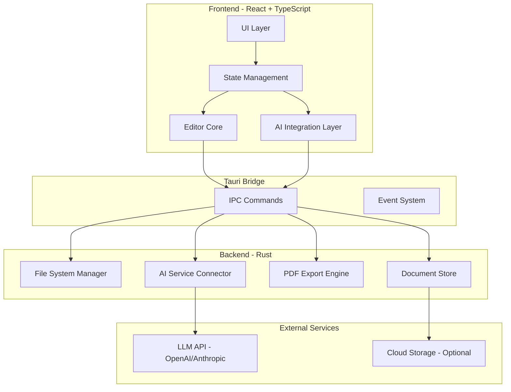
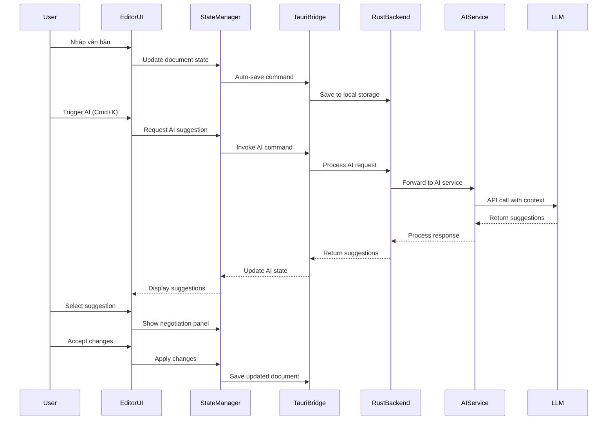

# Design Document: WordAI Text Editor

## Overview

WordAI là một ứng dụng desktop text editor hiện đại được xây dựng trên nền tảng Tauri (Rust backend) và React (TypeScript frontend), tích hợp AI assistant AuraSphere. Ứng dụng tuân theo triết lý "The Ethereal Editor" - một trải nghiệm soạn thảo tập trung vào nội dung (focus-first), nơi công cụ biến mất để lại không gian cho sáng tạo. AI không phải là một sidebar xâm lấn mà là một "soft, glowing presence" xuất hiện khi cần thiết và lùi vào nền khi người dùng đang trong trạng thái flow.

Hệ thống được thiết kế với ba màn hình chính: Editor Canvas với AI Assistant Panel, Negotiation Panel để so sánh và chấp nhận đề xuất AI, và Render-on-Demand Drawer cho việc xuất bản và định dạng tài liệu. Design system sử dụng glassmorphism, tonal shifts thay vì hard borders, và typography cao cấp (Newsreader serif cho nội dung, Manrope sans-serif cho UI).

## Architecture



## Main Workflow



## Components and Interfaces

### Component 1: EditorCanvas

**Purpose**: Màn hình soạn thảo chính với typography cao cấp và trải nghiệm minimal

**Interface**:
```typescript
interface EditorCanvasProps {
  document: Document
  onDocumentChange: (doc: Document) => void
  onAITrigger: (selection: TextSelection) => void
  isAIPanelOpen: boolean
}

interface Document {
  id: string
  title: string
  content: string // Rich text format (Markdown or custom)
  metadata: DocumentMetadata
  version: number
  lastModified: Date
}

interface DocumentMetadata {
  wordCount: number
  readingTime: number
  status: 'draft' | 'archived' | 'published'
  tags: string[]
}

interface TextSelection {
  start: number
  end: number
  text: string
}
```

**Responsibilities**:
- Render editor canvas với Newsreader font cho nội dung
- Handle text input và formatting
- Manage cursor position và text selection
- Trigger AI suggestions khi user nhấn Cmd+K
- Auto-save document changes
- Display document metadata (word count, last edited)

### Component 2: AuraSpherePanel

**Purpose**: AI assistant sidebar với chat interface và suggestion cards

**Interface**:
```typescript
interface AuraSpherePanel
